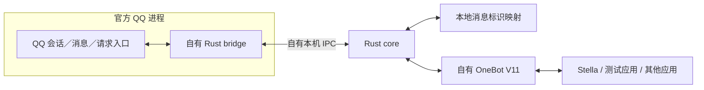

# Caligo 自有 Rust QQ 内核实施计划

> 日期：2026-10-06（Asia/Shanghai）。
> 执行者：用户；本轮交付：计划文档。状态：尚未实现、未加载模块、未接入真实 QQ、未执行消息收发。
> 主线：自有 Rust 桥接官方 QQ 会话 → 自有 Rust 核心 → 自有 OneBot V11。运行链路不依赖 SnowLuma、NapCat、LLBot、PMHQ 等协议端或专有内核。
> 执行目录：E:/stella/Caligo。当前为空目录、不是 Git 仓库，没有 HEAD、源码、测试或代码图谱。
> 归档目录：Stella 的 docs/plans，与原研究报告保存在一起。证据仓库 HEAD：eb5a135b890fd7876ca1f15b9eab03fe881f6cf0；它不是 Caligo 的实现提交。
> GitNexus：本计划不使用图谱作依赖闭合证明；Caligo 无源码与索引，不能借用 Stella 图谱替代。PDG 不可用，采用源码／文档与实验证据加权的 fallback。
> 证据 provenance schema 2；global dirty digest：5e6b57617070f03f271e590704508f22908515f7c98862545c552a1aa7090a06；cited-path manifest：3 项。只排除本计划的精确路径；研究报告及附件当前为未跟踪文件，其字节摘要见 §11。
> 深度：完整执行计划，承接用户“详细计划、让我看懂、我负责执行”的要求。本文所有模块、接口、测试与产物名称均为拟建内容，除明确注明的现有证据外，不表示已经存在。

## 阅读与执行导航

先阅读 §1 和 §3 理解目标，再按 §7 的 K0 → K1 → K2 → K3 执行。K3 是自有内核双向文本门槛；通过后做 K4 恢复，最后做 K5 OneBot 最小原型。§8 是验收表，§12 是未决问题，§13 是完成判据。

本计划是带调查关卡的工程计划。当前没有已验证的 QQ 私有函数名、地址、对象布局或调用约定。因此 K1 交付“入口契约”，后面的真实调用实现必须依据该契约；无法在计划阶段诚实地给出可直接粘贴的完整 Hook 实现。

标签：[verified] 本轮源文件、文件元数据或已有标准已核对；[inferred] 由证据形成的工程判断；[assumed] 必须通过实验验证。未加标签的实施要求是拟定规范，不是现状声明。

## 1. 目标与范围

### 1.1 最终目标

开发由我们掌握源码、构建、适配、维护和发行链路的 Rust QQ 接入产品 Caligo，逐步覆盖 SnowLuma 的能力。自主性以可复核的来源与构建证明为基础，不以包装第三方黑盒、改名或语言转换为完成标准。

### 1.2 第一阶段的目标

在一个冻结的 Windows x64 QQ 版本上，以一个指定账号实现：

1. 自有桥接取得真实账号与有效会话。
2. 接收好友私聊、普通群聊文本，保留作者、会话与消息标识。
3. 通过自有桥接执行私聊、群聊文本发送，取得可关联的执行结果。
4. 处理 QQ 重启、桥接断开、旧任务与不支持版本。
5. 由 Caligo 自行提供 OneBot V11 的基础事件与动作，使应用完成双向文本。
6. 从登记的源码重建核心产物；运行时不需要上述外部协议端、SnowLuma 原生组件或其授权服务。

允许官方 QQ 自身承担登录、签名、会话与网络通信。这是自有客户端桥接路线，不是脱离官方 QQ 的独立协议客户端。

### 1.3 范围冻结

首轮仅 Windows x64、单账号、单一冻结 QQ 版本、普通群聊、已建立好友关系的私聊、文本收发。先不覆盖临时会话、陌生人主动私聊、所有媒体、群管理、多账号与历史补回。

最小 OneBot 版本必须具备：

- get_login_info、get_status、get_version_info。
- send_private_msg、send_group_msg、send_msg。
- 群／私聊 message 事件，lifecycle/connect 与 heartbeat。
- Universal 正向 WS；其通过后加入 Universal 反向 WS，支持 NoneBot 等常见应用。
- Token 鉴权、请求 echo、发送失败／结果未知、并发关联。

HTTP API、分离 Api/Event WS、get_msg、delete_msg、好友群成员查询、@与引用、HTTP POST 上报为后续明确条目。文本首版遇到 CQ 非文本段，应明确拒绝不支持段或按 auto_escape 作为纯文本处理，不得悄悄删段并返回成功。

### 1.4 退出条件

K3 前不能把“已启动、已注入、IPC 已连通、模拟收发通过”宣称为内核完成。
K5 前不能把 Rust CLI 收发宣称为 OneBot MVP 完成。
第一阶段通过不代表全部 SnowLuma 功能等价。

## 2. 当前事实与证据边界

### 2.1 项目现状

[verified] Caligo 是空目录。前轮误生成的初始 Rust 文件已经撤回。当前没有可复用的 Caligo 业务符号与测试。本计划不修改 Stella 生产代码，不初始化 Caligo 仓库，不安装工具，不改 QQ 安装，不关闭任何现有进程。

[verified] 原报告基线为 SnowLuma v1.14.21、提交 9632b006385e603c9d9fe9150ab433e43792591f。报告明确公开 TS 桥接与原生 QQ Hook 之间存在实现边界；仅服务层移植不能证明具备自有内核。参见[研究报告 §3、§5](../reports/2026-10-06-snowluma-rust-native-reimplementation-research.md)。

[verified] 研究附件给出 203 个静态 wire 名称及元素、事件等清单，并注明没有运行时／真实 QQ 验证。这是范围调查，不能直接当作授权的代码生成输入或 clean-room 证明。附件[capability-inventory.json](../reports/evidence/snowluma-rust-20261006/capability-inventory.json)只用于后续覆盖跟踪。

### 2.2 本机候选基线

以下只证明文件与工具链存在，不证明能接入：

| 项目 | 本轮观察 |
|---|---|
| QQ 启动文件 | D:/Program Files/Tencent/QQNT/QQ.exe |
| QQ FileVersion | 9.9.33.52230 |
| QQ ProductVersion | 9.9.33.52230-aff854e8 |
| 版本目录 | D:/Program Files/Tencent/QQNT/versions/9.9.33-52230 |
| QQ.exe SHA-256 | abbed71fc3dfe84fa712a2243041029c4a2e60b25595528522cb92c5758d388a |
| 已观察到的候选文件 | QQNT.dll、resources/app/major.node、wrapper.node、application.asar、package.json |
| Rust | rustc 1.97.1 (8bab26f4f 2026-07-14) |
| 已安装编译目标 | x86_64-pc-windows-msvc |

MSVC 链接器、Windows SDK、调试工具、QQ 子模块摘要、实际运行进程加载的版本、本轮均未完整核验。QQ.exe 可能承担启动器角色，不能只凭其版本号锁定运行内核。K0 必须记录实际模块路径、摘要与进程创建时间。

### 2.3 来源纪律

行为契约优先依据 OneBot 标准、独立来源和自行设计的测试。调查与实现都登记来源。本任务不翻译 SnowLuma TS 实现，不研究或复用其专有二进制。项目贡献者已经接触过相关源码，不能声称本流程天然构成严格 clean-room。

“自有”指源码与维护控制，不等于所有通用库都必须重新编写。任何采用的第三方代码须记录具体提交、文件、许可、修改与发行义务；无完整源码或权利来源的专有内核不能成为必需运行依赖。

## 3. 架构与接入路线

### 3.1 主架构



进程内桥接做最少工作：确认版本与账号、获取有效上下文、接收通知、按要求在线程上下文执行发送、复制必要数据、汇报结果。进程外核心管理状态、队列、消息 ID、日志与网络。不得在 QQ 敏感回调里做数据库、HTTP、媒体或长时间等待。

### 3.2 接入优先级与路线门槛

| 路线 | 调查内容 | 进入实现的条件 | 不成立时的分支 |
|---|---|---|---|
| A1：会话／消息入口 | 当前 QQ 原生模块的会话创建、账号状态、消息订阅、发送调用与结果 | 身份、对象取得、ABI、线程、生命周期均有复现实证 | 在 K1 报告中逐项说明缺失，转 A2 |
| A2：内部协议入口 | 当前会话中的请求执行、推送与响应边界 | 明确可解析的数据边界、请求关联、发送通路及所需文本 schema 来源 | 仍不能得到双向文本，则 A 路线暂不通过 |
| B：独立协议客户端 | 当前版本登录、票据、签名、连接、推送、发送 | 无外部黑盒或不受控签名服务，真实身份与文本链成立 | 不能代替 A 未完成的证据；重新立项评估 |

[inferred] A1 优先可减少自写登录、票据与协议编解码的首轮范围，但 A1 是否存在可用入口仍为 [assumed]，不得直接假设稳定。

A2 不是“抓到网络包就会发送”。TLS／会话加密、封包时机、内部对象与发送权限可能令观察到的数据无法直接执行。原有加密报文不能作为任意修改或重放的实现方案。

### 3.3 Rust 与加载边界

默认 bridge、core、OneBot 使用 Rust。若实际入口只通过 QQ 内已有 Node-API 环境可取得，可在 K1 评估自有 Rust 原生模块与极薄加载适配；它不得演化成独立 Node 服务或把业务搬回 JS。Node-API 的 ABI 保证只针对自身，不等于 QQ 私有接口保证，见[官方文档](https://nodejs.org/api/n-api.html)。

如果发现 C++ ABI 需要少量 C/C++ shim，应先写方案变更记录：具体必要性、负责的对象生命周期、源码来源、构建与替代方案。QQ 接入语义、消息、调度与网络仍留在 Rust。不得将整套 C#／C++ 内核包装成“Rust 内核”。

不得把不开启第三方协议端误写成“不依赖官方 QQ 自带的 Electron／Node／原生模块”。

### 3.4 先独立程序，后原生嵌入

第一阶段 core 同时设计为 library 与 CLI。进程外独立运行便于调试和分离生命周期。后续再将 library 链接到长期 Rust 宿主。第一阶段不接入 Stella 运行时托管、PyO3、桌面或安装器；不改 AI 引擎。

## 4. GitNexus 与依赖分析结论

Caligo 无源码、Git 与索引，当前没有 primary symbols、callers、flows、impact 或 detect_changes 结果；这些内容不可伪造。归档仓库的 AGENTS.md 已读取，它约束未来修改既有 Stella 符号前做 impact，本轮只新增计划，不编辑任何函数、类或方法。

已有研究报告里的 Stella 图结果仅是其历史证据。本计划不刷新 Stella 索引，不引用其 LOW 风险作为新内核风险判定，不重跑与自有 QQ 内核无关的图查询。

执行者创建 Caligo 仓库并形成第一批源码后，视实际 runner 支持做 analyze --index-only；FFI、QQ 私有函数、系统加载、回调线程、IPC 都还需要手工契约与运行证据。图谱没有边不等于没有影响。

计划的归档 provenance 只能证明引用的研究材料；它不提供 Caligo 的代码提交 pin，也不覆盖 QQ 安装目录。

## 5. PDG 缺位与必须落实的执行约束

没有目标源码，无法建立 statement-level PDG。以下是拟定的控制／数据约束，不是工具测得的 PDG 边：

| 约束 | 必须形成的实现行为 |
|---|---|
| 版本与模块摘要确认 → 接入 | 未匹配适配清单拒绝 attach／发送，不能“试调用” |
| 有效账号与会话代次 → 操作 | 未确认账号拒绝写动作，旧会话结果不能更新新状态 |
| 正确线程与对象有效性 → 私有调用 | 不从 Tokio 任意线程直接调用 QQ 会话对象 |
| 回调数据 → 自有数据复制 | 未确认生命周期的原生指针不能跨线程／跨 await 传递 |
| 接受请求 → 原生执行 → 结果 | 按 request_id 关联终态，不能靠文本匹配认定发送成功 |
| IPC 断开／超时 → 结果未知 | 已进入原生执行的写动作不自动重发 |
| 停止 → 禁止新操作 → 回调收尾 | 在回调引用仍有效时不能卸载其代码或对象 |
| 编码与身份字段 → OneBot 事件 | 正文不改变作者、会话、recipient、消息标识 |

每个约束在 K1 入口契约、K2/K3 实现检查与 §8 反例中有对应验证。

## 6. 拟建模块与最小契约

所有路径相对于未来 Caligo 仓库。下列模块名称为拟建命名，不是已核验的现有符号。先用一个 Cargo workspace（由执行者创建）划分四个包；若复杂度不值得拆包可在同一 library 中按相同边界组织，不改责任划分。

| 拟建位置 | 职责 | 首轮约束 |
|---|---|---|
| crates/caligo-model | 账号、会话、消息、请求、结果、状态 | 不承载 QQ 对象／裸指针，不绑定 OneBot |
| crates/caligo-bridge | 进程内 Rust 动态库与版本适配 | unsafe 集中；不含业务网络与数据库 |
| crates/caligo-core | library；IPC、账号状态、动作、事件、消息映射 | 有界队列，明确终态，独立可测 |
| crates/caligo-cli | 程序；probe、接收观察、单次文本发送、启动服务 | 命令为拟定，不能宣称现在可运行 |
| crates/caligo-onebot | K5 后创建；消息投影、基础动作、WS | 只暴露实际通过的能力 |
| docs/research、docs/contracts | 入口调查、ABI、版本与来源契约 | 不复制第三方专有实现 |
| tests、tests/fixtures | ABI 边界替身、IPC、核心与协议场景 | 不使用真实凭据或未脱敏聊天 |
| local-evidence（不入公开发行） | 环境、实验、构建与真实收发证据 | 只记录必要数据；凭据不写入 |

### 6.1 入口契约必须记录的字段

K1 每一个被使用的 native entry 都要说明：

- 所属模块实际路径、架构、版本、SHA-256。
- 取得方法与复现依据；私有定位是否有独立来源。
- 调用约定、参数、返回值、对象拥有者、有效期、清理方式。
- 必须执行的线程／调度上下文；回调是否重入。
- 账号与会话确认方法，退出／重启失效信号。
- 错误结果、确认时机、异常与版本拒绝行为。
- 有哪些证据，哪些仍未知。

地址／偏移不是稳定身份。必要的版本适配应绑定确切模块摘要，并说明识别歧义时拒绝的行为。先只维护一个已验证版本，不提供自动猜测多个 QQ 版本的模式。

### 6.2 自有 IPC

Windows 首轮可选命名管道。IPC 必须是窄语义命令，不提供任意地址调用、任意脚本执行或原生内存读写的产品接口。

握手：协议版本、bridge build、模块基线、会话 run_id/generation、真实账号、能力集。只接受本机目标用户／已配对 core；ACL 与会话随机认证信息由执行者验证，pipe 名称本身不是鉴权。

帧：自有长度边界与结构化 payload；定义最大大小、半包、断开、解析失败。地址和跨进程指针不能成为 payload。桥接回调先复制被确认有效的必要数据到有界队列，再异步写管道。发送指令通过已验证的 QQ 线程调度返回原生入口。

拟定初值：最大帧 1 MiB、事件缓冲 256、写动作并发先为 1、请求超时 10 秒。它们不是实测性能结论；K3/K4 依据结果调整并记录。满队列必须计数，不能阻塞 QQ 敏感回调。接收溢出使服务进入 degraded 并暴露风险；首版不承诺无损补回。

### 6.3 模型与消息标识

- 账号 ID 独立于连接代次；run_id/generation 用于使旧回调失效。
- 会话键：账号 + kind（private/group）+ peer；同数字群号和好友号不能混淆。
- NativeMessageRef 暂设计为不透明的自有结构。实际字段必须等 K2/K3 调查确认，不能先编造 seq/random/UID 的固定组合。
- OneBot message_id 由 core 分配 signed int32，并保存与原生消息的映射；不能直接截断原生 ID 或哈希后忽略碰撞。
- 账号内映射唯一；首轮进程重启不能悄悄让已发出 ID 指向另一条消息。K5 前确定小型持久映射或明确带不复用保证的分配方案，优先使用独立 SQLite；core 是唯一 owner。
- 消息包括作者、方向、会话、原始标识和时间，文本为完整 UTF-8。
- 发送回执与本人发送通知明确关联。本人发送不伪装成 incoming 用户消息；不能仅根据相同文本去重。
- 后续 @ 与引用保留单独目标、原作者和原始消息锚点，不能依赖自然语言角色推断。

### 6.4 写动作的结果

建议内部状态：

```text
accepted -> queued -> native_execution_started
                    -> confirmed_success
                    -> confirmed_failure
                    -> delivery_unknown
queued -> cancelled_not_sent
```

只有在 native_execution_started 前确认取消才能声明未发送。已调用原生入口后的超时／断连默认 delivery_unknown，除非取得可证明未执行的结果。confirmed_success 由真实发送结果判定，不能以“调用返回没有崩溃”代替。

IPC request_id、native 关联标识与 OneBot echo 是三层标识，分别保存。没有原生关联标识时，必须在 K3 找到可证明的关联机制；按时间或文本猜测不能通过并发验收。

## 7. 逐阶段执行步骤

### K0 — 环境、来源与实验基线

**你要做：**

1. 在 Caligo 创建独立 Git 仓库与文档／证据目录，先提交基线说明；此操作由你执行，本计划未执行。
2. 选择指定 QQ 版本、一个测试账号、一个好友和一个测试群。使用可区分本轮实验的唯一正文，例如 CALIGO-K2-PRIVATE-001；所有发送都只针对明确的测试目标。
3. 确认 MSVC／Windows SDK、Rust MSVC 目标、链接器与选定调试工具。不要未经记录升级所有工具。
4. 确认实际 QQ 主进程及加载模块，记录路径、PID、创建时间、架构、版本与模块摘要。当前系统里的运行实例不自动作为实验目标。
5. 登记已有插件／Hook，并选一份没有第三方协议端介入的测试实例。由你明确决定如何隔离；不自动停止、修改其他 QQ 会话。
6. 准备恢复办法：备份配置与将修改的文件，记录如何退出指定测试实例、恢复加载方式。不要自动遍历并修改所有 QQ 安装。
7. 确定第三方来源清单；先冻结“参考／采用／拒绝／待审”状态。公共网页动态内容记录抓取时间和摘要，采用代码要固定 commit。

**你可以先运行的只读命令（PowerShell；不会接入 QQ）：**

```powershell
Set-Location -LiteralPath 'E:\stella\Caligo'
rustc --version
cargo --version
rustup target list --installed
(Get-Item -LiteralPath 'D:\Program Files\Tencent\QQNT\QQ.exe').VersionInfo |
    Select-Object FileVersion, ProductVersion
Get-FileHash -LiteralPath 'D:\Program Files\Tencent\QQNT\QQ.exe' -Algorithm SHA256

$caligoQqVersionDir = 'D:\Program Files\Tencent\QQNT\versions\9.9.33-52230'
$caligoModulePaths = @(
    (Join-Path $caligoQqVersionDir 'QQNT.dll'),
    (Join-Path $caligoQqVersionDir 'resources\app\major.node'),
    (Join-Path $caligoQqVersionDir 'resources\app\wrapper.node'),
    (Join-Path $caligoQqVersionDir 'resources\app\application.asar')
)
$caligoModulePaths | ForEach-Object {
    Get-FileHash -LiteralPath $_ -Algorithm SHA256
}
```

这些命令核对的是安装文件；确认实际运行模块仍要另行观察。不得把此输出当作会话入口证明。

**交付物：** environment.json、source-register.md、test-scope.md、recovery-notes.md，全部拟新增。
**通过条件：** 环境可重建；目标账号／群／好友明确；源码和运行依赖来源可核对。
**失败分支：** 工具链／目标版本不一致，先修正环境，不能进入 native 写实验。
**工作盒：** 建议 1–2 个工作单元（每单元约半天），是调查排期建议，不是实现工期承诺。

### K1 — 调查会话入口并建立最小加载／探测能力

**你要做：**

1. 对指定 QQ 版本建立模块／启动／会话创建的观察笔记。确认已发现的 major.node、wrapper.node 等各自实际职责；文件存在不等于它就是正确入口。
2. 从可核对的模块接口、允许使用的独立公开资料及测试实例观察中找账号状态、会话取得、消息订阅、发送及结果路径。先形成候选清单，列证据与未知项。
3. 为每个候选填写 §6.1 入口契约。ABI 或对象生命周期未确认的候选不能进入发送调用。
4. 根据入口性质选择自有加载方式：纯 Rust native bridge 为默认；QQ 内 Node-API 薄适配是有条件分支。若需要既有专有 loader、授权服务、文件修补或额外非 Rust shim，先作来源与方案变更评估，不默认接受。
5. 写最小 bridge 与开发 probe，先仅验证构建、加载、握手、真实账号和无副作用的会话观察。不加入 OneBot／WebUI。
6. 验证探测时 QQ 仍能正常人工收发；明确 loader 与 probe 拥有的进程／句柄／资源。
7. 实测账号退出、重新登录、目标对象失效；找出停止回调与安全收尾方式。不能安全热卸载时，首轮固定以退出指定测试 QQ 收尾，并记录限制。

**交付物：** native-entry-contract.md、version-adapter-manifest.json、loading-route-decision.md、probe 构建记录、身份／失效观察记录。
**通过条件 G1：** 源码可重建加载链；能够重复获得真实账号与有效会话；ABI／线程／生命周期有足够证据支撑下一步；不依赖第三方专有内核。
**A1 失败分支：** 如账号可见但消息订阅／发送入口缺失，记录具体缺项，转 A2 收发包边界调查，更新同一入口契约。不以大量猜测地址扩大实验。
**A 路线未通过：** A1 与 A2 都缺少有效发送或明文消息路径时，出路线结论，停止上层扩建，按 §12 评估 B。
**工作盒：** 建议先给 3–5 个调查工作单元。超过后复盘新增证据与缺项；没有新线索时不要无期限试偏移或改版本。

### K2 — 自有内核接收群／私聊文本

**前置：** G1 通过，入口契约完整到足以安全订阅。
**你要做：**

1. 订阅有效会话的消息通知；确认回调线程、对象有效期、重入和重复推送行为。
2. 在回调有效期内取得最少数据并复制为自有模型；不把裸指针送到异步任务。
3. 通过自有 IPC 送至 core 的接收观察入口。
4. 好友发送私聊测试文本；另一测试成员发送群聊文本。分别比对 QQ 可见消息与 core 观察。
5. 覆盖中文、换行、表情 Unicode、重复正文、连续多条消息和本人手动发送。
6. 检查作者与 recipient 的实际来源、群／私聊会话区别、时间的单位与含义、原生标识字段。
7. 故意暂停 core 的读取，在有限负载下验证回调不会无限阻塞 QQ；记录溢出／degraded 行为。

**交付物：** message-field-contract.md、脱敏样本与摘要、接收链记录、溢出结果；可运行的文本观察 CLI。
**通过条件 G2：** 私聊与群聊各至少 10 条固定样本字段对应正确；相同正文不被误去重；本人发送方向清楚；没有依赖第三方事件输出。
**失败分支：** 身份／会话缺失先回入口层找来源；仅收到字节而不能解析文本则 A2 继续协议字段调查，不对外发布错误事件。

### K3 — 自有内核发送并关联结果

**前置：** G2 通过；发送入口的 ABI、线程调度与对象生命周期已经确认。
**你要做：**

1. 将单次发送请求定义为账号、会话 kind/peer、文本、request_id、会话代次、deadline；首次只允许一个 native 写动作在途。
2. 由 core 经 IPC 下发，bridge 将调用安排到经验证的 QQ 上下文。对不匹配的账号／版本／代次／目标拒绝。
3. 从好友私聊单次文本开始，再做普通群聊文本。你在对端 QQ 确认收到。
4. 找到原生发送结果或可证明的关联机制，建立请求、回执和消息标识的映射。调用返回只代表“进入某阶段”时，不得冒认 confirmed_success。
5. 模拟 QQ 离线、目标错误、调用前取消、原生调用后 core 断开、结果迟到。验证 §6.4 终态。
6. 基本关联通过后做双请求测试，使用相同文本验证不会串回执；之后再逐步放开并发。
7. 从源码重新构建一次并重复完整流程；记录所有实际加载的自有／系统／QQ 模块。

**交付物：** send-result-contract.md、执行状态记录、真实双向文本报告、源码／构建／依赖清单。
**通过条件 G3：** 私聊与群聊各至少 10 次发送；实际到达与 core 结果对应，回执关联明确，发送后超时不自动重复；自有接入运行链不依赖外部协议端。
**失败分支：** 仅能触发发送但无法关联结果，应标成“发送触发已验证、可靠回执未通过”，继续调查；不能宣称正常收发门槛通过。
**阶段意义：** G3 才是“我们已经有一个最小自有 QQ 内核”的证据；尚不代表 OneBot MVP。
**工作盒：** 建议 K2/K3 各先安排 2–3 个工作单元，在实际入口条件确定后重估。

### K4 — 核心、恢复与关闭

**你要做：**

1. 固定账号 actor／状态 owner。建议状态：detached、attaching、identified、ready、degraded、stopping、stopped；连接与在线状态另外保留，不能把进程存在当作 ready。
2. 建立 run_id/generation；QQ 退出或会话失效后立即使旧对象与旧任务无效。
3. 在 QQ 重启后重新验证模块、入口、账号，不能沿用旧 PID／对象／地址。PID 与创建时间一起验证。
4. 处理 IPC 半包、错误版本、错误账号、队列满、迟到回执、core 崩溃与重新连接。只读恢复可重做，写动作不自动重放。
5. 明确下线期间的消息支持：首版无历史补回保证。记录观察间隙，不能宣称“无丢失”。
6. 核心停止：拒绝新动作 → 对排队项给未发送终态 → 对执行项等待有限时间／标未知 → 停止发布 → 收尾回调与 IPC。不能安全热卸载则保留桥接至指定测试 QQ 正常退出。
7. 核查 unsafe 只在 bridge／适配范围。FFI 入口阻止可展开 panic 穿越边界；catch_unwind 不能恢复访问违规／段错误，也不能作为内核安全证明。

**交付物：** 生命周期契约、故障矩阵、重启与关闭报告、消息 ID 策略。
**通过条件 G4：** 至少 3 次指定 QQ 重启与 core 重连循环成功；旧会话发送被拒绝；正常停止完成；未支持版本拒绝；没有操作无关 QQ／其他服务。

### K5 — 最小 OneBot V11 原型

**前置：** G3/G4 通过。到此才开始正式创建 caligo-onebot。
**你要做：**

1. 用 core 模型投影群／私聊文本事件。保存 self_id、作者、会话、消息 ID、正文与时间；缺失必需字段时报告异常，不编造身份。
2. 实现六个基础动作：get_login_info、get_status、get_version_info、send_private_msg、send_group_msg、send_msg。未实现动作明确 unsupported。
3. 接收字符串和 text 段数组；实现 auto_escape 与 CQ 文本转义规则。非文本段暂不支持时明确拒绝。接受可解析的标准 ID 参数，但消息 ID 始终保持 signed int32。
4. 正向 Universal WS 首先打通事件 + 动作 + 任意 JSON echo。echo 被省略和显式 null 要区分。
5. 加入反向 Universal WS：X-Self-ID、X-Client-Role、Bearer Token、重连、lifecycle/connect 与 heartbeat。身份未确认不能填一个假的 self_id 去建连接。
6. 制作最小测试应用；它接收一条私聊／群消息，再调用同类发送动作。若使用 NoneBot/Stella，先只接一个事件入口，避免原协议端直接接入造成双份回复。
7. get_status 同时反映 core、bridge、QQ 在线、版本适配、事件流与最近状态时间。健康数据过期要退化，不能只报告“WS 已连通”。
8. 测试慢客户端、有界任务、未知动作、错误 Token、任意 echo、写动作超时与关闭。

[verified] 接口依据：[公开 API](https://github.com/botuniverse/onebot-11/blob/master/api/public.md)、[正向 WS](https://github.com/botuniverse/onebot-11/blob/master/communication/ws.md)、[反向 WS](https://github.com/botuniverse/onebot-11/blob/master/communication/ws-reverse.md)、[鉴权](https://github.com/botuniverse/onebot-11/blob/master/communication/authorization.md)、[元事件](https://github.com/botuniverse/onebot-11/blob/master/event/meta.md)。实施 K0 固定所采用标准版本／抓取摘要，不能把 mutable master 当永久 pin。

**交付物：** 独立构建产物、启动配置说明、基础能力表、测试应用、OneBot 联调报告。
**通过条件 G5：** QQ → 自有 bridge/core → OneBot → 应用，以及应用 → OneBot → 自有 core/bridge → QQ 都成立；真实群／私聊收发、鉴权、echo、重连、未知结果与身份边界通过。
**最小可用原型版本：** Caligo v0.1，自有 QQ 内核 + 两种 Universal WS。HTTP、媒体与其他动作继续按阶段补。

### K6 — 扩展路线（不阻塞文本原型的首轮调查）

依次补：get_msg/delete_msg 与消息映射；@/引用及本人发送关联；好友／群／成员；HTTP API 和分离 WS role；通知／请求；图片与媒体；群管理／文件／扩展功能；管理／SDK／MCP；多平台、嵌入与发行。

全量覆盖台账保留原报告识别的能力分母，但每项重新形成有来源的行为契约。状态为 planned、implemented、contract_tested、qq_verified、baseline_placeholder、unsupported_by_design、blocked，并附证据与解释；不能以 handler 个数宣称等价。

HTTP POST 后续加入时需独立处理签名、快速操作和副作用，不是简单事件 POST。独立客户端路线与“全功能”计划也必须另有当前协议与来源门槛。

## 8. 测试与验收策略

当前没有以下测试文件；均为拟新增。自动测试不加载真实 QQ，native 现场实验单独记录。

| 编号 | 场景与操作 | 预期 |
|---|---|---|
| T01 | 与 manifest 摘要不匹配的模块 → 请求接入 | 明确拒绝，不猜偏移 |
| T02 | pipe 握手版本／账号／认证不匹配 | 拒绝，与其他账号隔离 |
| T03 | 同数字 private/group peer → 接收 | 两个不同会话 |
| T04 | 同正文多条真实消息 → 投影 | 全部保留，只有同原生身份的重复通知可去重 |
| T05 | 本人手动发送与程序发送通知 | 方向正确，不进入 incoming 用户链 |
| T06 | 中文、换行、Unicode → 收发 | 完整、无替换字符或错误切分 |
| T07 | 错误线程／已失效对象 → 发送 | 在调用前阻止；native现场确认 guard 来源 |
| T08 | 请求排队阶段取消 | 未发送终态，不执行 |
| T09 | 原生已执行后断开或超时 | delivery_unknown，不自动重试 |
| T10 | 回执迟到／重复／属于旧代次 | 不重新打开已结束请求、不污染新会话 |
| T11 | 两个相同正文并发发送 | 按标识关联，没有文本猜测 |
| T12 | 队列满／超长帧／半帧／非法结构 | 有界资源、明确错误；QQ回调不阻塞 |
| T13 | 负 OneBot ID、重复原生ID、映射重启 | signed保留，账号隔离，无错指向／碰撞覆盖 |
| T14 | 两应用使用相同 echo；echo对象、数组、null、省略 | 各自正确返回，类型和省略语义保持 |
| T15 | 错 Token、错误 role/身份、未知动作 | 拒绝或明确unsupported |
| T16 | QQ退出/重启、core退出/重连 | 重新绑定有效身份，旧PID与对象不沿用 |
| T17 | 慢应用／事件溢出 | 记录degraded/丢失风险或关闭慢连接，不默默假装完整 |
| T18 | normal stop与不能安全热卸载 | 明确终态和现场收尾方式，不悬挂引用／无关退出 |
| T19 | CQ特殊字符、auto_escape、非文本段 | 标准文本行为正确，不丢段后成功 |
| T20 | 完整应用回环 | 无第三方协议端参与，两类会话实际收到且回执对应 |

拟新增测试路径见 §10。Rust 格式／lint／测试／构建建议在 K0 创建工程后使用 cargo fmt --all -- --check、cargo clippy --workspace --all-targets -- -D warnings、cargo test --workspace、cargo build --workspace --release --target x86_64-pc-windows-msvc；当前空目录不能运行它们，包配置与依赖锁定后再确认。

真实 QQ 验收记录字段：case_id、环境与模块摘要、bridge/core构建摘要、账号别名、会话类型、请求关联、时间与时区、预期、实际、截图／日志摘要、判定、偏差。截图只作对端观察证据，不能单独证明链路由自有内核完成；还需进程与依赖／构建证据。

小样本门槛用于发现基础错误，不是可靠性概率或压力测试结论。完成 G5 后再设计 soak／负载标准。

## 9. 风险与影响

| 风险 | 优先级 | 应对与证据 |
|---|---|---|
| 找不到有效会话／发送入口 | 最高 | K1设关卡，A1→A2→B结论分支，不先堆上层 |
| 所谓自有内核实际来自专有DLL | 最高 | 来源、完整构建、运行依赖核查；重新构建重复收发 |
| ABI／对象／线程错误导致QQ崩溃 | 最高 | 单版本、窄bridge、守卫契约、最小只读实验先行 |
| QQ升级使定位失效 | 高 | 模块摘要绑定、失败拒绝、单独维护适配版本 |
| 写动作结果丢失重复发送 | 高 | 执行状态、标识关联、unknown终态、无盲重试 |
| 作者、账号、会话混淆 | 高 | typed会话与generation；同数字peer/旧回调反例 |
| bridge卸载后回调跳入释放代码 | 高 | callback drain与资源owner；不支持热卸载如实记录 |
| 原生标识映射碰撞／重启错指向 | 高 | 自有映射唯一性、signed测试、事务与不复用策略 |
| IPC或应用阻塞QQ回调 | 高 | 非阻塞复制、有界队列、degraded与溢出记录 |
| 工具链／许可／加载链不独立 | 高 | K0登记、K1方案变更，源码与产物可核对 |
| 两个入口给应用重复事件 | 中 | 只启用一个有效来源，测试订阅与发送责任 |
| 保存调试日志泄漏内容 | 中 | 默认结构化元数据；必要样本脱敏、凭据不落盘 |

潜在下游：指定官方 QQ 实例、core、OneBot 应用；首轮不改变 Stella 业务路径。现阶段没有既有 Caligo 符号的 direct dependents 可列，不能据此写“低风险”。

PMHQ、Lagrange NativeAPI、Mania仅列入来源调查候选。PMHQ公开配置声明manager凭据要求；Lagrange NativeAPI的C ABI不改变其C#实现事实；Mania归档且声明发送能力不完整。它们没有被选择为执行依赖，也未在本轮运行。

## 10. 预计由执行者创建的文件

归档仓库本轮只新增本计划。下列为 Caligo 内拟新增；符号随 K1 契约确定，不编造现有符号：

| 路径 | 建立阶段 | 用途 |
|---|---|---|
| Cargo.toml、Cargo.lock、rust-toolchain.toml | K0/K1 | 独立workspace、依赖锁与工具链 |
| docs/research/environment.json、source-register.md | K0 | 环境／来源 |
| docs/research/native-entry-contract.md、loading-route-decision.md | K1 | 接入与ABI调查结果 |
| docs/contracts/version-adapter-manifest.json | K1 | 单版本及模块摘要适配 |
| crates/caligo-model/src/lib.rs | K1/K2 | 自有数据契约 |
| crates/caligo-bridge/src/lib.rs、versions/ | K1-K4 | native加载、入口、回调、线程与关闭 |
| crates/caligo-core/src/lib.rs、ipc.rs、session.rs、requests.rs | K1-K4 | 核心运行、IPC、代次与请求 |
| crates/caligo-core/src/message_ids.rs | K2-K5 | 原生标识与OneBot映射 |
| crates/caligo-cli/src/main.rs | K1-K5 | 探测、观察、单次发送、服务入口 |
| docs/contracts/message-field-contract.md、send-result-contract.md | K2/K3 | 身份、字段与结果证据 |
| crates/caligo-onebot/src/lib.rs、actions.rs、events.rs、ws.rs | K5 | 基础OneBot |
| crates/caligo-core/tests/ipc_contract.rs | K1-K4 | 半包、认证、版本、限额 |
| crates/caligo-core/tests/session_requests.rs | K2-K4 | 代次、排队、超时、迟到回执 |
| crates/caligo-core/tests/message_identity.rs | K2-K5 | signed ID、会话、映射与作者 |
| crates/caligo-onebot/tests/ws_contract.rs | K5 | echo、鉴权、角色、生命周期 |
| docs/acceptance/kernel-text.md、onebot-mvp.md | K3/K5 | 实验报告与偏差 |
| README.md、配置示例 | K5 | 能力、使用、恢复与限制说明 |

local-evidence/中的现场日志、账户数据、模块定位与必要截图按实际敏感度保存在本机；公开仓库只存脱敏结果与摘要。完整QQ二进制不随项目重新分发或入库。

## 11. 可复用执行上下文

此 pack 供用户执行与后续复核使用。归档仓库≠实现仓库；不得让执行工具根据归档HEAD直接在Stella建bridge或把Stella现有图谱当作Caligo图谱。

```json
{
  "implementation_context": {
    "task_summary": "在独立Caligo项目先建立自有Rust官方QQ桥接内核，真实群私聊文本收发和恢复通过后，自行提供OneBot V11",
    "execution_mode": "human_executor",
    "implementation_root": "E:/stella/Caligo",
    "implementation_repository_state": "absent; executor creates and pins a new repository in K0",
    "archive_repository_root": "E:/stella/stella_project",
    "acceptance_criteria": [
      "G1有效身份与会话入口契约",
      "G2自有接收群私聊文本",
      "G3自有发送与真实回执关联",
      "G4恢复及关闭",
      "G5自有内核+OneBot两种Universal WS"
    ],
    "evidence_provenance": {
      "schema_version": 2,
      "head_commit": "eb5a135b890fd7876ca1f15b9eab03fe881f6cf0",
      "generated_plan_path": "docs/plans/2026-10-06-gitnexus-plan-caligo-native-qq-kernel.md",
      "global_dirty_digest": {
        "algorithm": "sha256",
        "canonicalization": "gitnexus-evidence-provenance-v2 NUL-framed UTF-8 records",
        "value": "5e6b57617070f03f271e590704508f22908515f7c98862545c552a1aa7090a06"
      },
      "cited_path_manifest": [
        {
          "path": "AGENTS.md",
          "object_kind": {
            "head": "regular",
            "index": "regular",
            "worktree": "regular",
            "untracked": "absent"
          },
          "state": "clean",
          "rename_from": null,
          "rename_to": null,
          "head_digest": "sha256:d2a89022b9fa5087cad8d80549aade7104a50ee4768db4979c243ab6b16f4db2",
          "index_digest": "sha256:d2a89022b9fa5087cad8d80549aade7104a50ee4768db4979c243ab6b16f4db2",
          "worktree_digest": "sha256:d2a89022b9fa5087cad8d80549aade7104a50ee4768db4979c243ab6b16f4db2",
          "untracked_digest": "absent"
        },
        {
          "path": "docs/reports/2026-10-06-snowluma-rust-native-reimplementation-research.md",
          "object_kind": {
            "head": "absent",
            "index": "absent",
            "worktree": "absent",
            "untracked": "regular"
          },
          "state": "untracked",
          "rename_from": null,
          "rename_to": null,
          "head_digest": "absent",
          "index_digest": "absent",
          "worktree_digest": "absent",
          "untracked_digest": "sha256:da1ce5032a7a68dc61c14fcc3e6f4e5dfa6bf6611af0ad2427773045e4afa168"
        },
        {
          "path": "docs/reports/evidence/snowluma-rust-20261006/capability-inventory.json",
          "object_kind": {
            "head": "absent",
            "index": "absent",
            "worktree": "absent",
            "untracked": "regular"
          },
          "state": "untracked",
          "rename_from": null,
          "rename_to": null,
          "head_digest": "absent",
          "index_digest": "absent",
          "worktree_digest": "absent",
          "untracked_digest": "sha256:5939eafaacff9f9b22cc93809851b774dfa49ba07643f0e0de16dbb44ec0e4a4"
        }
      ]
    },
    "primary_symbols": [],
    "related_symbols": [],
    "execution_path": [
      "QQ有效会话 -> 自有bridge -> 自有IPC -> core -> OneBot -> 应用",
      "应用动作 -> OneBot -> core -> 自有IPC -> QQ正确上下文执行 -> 结果关联"
    ],
    "pdg_constraints": [],
    "pdg_unavailable_reason": "Caligo has no source or index; section 5 contains design constraints, not PDG results",
    "architectural_patterns": [
      {
        "pattern": "thin in-process bridge with external Rust core",
        "example_location": "proposed only: crates/caligo-bridge and crates/caligo-core",
        "usage_guidance": "Callback does bounded copying; lifecycle and actions stay in core"
      }
    ],
    "files_to_modify": [],
    "files_to_create": [
      {
        "file": "crates/caligo-bridge/src/lib.rs",
        "status": "proposed",
        "intended_change": "K1明确native契约后实现自有bridge"
      },
      {
        "file": "crates/caligo-core/src/lib.rs",
        "status": "proposed",
        "intended_change": "实现IPC、状态、动作、终态与标识映射"
      },
      {
        "file": "crates/caligo-onebot/src/lib.rs",
        "status": "proposed",
        "intended_change": "G3/G4通过后实现基础OneBot"
      }
    ],
    "tests": [
      {
        "file": "crates/caligo-core/tests/ipc_contract.rs",
        "status": "new",
        "scenarios": [
          "认证/版本/限额/半包"
        ]
      },
      {
        "file": "crates/caligo-core/tests/session_requests.rs",
        "status": "new",
        "scenarios": [
          "旧代次/排队取消/发送后断连/迟到回执"
        ]
      },
      {
        "file": "crates/caligo-core/tests/message_identity.rs",
        "status": "new",
        "scenarios": [
          "群私同peer/本人方向/signed ID/重启映射"
        ]
      },
      {
        "file": "crates/caligo-onebot/tests/ws_contract.rs",
        "status": "new",
        "scenarios": [
          "任意echo/Token/事件/反向头/重连"
        ]
      }
    ],
    "verification_commands": [
      "rustc --version",
      "rustup target list --installed",
      "Get-FileHash -LiteralPath 'D:/Program Files/Tencent/QQNT/QQ.exe' -Algorithm SHA256"
    ],
    "planned_verification_commands_not_yet_runnable": [
      "cargo fmt --all -- --check",
      "cargo clippy --workspace --all-targets -- -D warnings",
      "cargo test --workspace",
      "cargo build --workspace --release --target x86_64-pc-windows-msvc"
    ],
    "external_environment_evidence": {
      "observed_date": "2026-10-06",
      "qq_version": "9.9.33-52230",
      "qq_exe_sha256": "abbed71fc3dfe84fa712a2243041029c4a2e60b25595528522cb92c5758d388a",
      "rust": "1.97.1",
      "target": "x86_64-pc-windows-msvc",
      "note": "Does not pin native modules or prove live integration"
    },
    "risks": [
      "入口未知",
      "ABI与回调线程",
      "版本升级",
      "发送结果未知",
      "依赖来源",
      "关闭与映射"
    ],
    "assumptions": [
      "K1验证当前QQ可取得有效会话",
      "K1验证源码可构建加载链和正确线程调用",
      "K2/K3核对原生标识与结果关联",
      "K0核验MSVC/SDK和实际模块版本"
    ],
    "open_questions": [
      "A1入口是否可用",
      "是否需要QQ内Node-API薄适配/ABI shim",
      "首版是否能安全热卸载",
      "当前QQ版本不成立时A2或B的具体来源"
    ],
    "avoid": [
      "Only the user executes; no source implementation in this planning turn",
      "Do not implement in archive Stella repository",
      "Do not depend on SnowLuma/NapCat/LLBot/PMHQ proprietary cores",
      "Do not invent native symbols, addresses or ABI",
      "Do not declare injection or IPC as QQ success",
      "Do not automatically retry uncertain writes",
      "Do not touch unrelated QQ processes",
      "Do not claim full SnowLuma parity at G5",
      "Do not claim clean-room certification"
    ]
  }
}
```

执行 K0 后，另生成 Caligo 自身的源码/依赖/模块基线。此 pack 的证据摘要不能“迁移”成 Caligo 的 HEAD；后续自动执行技能需要先解决跨仓库绑定并对实施计划重新 anchor。

## 12. 假设、未决问题与失败分支

### 12.1 假设及如何验证

| 假设 | 验证方式 | 不成立时 |
|---|---|---|
| 当前QQ版本可取得有效会话入口 | K1重复身份、对象有效期、ABI与线程实证 | A1→A2；不降级回OneBot外部网关 |
| 能接收有身份的文本事件 | K2与真实QQ逐字段比对 | 回入口与schema调查 |
| 能调用发送并关联真实结果 | K3目标实际到达与独立关联标识比对 | 只标“触发”，继续研究；不给成功承诺 |
| 自有加载可构建且不需受控黑盒 | K0/K1来源、完整构建、运行清单 | 更换加载方法或调整路线 |
| 回调可安全收尾 | K1/K4关闭实验 | 明确仅随指定QQ进程退出，不做热卸载 |
| 现有Rust/MSVC工具能构建 | K0工具与最小构建检查 | 安装/修复由执行者安排，本轮未操作 |

### 12.2 当前不能填成事实的项目

native函数／对象名称、地址与偏移、ABI、正确调度线程、消息标识、确认回调、实际平台签名路径、热卸载、QQ更新兼容范围，均尚未验证。下一阶段调查产物必须填写这些空缺，不能用通用Hook代码掩盖它们。

### 12.3 独立协议 B 路线的入场条件

A路线结论明确后，B另形成可行性报告，至少覆盖：

1. 具体协议与版本来源、完整源码与许可。
2. 登录、设备状态、票据、心跳、会话恢复的当前行为。
3. 必要签名能力的可构建来源；不能依赖第三方可撤销的受控服务后宣称完全自主。
4. 真正离开官方QQ桥接后的群私聊文本收发。
5. 平台与工具链构建、故障终态、必要媒体后续路线。

Mania、RICQ、Lagrange等是调查候选而非已选生产依赖。归档仓库、README勾选或C ABI存在不能证明今天现网可用。采用某个GPL等来源也不能解释成“无第三方义务”。

### 12.4 计划范围外

不在本轮执行：SnowLuma专有二进制研究、生产QQ接入、全量账号操作、自动关闭进程、UI、AI逻辑改造、Stella托管、正式安装器、全量功能实现。授权范围变化时再更新具体方案；不把本计划视为对未知入口安全性或发行权利的认证。

## 13. 完成定义与第一轮执行清单

### 13.1 三个不同的完成状态

| 状态 | 必须通过 | 可以说明什么 |
|---|---|---|
| 调查入口成立 | G1 | 当前指定版本取得有效身份／会话，具有继续实现的依据 |
| 最小自有QQ内核 | G1-G4 | 指定版本／账号真实群私聊文本收发与恢复可复核 |
| OneBot MVP v0.1 | G1-G5 | 应用经自有内核双向收发；基础协议契约成立 |

全功能等价、全部平台、自动升级与原生嵌入均不属于上述完成声明。

### 13.2 核心判据

- [ ] 运行链路不需要现有第三方QQ协议端及SnowLuma/PMHQ等专有内核。
- [ ] 源码、依赖、加载与版本适配可核对、可重建。
- [ ] 真实账号正确，群私会话和作者完整。
- [ ] 双向文本由自有内核完成，并有结果关联证据。
- [ ] 队列有界，超时/断开/停止有明确终态，未知写动作不重试。
- [ ] 重启使旧对象失效，重新接入验证版本与身份。
- [ ] signed消息映射正确，重启不错误复用。
- [ ] OneBot动作/事件/echo/鉴权/生命周期/两种Universal WS通过。
- [ ] 能力缺口、关闭限制、断线消息恢复范围如实说明。
- [ ] 有一份从源码重建后重复真实验收的报告。

### 13.3 你现在先执行什么

第一轮只做 K0 与 K1 的入口调查，不先写完整服务：

1. 建立Caligo仓库和环境/来源记录。
2. 确认指定测试QQ的真实模块基线与恢复方式。
3. 调查并填写账号/会话/接收/发送/结果五类入口契约。
4. 选择能自行构建的加载与线程调用路线。
5. 做最小只读probe，取得真实身份与会话失效证据。
6. 给出G1通过、缺少哪些证据、或A1转A2的结论。

第一轮建议回报的证据包：environment.json、source-register.md、native-entry-contract.md、loading-route-decision.md、脱敏probe日志、模块与构建摘要、剩余问题。凭据、会话密钥、未脱敏聊天与QQ二进制不用发送或提交。

本计划没有承诺“在某个固定日期完成内核”。K1尚无实测前，按工作盒复盘与证据推进比给出全量工期更可靠。

