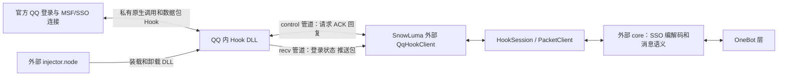

# Caligo K4 执行计划修订：以 SnowLuma 交互逆向重建内核契约

> 修订日期：2026-10-08，Asia/Shanghai；执行者：用户。本轮完成静态调查和计划修订，没有实施业务代码变更，没有运行 SnowLuma、加载 Hook 或操作 QQ。
> Caligo 锚点：`681434bb8c0a32fd4e98ddaceadedf7e48f95782`，main。GitNexus 1.6.12 本轮以 `analyze --index-only --pdg` 刷新；索引时间 `2026-10-08T02:46:44.698Z`；87 文件、9028 节点、23282 边、268 流程。
> SnowLuma 锚点：`9632b006385e603c9d9fe9150ab433e43792591f`，v1.14.21；只分析这个固定版本。REA 5.0.0；没有注册全局 MCP。
> provenance：schema 2；全局脏状态摘要 `48c1ac8e5d0063501032ef098c82a767bbe4fc010728e9dfd4dca0dd284b9ce2`；22 个引用路径见 §11；只排除本文路径。外部证据另有 SHA256 清单，不能由仓库摘要替代。
> 本文替换原路径上的 2026-10-07 计划，旧版由安全写入工具保存在 Git 管理目录。新代码、接口名、阈值、阶段耗时均是提议，不是已实现事实。
> `[verified]` 表示当前源码/静态产物或记录已核对，不自动等于 QQ 现场通过；`[graph]` 表示图结果；`[inferred]` 表示推论；`[assumed]` 表示待证明前提。

**推进依据改为可复核的交互契约。取消“只剩一个重连缺陷、下一轮现场即可收敛”的假设。先完成原生边界研究及路线选择，修复公共协议缺口，再重做真实接收、发送和恢复验收。**

阅读顺序：§2 看当前事实；§3 看 SnowLuma 如何交互及哪些地方仍未知；§6 看设计调整；§7 按步骤执行；§8、§13 判断是否可以进入下一阶段。K4 是自有 QQ 内核；正式 OneBot V11 仍是 K5。

## 1. 目标、范围与交付层级

目标保持：官方 QQ 提供账号登录、会话及网络，Caligo 自行实现 Rust 进程内 bridge、IPC、进程外 core，随后实现 OneBot V11。SnowLuma 是研究参照，不能成为运行依赖。首版 Windows x64、一个固定 QQ 版本、一个测试账号、好友私聊和普通群文本；图片、文件、多账号、多版本自动适配及脱离 QQ 的独立协议登录暂不纳入。[verified：既定目标；现有 `docs/research/k4-execution-scope.md`]

本次交付分三层：

| 层级 | 需要得到的结果 | 当前结论 |
|---|---|---|
| K4-RE | 固定版本交互规格、原生边界证据、路线决策与失败分支 | 外部交互和部分 DLL 行为已恢复；私有 ABI 未闭合 |
| K4-LAB | 自建宿主 + 实际命名管道上的代次、帧、请求、恢复、关闭契约 | 现有设施可复用；发现反例，需补测和修复 |
| K4-FIELD / G1–G4 | 指定 QQ 的合法入口、真实收发、至少三轮恢复及持续运行 | 保留历史成果；完整验收未完成 |
| K5 / G5 | 自有内核与其他应用按 OneBot V11 通信 | K4 全门通过后实施 |

本轮不解除现场门槛。用户摘要作为待核对的线索；源码与逐实例原始记录决定结论。不要因一个 send 探针返回 Degraded 就推导 pump、断线根因或此前收发均已证明。

## 2. Caligo 当前行为与重新核定的进度

### 2.1 已落地设施与剩余工作

[verified] 已存在代次模型、账号 actor、journal、resident、真实管道、daemon worker、QQ entry 与 V8 收发接线。原计划“这些模块待新增”已过时；不得从 D0 重新实现。现有实际链路为：

`一次 bootstrap → QQ 首入/uv pump → resident/QQ V8 适配 → worker → 命名管道 → caligod/AccountActor/journal → 控制面`。

入口及运行段见 `crates/caligo-bridge/src/qq_entry.rs:415`、`lib.rs:633`、`daemon_client.rs:425`、`crates/caligo-core/src/daemon.rs:263`。旧 onebotd/逐次 inject 链不作为生产链路；已有冻结记录保留。[verified：源码及执行范围文档]

| 原步骤 | 本次核定状态 | 后续处理 |
|---|---|---|
| D0–D1 冻结、事故与资源审计 | 已有代码和记录；本轮未重新审计全部历史事故 | 保留，不重做；新路线仍需装载/资源账本 |
| D2 入口契约 | V8 首入/pump 接线存在；稳定入口及寿命证明仍需重审 | R1–R2 路线门重新核定 |
| D3–D5 模型、resident、IPC | 代码已落地；实际消费/恢复/关闭存在缺口 | R3–R4 修复和补齐契约测试 |
| D6–D7 现场接入 | 有历史现场记录；本轮不复现 | 所选路线变更后重新准入 |
| D8 接收 | 报告为 G2 PASS 受限，方向配置及平台时间未闭合 | R5 重验；不将其扩张为收发全链通过 |
| D9 发送 | 接线已存在；报告明确 G3 样本未开始 | R4 先收口结果语义，R6 真实验收 |
| D10–D11 恢复与持续运行 | 没有足以宣称全门通过的材料 | R7 按条件执行 |

`docs/acceptance/k4-d8-receive.md:25` 记载 SelfSent 被标为 incoming、platform_time 全 None；`:38` 给出受限结论。pump closed 记录不能替代监听器移除确认。`docs/acceptance/k4-d9-send-wiring.md:35` 明确 G3 未开始。[verified：报告内容；不代表本轮现场复现]

### 2.2 本轮源码确认的独立缺口

| 编号 | 可核对事实 | 影响及所需实验 |
|---|---|---|
| C1 | daemon epoch 初始化为 1，只读取不推进；`serve_bridge` 忽略 `actor.reconnect` 返回值，然后发 accepted=true。runtime 拒绝同 core nonce 且 epoch 未增的重连 | 可形成“握手成功、actor 仍 Degraded”；先用已 Active 后断管道的 LAB 复现。`daemon.rs:125,269,313–328`；`runtime.rs:399–413` |
| C2 | daemon `read_frame` 每次新建头/正文；transport `read_exact` 的 off 是函数局部值 | 半帧已消费后唤醒/取消，下一次调用不能从原边界恢复；底层部分读修复不能单独证明上层安全。`daemon.rs:48–66`；`transport.rs:210–223` |
| C3 | worker `recv_json` 每次局部 out，解码后仅 `out.pop()` 返回一个 payload | 一次 read 含多帧时会丢弃其余完整帧，并可能倒序交付最后一帧。`daemon_client.rs:398–421` |
| C4 | unacked/pending 在 `session_loop` 内新建，seq/ACK 游标却跨会话保存 | 断开可丢失未确认内容，仅保留序号；注释“重连重放”不足以证明重放。`:552–568` |
| C5 | worker 先发送 NativeStarted，再 resident.submit/wake；真正宿主调用发生在 resident.drain | native_started 不能代表已经进入 QQ；取消和 unknown 判定可能过早。`:733–756`；`resident.rs:309–321` |
| C6 | send Promise 可序列化就标 done；resident.complete_sends 接受空 native ID 为 Success | Promise resolve、生成 mid、fired 都不是业务确认。`qq_v8.rs:526–540`；`resident.rs:394–405` |
| C7 | 导出 shutdown 只停 worker 并关 uv；pump close 分支直接 return，不调用 resident.close；resident.close 仅将 NativeStarted 标 unknown，遗漏 SendPending | 现有关闭日志不能证明 listener 已移除、pending 已分类或资源已完整释放。`lib.rs:518–531`；`qq_entry.rs:462–489`；`resident.rs:482–488` |
| C8 | 接收 ring 上限 200，超限删旧；文本裁到 8000；poll 清空 ring 后截 JSON 到 900000；STOP 捕获 remove 异常仍返回 STOPPED | 静默丢失、无效 JSON、错误关闭成功。`qq_v8.rs:373–383,411–416,429–433` |
| C9 | daemon 绑定时创建时间为空、host nonce 来自 core；同会话分支主要比较 account/generation | 不足以确认 PID 重用、新宿主、旧回执隔离。`daemon.rs:296–320`；模型要求见 `caligo-model/src/lib.rs:126–166` |

以上是静态缺口及可构造反例，不据此将每项都认定为最近现场断线的根因。每项先增加会失败的实际链路测试，再修复。

## 3. SnowLuma 交互逻辑逆向结果

### 3.1 版本、产物与 REA 分析范围

[verified] 固定源码为 v1.14.21 / `9632b006385e603c9d9fe9150ab433e43792591f`。下载官方 Windows x64 lite 发布包并核对 SHA256：

| 产物 | 字节数 | SHA256 |
|---|---:|---|
| 发布 ZIP | 4790805 | `ba722718e1da08353dbe0cc572172a60c11929cf6b9881cdd76ce09ef4e9ee64` |
| Hook DLL | 248832 | `215a32fe72120f23bed5130fa14c121877db28c69c2088aa51893cfbfee26ec4` |
| 控制侧 .node | 306688 | `6346a28cfcd09b1c99c0c15f3094ed579200f3dfd3edbf27512e81d865a26991` |

源码仓库 native 产物与发布包对应 DLL/.node 哈希一致；这不等于整个 JS bundle 已与源码逐字比较。[verified]

REA 实际完成 inspect_artifact、extract_artifact、inspect_managed_artifact：DLL 为 native x64 PE，不是 .NET。全发布目录 JS 图分析在约 10 分钟、约 3.7 GB 工作集时主动终止，没有交付完整图；原始记录保留。改为对固定源码 `qq-hook-client.ts` 的完整副本做局部分析：35379 字节、5298 AST 节点、0 parse failure、0 truncated scopes；QqHookClient module trace 为 33 节点/36 边。动态 `mojo.` 字符串 seed 没有匹配；不能据此声称没有管道。[verified：REA JSON；局部源码图，不是发布包完整覆盖]

证据目录：`E:/stella/_reference/snowluma-interaction-20261008`。`external-evidence-manifest.json` 记录外部文件路径、哈希和字节数。REA 主要 Evidence ID：

- 发布包清单：`ev_5ae78018fca06a65411af4e5a497a678f471d421b167ad1db923001b1f0c7404`。
- 发布包提取：`ev_0f86fe3e45fc8a878bd0cefe1b261e1a10d2538d6ebc685187137f1d28c493f0`。
- DLL 格式：`ev_85b9db077868f2f58dbee705c56596beae3177134cbccc99c79fb5620fe01cd5`。
- managed 边界：`ev_75551cb55eaad762d96defd0f89a5bf59b6ff2e2894d83f6c57f4a417e04c364`。
- 客户端局部图：`ev_e1494b35045121db4c6edfb6f82e7073cc453e86fa029ae890a241c7a6761d2d`。
- 客户端模块 trace：`ev_2c7a2e2f30624e833d98375f90b817204a4159c7fa7792621a5fba7cae776c7f`。

Windows REA 5.0 的 Ghidra P0 明确不支持 DLL/.node；本机没有 Ghidra/IDA 分析引擎。仅有工具壳不能恢复闭源内核。当前原生结论来自 dumpbin、GNU objdump、PE 元数据及受限直接交叉引用；没有声称已经得到完整反编译伪代码。[verified：REA 官方能力说明及本机 doctor]

参考：[REA](https://github.com/morluto/rea)、[Windows Ghidra P0 边界](https://raw.githubusercontent.com/morluto/rea/main/docs/windows-ghidra-p0.md)、[固定发布页](https://github.com/SnowLuma/SnowLuma/releases/tag/v1.14.21)。

### 3.2 核心链路：控制进程与 QQ 内 Hook 分工



[verified] `packages/bridge/src/injector.ts:16–50,122–140`：外部 Node 进程通过 process.dlopen 加载 `.node`，调用 loadModuleManual(pid,dllPath)，真正进入 QQ 的是 DLL。因此不能把“存在 .node”理解为 QQ 内 Node-API/TSFN 入口已成立。

[verified] `hook-session.ts:323–355,440–449`：可装载或接管已存在管道；loaded 不等于 connected，更不等于 logged_in。`qq-hook-client.ts:154–158` 定义 `\\.\pipe\mojo.<pid>.control` / `.recv`；`:610–613,884–915` 连接两路并等待 Hello。native PID/角色检查与登录证据应分开。

[inferred] SnowLuma 的可见设计以“数据包进入/离开官方 QQ 会话”为桥接边界，外部 core 处理业务；Caligo 当前以 V8 服务/监听器为边界。两者不能直接互换 ABI 或把一种的重连策略当成另一种的修复证明。

### 3.3 QHP1 外部管道规格

[verified：`packages/bridge/src/qq-hook-client.ts:15–40,319–446`]

| 字段 | 偏移/类型，little-endian | 意义 |
|---|---|---|
| magic | 0/u32，0x31504851 | QHP1 |
| version / op | 4/u16，6/u16 | version=1，消息种类 |
| requestId / status / flags | 8/u32，12/i32，16/u32 | 请求关联、错误、选项 |
| cmdLen / msgLen / bodyLen | 20/24/28，各 u32 | 随后的 UTF8 cmd、UTF8 msg、原始 body |
| value0 | 32/u64 | 依 op 表示 PID/UIN/seq 等；禁止全局用同一种含义解释 |

头部 40 字节；cmd 最多 4096、msg 最多 65536、body 最多 16 MiB。读取器按增量分块重组，先检查长度再分配。op：Hello=1、sendRequest=2、sendAck=3、sendReply=4、error=5、recvPacket=6、loginState=7、loginIdentityHint=17。这些是 SnowLuma 的版本事实，Caligo 继续用自己的 CLG1/v2，不必复制兼容头、容量或魔数。

### 3.4 发送：四层结果，不能只看 ACK

[verified] `qq-hook-client.ts:623–695`：分配非零 requestId，先登记 ACK/reply pending，再写 control；默认 ACK 等待 5s、reply 30s。wantReply=false 只等 ACK；wantReply=true 继续等 sendReply。`:1052–1085` 将 ACK/Reply 分别关联同一个 requestId，error 拒绝 pending。`:806–818` 断管道会拒绝未完成请求；公开客户端没有把这些写请求自动重放。

[verified] `packages/bridge/src/hook-packet-client.ts:19–47` 要求登录，带 wantReply；`packages/core/src/bridge/apis/message.ts:47,373–425` 为普通群文本编码 `MessageSvc.PbSendMsg`，检查 transport success、gotResponse、body、protobuf result，并要求 groupSequence>0 才给群发送回执。私聊分支 `:435–501` 并未同样强制有效 privateSequence，不能原样提升为 Caligo 的可靠性契约。

分层为：Rust 接受请求 → 宿主真正开始 QQ 调用 → SSO 调用/回复 → QQ 业务确认。对于 Caligo，无论选 V8 或 SSO，都必须区分以上层级，保存原始业务结果及消息身份；断线/超时但可能已经送出时为 delivery_unknown，不自动再发。

### 3.5 接收、登录、重连和关闭

- [verified] recvPacket 带 service command、seq/value0、错误码/status、UIN/msg、body；`qq-hook-client.ts:1090–1106`，`hook-session.ts:769–790`。外部 core 路由 `trpc.msg.olpush.OlPushService.MsgPush`，区分群/私聊/临时消息，解码 richText；见 `packages/core/src/bridge/bridge.ts:115–121,272–273`、`packages/protocol/src/msg-push/index.ts:42–61,119–160`。SSO seq 不是 OneBot message_id。
- [verified] `hook-session.ts:523–538,602–643`：两路 connected 与真实 native login/UIN 分开；identity hint 只是请求 Hook 核对身份，客户端不自行伪造登录。重连重新获取快照，同一 UIN 的重复登录事件抑制；账号改变必须改变绑定。
- [verified] `hook-session.ts:306–318` 串行化 load/unload/refresh；`:572–581` 用当前 client 对象身份拒绝旧回调；`:585–600` 拆除旧 listener/socket/probe。`hook-manager.ts:289–315` 每个 watcher tick 对 pipes仍在但 disconnected 的 session 做 reconcile，弥补 EPIPE 后没有新的 pipe-up 边缘事件。
- [verified] `pipe-watcher.ts:152–216` 对进程/管道枚举 UNKNOWN 保留有效快照，避免误判进程消失。不能把“枚举失败”当成“QQ 退出”。
- [verified] `hook-session.ts:801–860` 观察 MSF 心跳，先看到心跳后才启用静默监测，90s+15s 确认；原始接收可恢复健康。`:364–394` teardown 后调用卸载并验证管道消失；这只是外层策略，不能证明原生线程、callback、vtable 均已安全释放。

### 3.6 原生 DLL 已恢复的有限行为

所有 RVA 都属于上述固定哈希的 SnowLuma DLL，image base `0x180000000`；不能复制到 QQ 模块或 Caligo。详见 `hook-dll-disassembly.txt`、`hook-static-xrefs.json`。

| 本地 RVA | 静态观察 | 可信边界 |
|---|---|---|
| 0x1120 | reason=1 时 DisableThreadLibraryCalls/CreateThread，线程入口 0x1AA0；reason=0 存在 stop、等待和关句柄路径 | 入口候选；不是 QQ owner 入口证明 |
| 0xA3C0 | 建立同步对象，取 PID，构造 control/recv 名，启动 0x8E80/0x9310/0x9CC0 线程 | 多线程管道服务的实际汇编证据 |
| 0x9230 | CreateNamedPipeA，mode/access 参数及多档缓冲回退 | DLL 在 QQ 侧建 pipe；不是“管道由外部 daemon 建立”的同构架构 |
| 0x9310 | ConnectNamedPipe/读帧；op=2 进入 0x88D0，op=17 另行处理；含断开/再接受相关分支 | 控制管道 dispatcher；重连全时序尚未证明 |
| 0x9CC0 | 接收管道 ConnectNamedPipe/PeekNamedPipe/取消断开循环 | 独立 recv 通道，不证明推送不丢失 |
| 0x77A0 | op=3 交给 0x6830 编码，后续 WriteFile | sendAck 生成函数候选已与协议 op 对齐 |
| 0x88D0 | 先检查对象/连接；0x8C35/0x8C47 或 0x8E26/0x8E40 间接调用后，才到 0x8C51/0x8C54 的 ACK 生成；错误分支使用 0x8830 | ACK 在间接调用之后；仍未证明私有函数含义、QQ 发送成功或回复回调 ABI |
| 0x5250 | bad-vptr/install-fail 等交叉引用，VirtualProtect/FlushInstructionCache | [inferred] 可能进行 vtable/代码修补；尚未证明目标接口和签名 |

当前必须保留的 UNKNOWN：QQ 符号解析/版本匹配、对象来源和失效、函数参数与调用约定、允许线程、回调 ownership、SSO seq 与 requestId 对应、收包 Hook 的原始缓冲复制、登录快照来源、错误后复用条件、原生卸载和活跃回调排空。没有这些证据，不能宣布“SnowLuma 内核已逆向完成”。

## 4. GitNexus 调查结论与影响边界

[graph] 本轮 `context(recv_json,file_path=crates/caligo-bridge/src/daemon_client.rs)` 定位 `session_loop → recv_json → PipeConn.read_some / FrameDecoder.push`。图关联对“哪一层消费字节”的定位有用；C3 由当前源码确认。

[graph] `context(pump_cb,file_path=.../qq_entry.rs)` 给出函数范围 462–485，但无普通 incoming caller。它通过函数指针注册，不能解释为未接线。

[graph] `impact(serve_bridge,direction=upstream,maxDepth=3,includeTests=true)` 返回 UNKNOWN、未解析直接调用者。实际生产启动和测试线程通过动态/闭包调用，必须以源码和注册链补齐；不据零结果免除测试。

直接消费者人工核对：worker 的每一种 CoreToBridgeMsg；daemon 控制面及 AccountActor；resident owner 执行与结果通道；导出 shutdown 和 uv callback；实际命名管道集成测试。涉及握手字段时同时处理 bridge/core/control，拒绝旧版本，不能只改一侧。

原始图响应保存在 `caligo-graph-queries.json`；源码优先于图。索引警告包含退出路径/流程发现限制，不把静态流程数当成完整运行链证明。

## 5. 语句级 PDG 与顺序约束

[graph] `pdg_query(mode=controls,target=serve_bridge,limit=16)` 返回 95 条中的 16 条，partial。认证、版本、baseline、account 检查控制会话绑定。该切片不是完整恢复路径；同账号/代次分支中忽略 reconnect 失败，由 `daemon.rs:313–328` 源码补证。

[graph] `pdg_query(mode=flows,target=recv_json,variable=out,limit=12)` 存在两个同名函数；加入 file_path 后本版本后端仍返回 ambiguous。没有交付该符号的已消歧数据流证明。C3 的 out 生命周期结论来自源码，不将其包装为 PDG 已证明。

必须保留的顺序约束：

1. 完整认证及 host/session 核对 → 成功完成 attach/reconnect → 回复 accepted=true；失败不得悄悄进入正常会话循环。
2. 字节消费 → 长寿命 decoder → FIFO 完整帧队列 → 语义处理；tick/dispatch 唤醒不能重置已消费半帧。
3. 请求持久接受 → 有界排队 → 宿主实际调用边界 → 对应业务结果；worker 收 Dispatch 不可冒充 native_started。
4. 对事件：保存未确认内容 → core 持久化 → ACK → 淘汰缓存；连接变化不改变宿主事件身份。
5. 对关闭：禁止新动作 → 取消可证未执行请求 → owner/合法线程移除监听与处理在途 → 排空回调 → 关闭 handle/worker/IPC → Closed；失败进入 Quarantined。

## 6. 设计调整与拟实施变更

### 6.1 路线门：将 A2 SSO Hook 提为首要可行性研究

原计划默认优先 Node-API addon，并把 A2 内部协议边界作为 A1 失败后的补充。本次取消这一默认：SnowLuma 的 .node 属于外部注入控制；它不证明 QQ 内 Node-API 环境可用。先研究 A2，再用证据决定是否实施；现有 V8 路线保留为 A1 候选。[inferred：§3 的结构差异]

| 候选 | 需要证明 | 通过后怎样实现 | 失败分支 |
|---|---|---|---|
| A2 自有原生 SSO Hook | QQ 对象/函数 ABI、合法线程、收发回调、登录和卸载/禁用边界 | Rust bridge 把有界 SSO 数据包交给 Rust core；core 只实现群/私聊文本 protobuf 与身份模型 | 不以猜测地址调用 QQ；整理缺失项，评估 A1 |
| A1 自有 V8 会话适配 | QQ 首入、isolate/context/对象引用、pump及shutdown契约 | 复用已接线 resident，修复 Promise业务结果/队列/资源边界 | 不继续靠放宽指针校验迭代；无合法契约则 FIELD BLOCKED |

两种方案均保留官方 QQ 会话与自有 Rust core，不把现成 QQ 后端接回原型。SSO 路线的研究优先级不等于它已经可行；R2 必须作单一路线决策，不混合未经证明的有利假设。

### 6.2 公共契约先于 QQ 实验

| 文件/已核对符号 | 责任及拟变更 | 依赖与约束 |
|---|---|---|
| `crates/caligo-core/src/daemon.rs`：serve_bridge/read_frame | 绑定成功才 ACK；成功认证连接获新 epoch；验证真实 host/session；长寿命 reader | runtime.reconnect 错误必须传播；不能对相同账号任意覆盖旧 host |
| `crates/caligo-core/src/transport.rs`：PipeConnection.read_exact/read_some | 明确“消费部分字节后可取消”的返回契约 | 首选语义层增量 reader；不能只修底层后宣称上层全安全 |
| `crates/caligo-bridge/src/daemon_client.rs`：recv_json/run_worker/session_loop | FIFO frame inbox；worker 级有界未确认事件窗口；连接与事件序号分离；幂等 reconciling | 缓冲跨连接保存内容和宿主身份；未确认写动作只查询，不自动重发 |
| `crates/caligo-bridge/src/resident.rs`：drain/complete_sends/close | 在真实宿主调用点上报 NativeStarted；严格结果分类；SendPending 的停止处理 | adapter 需要返回可核对业务结果；不能空 ID 无条件 Success |
| `crates/caligo-bridge/src/lib.rs`：caligo_qq_entry_shutdown；`qq_entry.rs`：pump_cb/close_cb | 完整接上 owner 清理与 worker join；确认回调不再进入后释放 owned资源 | 如果生命周期不能证明，Quarantined并保留，不强制热卸载 |
| `crates/caligo-bridge/src/qq_v8.rs`：build_send_js、D8 脚本 | A1 通过才修 V8业务结果、接收有界批次、明确溢出与remove失败 | A2 选定则保留历史研究代码，生产链不执行它 |
| `crates/caligo-model/src/lib.rs`、`ipc_v2.rs` | 明确 host nonce来源、session/login代次、结果来源与必要字段 | 协议变化显式升级，旧 peer明确拒绝；不静默改变 v2字段含义 |

### 6.3 状态、重连与消息交付

建议分别报告 HostLoaded、TransportConnected、SessionReady、SendReady 与 phase；禁止只有一个“在线”布尔值。Ready 条件包括宿主契约通过、当前真实账号会话、两端协商完成及 actor Active。core 认证连接重建只变 ConnectionIdentity，QQ 登录/对象更换才变 SessionIdentity；进程新生/PID重用变 HostIdentity。

同一 host/session 断线：关闭旧连接和旧回调、保留未确认事件及账本、重新认证、取得新连接代次、同步状态/查询非终态请求，再恢复发送。新 host/session：旧记录按终态规则处理，不将旧地址/回执/待发送文本搬入新会话。恢复策略使用定时 reconcile 与可观测退避；不会因管道名仍存在就停止重试。健康检查证明活跃阶段/代次，而不是“控制端 socket 活着”。

动作状态：accepted、queued、native_started、confirmed_success、confirmed_failure、cancelled_unsent、delivery_unknown。只有能证明未跨越实际调用边界的动作可取消或重新派发；未知是否调用过必须 unknown。SSO ACK与V8 Promise resolve分别记录为中间证据，不能直接映射 confirmed_success。

接收按完整身份去重，不按正文；同正文两次发送都保留。正文或身份超过限额时给明确错误/gap，禁止静默截断。platform_time 来自实际平台字段，取不到为 None 并说明覆盖范围。进入下一批读取前，必须保证上一批内容已交给有界缓冲；不能清空后再截 JSON。

## 7. 从当前 HEAD 开始的执行顺序与操作指南

新顺序：`R0 证据基线（本轮已完成主体） → R1 原生边界逆向 → R2 路线决策 → R3 公共传输/恢复契约 → R4 所选内核实现与LAB → R5 接入/G2 → R6 G3 → R7 G4/持续运行 → K5`。R3 的离线反例可与 R1 独立推进，QQ 现场必须等待 R2、R3、R4 全部通过。不要以重试实例数作为进度指标。

### R0 — 基线与证据包：完成主体，执行者先复核

1. 核对本地 HEAD、git status、QQ版本及模块摘要；若 Caligo 已超过本文 pin，先检查 §11 引用变化，不能直接换 SHA。
2. 保存固定 SnowLuma source、发布 ZIP、提取清单、DLL/.node 摘要及原始 REA输出；不用 latest 代替固定版本。
3. 使用 `external-evidence-manifest.json` 逐项校验。将 GitNexus、REA、dumpbin/objdump 结果分别标为图、格式检查和汇编分析，避免证据级别混写。
4. 建立新的 RE 证据目录；每条发现含：问题、文件/哈希、源码范围或 RVA、观察、推论、未知、下一项能排除假设的操作。

交付：不可变版本清单、研究范围、来源记录、缺口表。退出标准：其他执行者能按哈希和位置复核 §2–3。当前未完成的是原生 ABI，不是再下载一份项目。

### R1 — 逆向原生边界，按问题给出证据

**R1.1 选择分析引擎。** REA 当前 Windows Ghidra P0 不接受 DLL/.node。先选择已具备 DLL 支持的 provider，或安装官方 Ghidra 后直接静态 headless 分析；后者如未由 REA调用，报告明确写“Ghidra 直接分析”。本轮提出的 Ghidra 12.1.4 大型下载仍未执行。不能把 doctor 的 audit-wide失败当成必须全局修复/MCP注册。保留分析器版本、配置、binary hash及项目目录，禁止执行目标二进制。

**R1.2 从管道 dispatcher 向 QQ 交互反向切片。**

1. 导入固定 DLL；以 0x9310 → 0x88D0 → 间接目标槽 0x3BE48/0x3BEC8/0x3BED0 为已知锚点。找全部写入槽的位置和使用者，不能只凭一次 indirect call命名发送函数。
2. 恢复这些槽的解析来源、对象 0x4C40 的获取路径、对象失效判据及错误码；区分“QQ not ready”“connection changed”“prepare/send error”。跟踪 native seq生成/获取及 requestId 的关联。
3. 从 0x5250 及其上下游恢复 hook安装/原表保存/恢复路径。每个候选接口形成 ABI表：目标所属模块、版本判据、函数签名、this/vtable位置、参数布局、返回及错误、合法调用线程、ownership、释放者。
4. 跟踪发送回调构造（0x88D0 中 callback/functionpointer），确认 sendReply 的生产者、先后关系、回调是否可能在 ACK前到达、同 reqId重复/迟到的行为。
5. 从 recv线程和 recvPacket编码器反向找到真实收包 Hook。证明原始QQ缓冲何时复制、谁持有、何时失效、是否阻塞QQ线程，以及来源方向/登录身份怎样获得。
6. 单独跟踪 loginState/identityHint，不把探测QQ端口得到的UIN当作发送就绪。记录登录切换和断线后是否重新绑定对象。
7. 从 detach/stop恢复关pipe、cancel、线程join、hook恢复及活跃回调排空；等待5s或Delete对象不是可安全卸载的自动证明。

**R1.3 .node 的角色。** 静态恢复 napi_register_module_v1 导出对应的 getAllMainProcess/loadModuleManual/unloadModuleManual；确定导出参数/错误及 loader的 import、TLS、异常表、入口、资源所有权。控制侧 loader 与 QQ内 Hook分开记录。优先保留能支撑最小自有装载契约的事实，不为重写全部 SnowLuma loader阻塞关键收发研究。

**R1.4 合并为交互规格。** 将公开协议与反编译结论逐项对齐。每一“确认”至少有源码/汇编/伪代码位置；每一“可能”列反例及下一探针。禁止依据字符串、页可读或函数地址存在直接调用 QQ。

交付建议（后续执行创建）：`docs/research/snowluma-interaction-spec.md`、`docs/contracts/qq-sso-abi-<baseline>.md`、`docs/research/k4-route-decision.md`；原始工具输出留在 local-evidence，不复制用户聊天正文到仓库。

退出标准：收发入口、对象、线程、回调寿命和禁用/卸载边界均有可审核契约；尚有核心 UNKNOWN则 R1标 PARTIAL/BLOCKED，不进入原生调用。失败分支：缩小到一个 SSO命令/一个对象路径继续研究；若引擎只能给无关联字符串，换合适分析器或取得更好的符号/版本样本，而不是继续注入。

### R2 — 作单一路线决策，冻结首版实现范围

1. 对 A2、A1分别填：合法装载、首次调用、对象持有、线程调度、接收来源、发送业务回执、停止、版本适配，列证据/未决/最小验证。
2. A2 若核心契约齐全，选它作为首版内核：bridge只做宿主适配/原始包桥接，Rust core做消息编码解码。补充 Rust最小protobuf schema和fixture来源；首版只做一个发送命令和一个推送命令。
3. 若 A2欠关键ABI而A1具备可证明入口与生命周期，明确选择A1，复用resident；写明SSO研究成果作为后续路线，不混用两种对象/回执身份。
4. 若两条都欠合法调用契约，标 K4-FIELD BLOCKED。完成公共LAB工作和下一研究问题，不回接第三方后端，不把普通QQ账号能力替换成别的开放平台能力。

交付：一页路线决策 + 首版契约 + 拟改文件。退出标准：执行者能够说明“哪个组件真正调用QQ、在哪个线程、什么证明成功、何时不能调用”；所选路线中没有隐含的V8/NodeAPI/线程安全假设。

### R3 — 公共传输和会话恢复，全部在自建宿主完成

执行顺序按 C3/C2 → C1/C9 → C4/C5；每项先增加能暴露当前错误的反例，再改实现。

1. 让两端增量读取状态属于连接对象，完整帧进入FIFO inbox。一次read输出多帧全部顺序消费；tick/dispatch取消只唤醒，不抹去半帧。连接明确断开才丢弃该连接的未完整帧；记录字节数及原因。
2. 对每次成功认证的新连接分配严格增长epoch；完整核对host/session。重绑定结果参与ACK，不得吞错误。测试同daemon、同host的Active→断开→Degraded→新epoch→Active，并校验旧socket/旧epoch不能再次更新actor。
3. 让未确认事件“内容+wire seq+host/session”跨session_loop保存；采用有界策略。ACK游标只确认连续已持久化前缀，跨新宿主不搬旧缓存；daemon重启游标协商及事件去重写进契约。
4. 使请求状态由实际执行者驱动。先排队、在真实调用前标native_started、再提交结果。bridge与core都保存request_id和所属代次；ACK丢失不重发写操作，只查询结果或unknown。
5. 增加不依赖“pipe-up”边缘的reconcile；退避只用于可恢复连接故障。身份不匹配/版本错误须明确拒绝，不能无限重试或改参数绕过。
6. 改健康响应，包含phase、host/session/connection身份、listener/entry状态、队列/未确认量、last_rx/last_owner_progress及降级原因。分别检测daemon alive、transport connected、QQ session ready。

退出标准：§8 L01–L10通过；真实管道循环100次不产生假Active、帧丢失、重复native调用或重复listener。100次是拟定LAB压力门，不是QQ官方要求。失败只定位对应契约；不以多个修复一起绿灯掩盖单项反例。

### R4 — 所选宿主实现、结果与关闭

1. **A2选择后**：依据R1 ABI实现最小Rust Hook/adapter；必要薄ABI shim只负责不能稳定表达的调用边界并明确归属，核心状态与协议仍Rust。使用真实版本 manifest；原生回调立即复制owned有界数据再入队；重入/线程错误/对象失效明确拒绝。先用自建模拟SSO宿主验证；“模拟通过”不能代替QQ入口证明。
2. **A1选择后**：重核首次进入和后续pump的isolate/context允许状态，修正测试名与实际断言不符的情况；禁止用桌面Node版本文档替代QQ嵌入环境。修复发送脚本业务结果解析、有界完整接收批次和监听移除错误传播。不能直接放宽owner/context校验让现场继续。
3. 两路都按业务结果契约分类；异常、未知字段/解码失败、缺少必要native身份是failure或unknown，不能以任意Promise或ACK当Success。记录请求→宿主调用→中间ACK→QQ业务回执的对应关系。
4. 接上完整shutdown：拒绝新动作、标记queued/NativeStarted/SendPending、合法线程移除监听/禁用Hook、排空callback、close句柄、worker join、关闭IPC并落终态。remove失败不能删对象后返回STOPPED；不能关闭pump后才尝试它负责的清理。
5. 正常停止与热卸载分开。若Hook安全热卸载无法证明，允许定义“禁用服务、保留模块直到QQ正常退出”，状态和限制如实写入契约。禁止强制FreeLibrary/TerminateThread释放仍可能回调的对象。

退出标准：§8 L11–L16通过；停止由真实导出/worker/pump链触发，而非测试直接调用Resident.close。资源统计稳定，所有回调指向有效对象，SendPending不悬挂。进入FIELD前更新准入表。

### R5 — 重新准入，单个指定实例验证入口和真实接收

1. 固定构建hash、QQ模块hash、账号、PID+creationtime+hostnonce、路线；停止旧研究runner；只操作test-scope指定实例。每次新进程是新宿主，不能沿用地址/会话。
2. 先不开放发送：证明一次装载、一次会话绑定、后台持续通信、登录状态真实、重复connect不重复监听。确认失效/退出后不能再调用旧对象。
3. 真实G2：好友私聊10条、普通群10条，完整身份、来源/方向、正文及平台时间覆盖如实记录；同正文两条必须保留，包含长文本和SelfSent样本。样本记录与构建/实例一一对应，不能挪用别的生命周期日志。
4. 明确listener removal/Hook禁用和callback排空证据，正常停止后观察指定QQ仍可用。pump closed单独不算清理通过。

退出标准：G1入口契约和G2接收分别PASS；平台时间无法获得则保留明确限制，不能把未知填本地时间。身份/方向错误、静默丢失、对象失效或崩溃立即退出现场推进，回到对应R步骤。

### R6 — G3参数化真实发送，串行验收

1. 使用当前session真实账号/target，不用占位值。先一条私聊与一条群消息，检查请求/调用/业务回执/对端可见四层。
2. 首条完整闭合后，串行完成私聊10条、群10条。每条唯一request_id，记录正确peer、正文摘要、native ID/seq及代次、业务code和对端确认；同正文重复作为独立动作验证。
3. 若native字段不足以构成回执，明确该样本unconfirmed；禁止按正文/时间猜native ID。局部生成mid不是QQ确认ID。
4. 断线/超时样本只查询，不自动重发；对端确认了而本地不能确认，仍报告本地delivery_unknown并保留现场观察，不能回填假receipt。

退出标准：20条有效样本全部相关联、对端/目标正确，无重复写入，无伪造成功。接线/单元测试/一次成功不足以完成G3。失败回R3/R4，不承诺“一轮即可收敛”。

### R7 — G4恢复、持续运行与收尾

1. 完成至少3轮指定QQ正常重启，每轮记录新host/session；旧请求、旧回调和旧地址被拒，新会话真实接收/发送可用。
2. 至少3轮core重启/IPC断开恢复；同QQ不重复装载/注册，旧连接无法改新状态；查询在途结果，核对unknown不重发。另测daemon先启动、worker先启动、仅control正常但bridge断开的情况。
3. 所选路线进行拟定2小时受控持续运行，记录队列、丢弃/gap、ACK/请求状态、内存/handle、last_progress与重连，不用频繁send掩盖owner pump停转。
4. 经真实停止入口收尾；证据包含监听/Hook停止、callback排空、worker/管道停止、账本终态、资源限制。安全热卸载未知就保留明确边界。
5. 报告按“代码存在 / LAB通过 / QQ现场通过 / 未完成”分栏，列每项有效样本数量及限制；不得将阶段性修复改写成整个K4已完成。

退出标准：G4三轮重启与三轮连接恢复、持续运行、正常关闭均通过，G1–G3没有未解释反例。之后单独实施K5 OneBot V11：HTTP/WS行为、事件映射、动作/echo、鉴权、真实其他应用接入；不恢复旧onebotd逐次注入。

## 8. 测试策略、反例与命令

本轮未重新运行Rust测试，没有声称现有测试通过数。下表是后续实施必须新增/更新的反例；按每次改动运行针对性测试，通过后运行完整相关suite。

| 场景 | 输入与动作 | 预期 |
|---|---|---|
| L01 多帧合并 | 单次Write发送HelloAck+HealthAck+Dispatch三帧 | FIFO全数交付，无out.pop丢帧 |
| L02 半包唤醒 | 分别在头、payload中段触发tick/dispatch唤醒，再续写 | 同连接正确恢复，无magic错位，无已消费前缀丢失 |
| L03 断开半帧 | 断开后新连接再发完整帧 | 旧连接前缀不污染新连接；明确未完整帧清理 |
| L04 真正中途重连 | 已Active之后断bridge、同daemon接受新连接 | epoch增加、actor恢复Active、ACK与phase一致 |
| L05 重绑定拒绝 | stale epoch/hostnonce/PID重用/account改变 | 明确拒绝，旧callback不可更新新session |
| L06 事件ACK丢失 | core持久化事件后ACK丢失，再重连 | 不丢内容；同native身份幂等，无误删后续未确认事件 |
| L07 新daemon游标 | core重启、worker持有旧未确认窗口 | 协商恢复，重复抑制和连续ACK语义一致 |
| L08 真实调用前取消 | Dispatch已收但owner未执行时Stop/cancel | 不标native_started；可证cancelled_unsent；native调用次数0 |
| L09 native调用后断线 | 业务已调用，回复丢失/迟到 | Query/unknown；native调用次数1；不自动重发 |
| L10 恢复压测 | 100次断连和旧回调交错 | listener只初始化1次，同代次资源有界、无假Active |
| L11 结果分层 | ACK-only、Promise resolve业务失败、空receipt、解码失败 | 不给confirmed_success，原始结果与原因可查询 |
| L12 reply/ACK乱序 | 注册pending后同步/乱序回调、迟到重复结果 | 关联request/代次，终态只一次，未登记回执无归属则记录 |
| L13 真停止链 | 导出shutdown→worker/owner清理，含SendPending | listener移除/Hook禁用先于pump关闭；请求全部分类 |
| L14 移除失败 | remove失败、owner不可达、cleanup超时 | Quarantined；资源不提前释放，不宣称STOPPED成功 |
| L15 有界接收 | burst超过ring/IPC限额、超长正文/身份、转JSON后超限 | 完整批次或显式gap/error；不静默截断，不清空后丢失 |
| L16 对象失效 | 登录切换/QQ退出/晚到callback/旧对象地址仍可读 | 不调用旧对象；身份隔离、停止/失效原因可核对 |

更新位置：core的 `tests/transport_contract.rs`、`daemon_client_lab.rs`、`daemon_chain.rs`；bridge的 `tests/qq_entry_lab.rs`、`resident_lifecycle.rs`。额外fixture/原生模拟测试是新增项，不能冒充既有测试。

[verified] 当前所谓reconnect测试 `daemon_client_lab.rs:135–197` 主要是worker先启动、daemon延迟就绪，并未制造Active之后的管道断开；`transport_contract.rs:47–111` 分块用例的cancel始终false；`daemon_chain.rs:118–150` fake agent先上报NativeStarted，不能证明owner实际调用时序；`qq_entry_lab.rs:504–522` 的zero_current_refuses名字与允许entered context的断言不一致。修改名称及模型同时增加真实缺口反例。

当前Cargo workspace及research feature已通过metadata核对；未来在Windows工作区使用：

```powershell
cargo test -p caligo-core --features research --test transport_contract --test daemon_client_lab --test daemon_chain
cargo test -p caligo-bridge --features research --test qq_entry_lab --test resident_lifecycle
cargo test --workspace
cargo test -p caligo-core --features research
cargo test -p caligo-bridge --features research
cargo check --workspace
```

这些命令验证LAB/默认门控，不调用QQ现场。feature通过不是现场准入。R1选择/安装分析引擎后再记录实际native分析命令和provider输出；未验证的Ghidra命令模板不放入机器可执行验证列表。

## 9. 风险、影响与观测要求

- 原生私有ABI错误可能导致QQ失效。静态地址存在不能说明调用合法；manifest/签名/线程/ownership全部闭合后才准入。
- SSO路线将消息protobuf工作移到Rust core，增加字段、方向、UIN/UID、native身份适配；首版只支持明确文本子集，收到其他消息保留“不支持”或受限信息，避免错误宣称完整兼容。
- 现有V8实现若保留，主要风险为entered/current环境差异、Promise非业务成功、ring/序列化丢失和清理未接线。选择A2不免除通用IPC和账本缺口。
- 协议字段升级会影响bridge/core/control同时部署；旧peer明确拒绝。QQ宿主nonce不能借core随机数替代，重启core不应重建QQ宿主身份。
- native callback与I/O线程不能持锁阻塞QQ消息线程；采用owned有界队列、明确背压和gap；中间写入失败不自动再执行QQ发送。
- 必须记录构建/模块hash、PID+creationtime、host/session/connection代次、request/wire/native身份、frame读写、原生调用边界、业务回执、listener/Hook清理、workerjoin、拒绝/unknown原因。记录必要字段摘要，原始敏感消息保存在本地指定证据目录。
- 不对达到R1门槛的日期或现场迭代次数作保证。阻塞报告写缺哪个可证契约、已经排除什么以及下一动作，不写“还有最后一个缺陷”。

## 10. 预计变更文件与提交边界

本轮实际只改本文。后续实施按下表拆分，使审查者能把反例、实现和验收对应起来；不默认将全部文件一次性改完。

| 文件 | 主要职责/符号 | 阶段 |
|---|---|---|
| `docs/research/snowluma-interaction-spec.md`（新增） | 固定产物、QHP1及原生UNKNOWN规格 | R1 |
| `docs/contracts/qq-sso-abi-<baseline>.md`（新增） | 所选原生接口/对象/线程/寿命契约 | R1–R2 |
| `docs/research/k4-route-decision.md`（新增） | A2/A1决策与准入矩阵 | R2 |
| `crates/caligo-core/src/daemon.rs` | serve_bridge/read_frame | R3 |
| `crates/caligo-core/src/transport.rs` | PipeConnection读取消/会话边界 | R3 |
| `crates/caligo-core/src/runtime.rs` | reconnect及请求/连接状态校验 | R3–R4 |
| `crates/caligo-bridge/src/daemon_client.rs` | recv_json/run_worker/session_loop/回执链 | R3 |
| `crates/caligo-model/src/lib.rs`、`ipc_v2.rs` | 代次和实际结果契约 | R3–R4 |
| `crates/caligo-model/src/framing.rs` | 复用增量decoder；仅有新增反例才改本体 | R3 |
| `crates/caligo-bridge/src/resident.rs` | drain/complete_sends/close | R4 |
| `crates/caligo-bridge/src/lib.rs`、`qq_entry.rs` | shutdown/pump清理接线 | R4，A1关联 |
| `crates/caligo-bridge/src/qq_v8.rs` | build_send_js/D8脚本 | 仅A1选定后 |
| 新增Rust SSO adapter/codec模块（位置R2决定） | 原生ABI适配、最小消息schema | 仅A2选定后 |
| §8现有五个LAB测试文件 | 故障反例、实际worker/导出接线验证 | R3–R4 |
| 新增RE/G1–G4验收记录 | 按构建与生命周期报告 | R5–R7 |

推荐提交次序：规格/决策 → 帧反例与修复 → 身份/重连反例与修复 → 事件/请求账本 → 所选宿主适配 → 结果/关闭 → 实测记录。历史验收报告保留原文，在新报告中限定结论；不篡改旧样本来“补齐”现在的门槛。

## 11. 可复用实施上下文

以下JSON是执行入口，repo路径相对Caligo；外部证据使用独立manifest。执行者加载本文后先检查provenance，按R阶段跳过本轮已完成的静态调查，不重新全库探索。

```json
{
  "implementation_context": {
    "task_summary": "以固定SnowLuma交互逆向修正K4；先私有ABI/路线门、公共LAB反例与修复，再重验G1-G4；本轮只写计划。",
    "acceptance_criteria": [
      "R1有可审核收发入口、对象、线程、回调寿命和停止契约",
      "R2单一路线决策，A2优先研究不等于已可行",
      "L01-L16覆盖实际reader/worker/owner/停止链",
      "G2 10私聊+10群接收、方向和身份正确",
      "G3 10私聊+10群发送和真实业务回执/对端关联",
      "G4三轮QQ重启、三轮连接恢复、两小时受控运行和正常停止",
      "K5另行验收OneBot V11真实应用通信"
    ],
    "evidence_provenance": {
      "schema_version": 2,
      "head_commit": "681434bb8c0a32fd4e98ddaceadedf7e48f95782",
      "generated_plan_path": "docs/plans/2026-10-07-gitnexus-plan-caligo-k4-runtime-recovery.md",
      "global_dirty_digest": {
        "algorithm": "sha256",
        "canonicalization": "gitnexus-evidence-provenance-v2 NUL-framed UTF-8 records",
        "value": "48c1ac8e5d0063501032ef098c82a767bbe4fc010728e9dfd4dca0dd284b9ce2"
      },
      "cited_path_manifest": [
        {
          "path": "Cargo.toml",
          "object_kind": {
            "head": "regular",
            "index": "regular",
            "worktree": "regular",
            "untracked": "absent"
          },
          "state": "clean",
          "rename_from": null,
          "rename_to": null,
          "head_digest": "sha256:5d8b0dd7e0e0ba73b0856e1f1b0b5a93e621a520aaab25a19dec5eb51045182f",
          "index_digest": "sha256:5d8b0dd7e0e0ba73b0856e1f1b0b5a93e621a520aaab25a19dec5eb51045182f",
          "worktree_digest": "sha256:5d8b0dd7e0e0ba73b0856e1f1b0b5a93e621a520aaab25a19dec5eb51045182f",
          "untracked_digest": "absent"
        },
        {
          "path": "crates/caligo-bridge/Cargo.toml",
          "object_kind": {
            "head": "regular",
            "index": "regular",
            "worktree": "regular",
            "untracked": "absent"
          },
          "state": "clean",
          "rename_from": null,
          "rename_to": null,
          "head_digest": "sha256:ee0b9863d453ee9c415d542cd3e0e95690fb2108d141f915a670e123978074ae",
          "index_digest": "sha256:ee0b9863d453ee9c415d542cd3e0e95690fb2108d141f915a670e123978074ae",
          "worktree_digest": "sha256:ee0b9863d453ee9c415d542cd3e0e95690fb2108d141f915a670e123978074ae",
          "untracked_digest": "absent"
        },
        {
          "path": "crates/caligo-bridge/src/daemon_client.rs",
          "object_kind": {
            "head": "regular",
            "index": "regular",
            "worktree": "regular",
            "untracked": "absent"
          },
          "state": "clean",
          "rename_from": null,
          "rename_to": null,
          "head_digest": "sha256:0f76f0af9fe876e4df216ddf16354f53ca14d2f0dbc57a4383a78f6fdf0b95b0",
          "index_digest": "sha256:0f76f0af9fe876e4df216ddf16354f53ca14d2f0dbc57a4383a78f6fdf0b95b0",
          "worktree_digest": "sha256:0f76f0af9fe876e4df216ddf16354f53ca14d2f0dbc57a4383a78f6fdf0b95b0",
          "untracked_digest": "absent"
        },
        {
          "path": "crates/caligo-bridge/src/lib.rs",
          "object_kind": {
            "head": "regular",
            "index": "regular",
            "worktree": "regular",
            "untracked": "absent"
          },
          "state": "clean",
          "rename_from": null,
          "rename_to": null,
          "head_digest": "sha256:e2ad4805dd6092340d802ebdecdf110e362f5d0ffba055be3cf50895a4f5ca67",
          "index_digest": "sha256:e2ad4805dd6092340d802ebdecdf110e362f5d0ffba055be3cf50895a4f5ca67",
          "worktree_digest": "sha256:e2ad4805dd6092340d802ebdecdf110e362f5d0ffba055be3cf50895a4f5ca67",
          "untracked_digest": "absent"
        },
        {
          "path": "crates/caligo-bridge/src/qq_entry.rs",
          "object_kind": {
            "head": "regular",
            "index": "regular",
            "worktree": "regular",
            "untracked": "absent"
          },
          "state": "clean",
          "rename_from": null,
          "rename_to": null,
          "head_digest": "sha256:e2cee7ec66a18882001c455e2634d6ab221c5b858be3b053b6a1c039e922314e",
          "index_digest": "sha256:e2cee7ec66a18882001c455e2634d6ab221c5b858be3b053b6a1c039e922314e",
          "worktree_digest": "sha256:e2cee7ec66a18882001c455e2634d6ab221c5b858be3b053b6a1c039e922314e",
          "untracked_digest": "absent"
        },
        {
          "path": "crates/caligo-bridge/src/qq_v8.rs",
          "object_kind": {
            "head": "regular",
            "index": "regular",
            "worktree": "regular",
            "untracked": "absent"
          },
          "state": "clean",
          "rename_from": null,
          "rename_to": null,
          "head_digest": "sha256:0e7a7639df338e66939484682aca4521c238f9d8ead993852d94f288bd18cf28",
          "index_digest": "sha256:0e7a7639df338e66939484682aca4521c238f9d8ead993852d94f288bd18cf28",
          "worktree_digest": "sha256:0e7a7639df338e66939484682aca4521c238f9d8ead993852d94f288bd18cf28",
          "untracked_digest": "absent"
        },
        {
          "path": "crates/caligo-bridge/src/resident.rs",
          "object_kind": {
            "head": "regular",
            "index": "regular",
            "worktree": "regular",
            "untracked": "absent"
          },
          "state": "clean",
          "rename_from": null,
          "rename_to": null,
          "head_digest": "sha256:7349f9d7f7f59c82a15f89041d7f113be6ca25131dd261e6728ccf01988c3124",
          "index_digest": "sha256:7349f9d7f7f59c82a15f89041d7f113be6ca25131dd261e6728ccf01988c3124",
          "worktree_digest": "sha256:7349f9d7f7f59c82a15f89041d7f113be6ca25131dd261e6728ccf01988c3124",
          "untracked_digest": "absent"
        },
        {
          "path": "crates/caligo-bridge/tests/qq_entry_lab.rs",
          "object_kind": {
            "head": "regular",
            "index": "regular",
            "worktree": "regular",
            "untracked": "absent"
          },
          "state": "clean",
          "rename_from": null,
          "rename_to": null,
          "head_digest": "sha256:49f13d2a4dbc4c5614861e1cce156ec7167c8b44ccd7a84016d84728a86a8e2e",
          "index_digest": "sha256:49f13d2a4dbc4c5614861e1cce156ec7167c8b44ccd7a84016d84728a86a8e2e",
          "worktree_digest": "sha256:49f13d2a4dbc4c5614861e1cce156ec7167c8b44ccd7a84016d84728a86a8e2e",
          "untracked_digest": "absent"
        },
        {
          "path": "crates/caligo-bridge/tests/resident_lifecycle.rs",
          "object_kind": {
            "head": "regular",
            "index": "regular",
            "worktree": "regular",
            "untracked": "absent"
          },
          "state": "clean",
          "rename_from": null,
          "rename_to": null,
          "head_digest": "sha256:89a164be16405a8a2179ad80a5c030ed689255c57818f096a26e6786478b76e2",
          "index_digest": "sha256:89a164be16405a8a2179ad80a5c030ed689255c57818f096a26e6786478b76e2",
          "worktree_digest": "sha256:89a164be16405a8a2179ad80a5c030ed689255c57818f096a26e6786478b76e2",
          "untracked_digest": "absent"
        },
        {
          "path": "crates/caligo-core/Cargo.toml",
          "object_kind": {
            "head": "regular",
            "index": "regular",
            "worktree": "regular",
            "untracked": "absent"
          },
          "state": "clean",
          "rename_from": null,
          "rename_to": null,
          "head_digest": "sha256:30e902199836855dab806a3c196612e02abc8517dd402e41f6a35163951b9d4a",
          "index_digest": "sha256:30e902199836855dab806a3c196612e02abc8517dd402e41f6a35163951b9d4a",
          "worktree_digest": "sha256:30e902199836855dab806a3c196612e02abc8517dd402e41f6a35163951b9d4a",
          "untracked_digest": "absent"
        },
        {
          "path": "crates/caligo-core/src/daemon.rs",
          "object_kind": {
            "head": "regular",
            "index": "regular",
            "worktree": "regular",
            "untracked": "absent"
          },
          "state": "clean",
          "rename_from": null,
          "rename_to": null,
          "head_digest": "sha256:80d0b1019db1564149713bbced4b92051d90ae86dd0f63609290b963e3c24368",
          "index_digest": "sha256:80d0b1019db1564149713bbced4b92051d90ae86dd0f63609290b963e3c24368",
          "worktree_digest": "sha256:80d0b1019db1564149713bbced4b92051d90ae86dd0f63609290b963e3c24368",
          "untracked_digest": "absent"
        },
        {
          "path": "crates/caligo-core/src/runtime.rs",
          "object_kind": {
            "head": "regular",
            "index": "regular",
            "worktree": "regular",
            "untracked": "absent"
          },
          "state": "clean",
          "rename_from": null,
          "rename_to": null,
          "head_digest": "sha256:1f88f1f6fd8800ffd8feadccafd0f670a2b29de2335eef20bece07163232e32c",
          "index_digest": "sha256:1f88f1f6fd8800ffd8feadccafd0f670a2b29de2335eef20bece07163232e32c",
          "worktree_digest": "sha256:1f88f1f6fd8800ffd8feadccafd0f670a2b29de2335eef20bece07163232e32c",
          "untracked_digest": "absent"
        },
        {
          "path": "crates/caligo-core/src/transport.rs",
          "object_kind": {
            "head": "regular",
            "index": "regular",
            "worktree": "regular",
            "untracked": "absent"
          },
          "state": "clean",
          "rename_from": null,
          "rename_to": null,
          "head_digest": "sha256:baa627cf8e7c84c4eed1cafd8181b3d2a9c01c59adf77da9559ad9f7749a83c2",
          "index_digest": "sha256:baa627cf8e7c84c4eed1cafd8181b3d2a9c01c59adf77da9559ad9f7749a83c2",
          "worktree_digest": "sha256:baa627cf8e7c84c4eed1cafd8181b3d2a9c01c59adf77da9559ad9f7749a83c2",
          "untracked_digest": "absent"
        },
        {
          "path": "crates/caligo-core/tests/daemon_chain.rs",
          "object_kind": {
            "head": "regular",
            "index": "regular",
            "worktree": "regular",
            "untracked": "absent"
          },
          "state": "clean",
          "rename_from": null,
          "rename_to": null,
          "head_digest": "sha256:9dbe7bb2b623c31a7dce9d934344f8e105341674f27afb0b4ef8f3dbba6328ca",
          "index_digest": "sha256:9dbe7bb2b623c31a7dce9d934344f8e105341674f27afb0b4ef8f3dbba6328ca",
          "worktree_digest": "sha256:9dbe7bb2b623c31a7dce9d934344f8e105341674f27afb0b4ef8f3dbba6328ca",
          "untracked_digest": "absent"
        },
        {
          "path": "crates/caligo-core/tests/daemon_client_lab.rs",
          "object_kind": {
            "head": "regular",
            "index": "regular",
            "worktree": "regular",
            "untracked": "absent"
          },
          "state": "clean",
          "rename_from": null,
          "rename_to": null,
          "head_digest": "sha256:85e07c81c26f33c731b05118412dcf2a40873d846408518f951b7429e58aeea9",
          "index_digest": "sha256:85e07c81c26f33c731b05118412dcf2a40873d846408518f951b7429e58aeea9",
          "worktree_digest": "sha256:85e07c81c26f33c731b05118412dcf2a40873d846408518f951b7429e58aeea9",
          "untracked_digest": "absent"
        },
        {
          "path": "crates/caligo-core/tests/transport_contract.rs",
          "object_kind": {
            "head": "regular",
            "index": "regular",
            "worktree": "regular",
            "untracked": "absent"
          },
          "state": "clean",
          "rename_from": null,
          "rename_to": null,
          "head_digest": "sha256:e57f27765fd2f4a055956009ae5d018ccf5c20a902f8b7eb16687ed623de157b",
          "index_digest": "sha256:e57f27765fd2f4a055956009ae5d018ccf5c20a902f8b7eb16687ed623de157b",
          "worktree_digest": "sha256:e57f27765fd2f4a055956009ae5d018ccf5c20a902f8b7eb16687ed623de157b",
          "untracked_digest": "absent"
        },
        {
          "path": "crates/caligo-model/src/framing.rs",
          "object_kind": {
            "head": "regular",
            "index": "regular",
            "worktree": "regular",
            "untracked": "absent"
          },
          "state": "clean",
          "rename_from": null,
          "rename_to": null,
          "head_digest": "sha256:1a614e2844f3ed7d3cf4179b5879404a0839012cb4d7f923f11276d848c7e505",
          "index_digest": "sha256:1a614e2844f3ed7d3cf4179b5879404a0839012cb4d7f923f11276d848c7e505",
          "worktree_digest": "sha256:1a614e2844f3ed7d3cf4179b5879404a0839012cb4d7f923f11276d848c7e505",
          "untracked_digest": "absent"
        },
        {
          "path": "crates/caligo-model/src/ipc_v2.rs",
          "object_kind": {
            "head": "regular",
            "index": "regular",
            "worktree": "regular",
            "untracked": "absent"
          },
          "state": "clean",
          "rename_from": null,
          "rename_to": null,
          "head_digest": "sha256:8a64dd5787afb5723d16a7e3230f3508505a8bcb7853c23ec49c57b144f757d9",
          "index_digest": "sha256:8a64dd5787afb5723d16a7e3230f3508505a8bcb7853c23ec49c57b144f757d9",
          "worktree_digest": "sha256:8a64dd5787afb5723d16a7e3230f3508505a8bcb7853c23ec49c57b144f757d9",
          "untracked_digest": "absent"
        },
        {
          "path": "crates/caligo-model/src/lib.rs",
          "object_kind": {
            "head": "regular",
            "index": "regular",
            "worktree": "regular",
            "untracked": "absent"
          },
          "state": "clean",
          "rename_from": null,
          "rename_to": null,
          "head_digest": "sha256:a94905b07f4d97aa29183973d7b91f08fb6299a7ddc2369df7fb967b686a07d4",
          "index_digest": "sha256:a94905b07f4d97aa29183973d7b91f08fb6299a7ddc2369df7fb967b686a07d4",
          "worktree_digest": "sha256:a94905b07f4d97aa29183973d7b91f08fb6299a7ddc2369df7fb967b686a07d4",
          "untracked_digest": "absent"
        },
        {
          "path": "docs/acceptance/k4-d8-receive.md",
          "object_kind": {
            "head": "regular",
            "index": "regular",
            "worktree": "regular",
            "untracked": "absent"
          },
          "state": "clean",
          "rename_from": null,
          "rename_to": null,
          "head_digest": "sha256:96e10d4be9924e0789eec4d291ae7e2e8a2b73b320517a01fa3371c3be964745",
          "index_digest": "sha256:96e10d4be9924e0789eec4d291ae7e2e8a2b73b320517a01fa3371c3be964745",
          "worktree_digest": "sha256:96e10d4be9924e0789eec4d291ae7e2e8a2b73b320517a01fa3371c3be964745",
          "untracked_digest": "absent"
        },
        {
          "path": "docs/acceptance/k4-d9-send-wiring.md",
          "object_kind": {
            "head": "regular",
            "index": "regular",
            "worktree": "regular",
            "untracked": "absent"
          },
          "state": "clean",
          "rename_from": null,
          "rename_to": null,
          "head_digest": "sha256:0399a71cffd48118643c030c25479cd338bdbb6503bcac007f55875c27e06cae",
          "index_digest": "sha256:0399a71cffd48118643c030c25479cd338bdbb6503bcac007f55875c27e06cae",
          "worktree_digest": "sha256:0399a71cffd48118643c030c25479cd338bdbb6503bcac007f55875c27e06cae",
          "untracked_digest": "absent"
        },
        {
          "path": "docs/research/k4-execution-scope.md",
          "object_kind": {
            "head": "regular",
            "index": "regular",
            "worktree": "regular",
            "untracked": "absent"
          },
          "state": "clean",
          "rename_from": null,
          "rename_to": null,
          "head_digest": "sha256:82a5ff5efb4c9dc5e8446af84190c78cc85b80ac77775f411dc465e336eb6e0a",
          "index_digest": "sha256:82a5ff5efb4c9dc5e8446af84190c78cc85b80ac77775f411dc465e336eb6e0a",
          "worktree_digest": "sha256:82a5ff5efb4c9dc5e8446af84190c78cc85b80ac77775f411dc465e336eb6e0a",
          "untracked_digest": "absent"
        }
      ]
    },
    "external_evidence_manifest": {
      "path": "E:/stella/_reference/snowluma-interaction-20261008/external-evidence-manifest.json",
      "digest": "sha256:b4d80daa027afdb3d486f3dece233e9911e0de67ef8297ff9e22ad32c2e90f7b",
      "snowluma_commit": "9632b006385e603c9d9fe9150ab433e43792591f",
      "scope": "fixed source, release and raw static evidence; does not claim native ABI or whole bundle equivalence"
    },
    "primary_symbols": [
      {
        "symbol": "serve_bridge",
        "file": "crates/caligo-core/src/daemon.rs",
        "lines": "253-333",
        "role": "认证和绑定后的真实握手判定",
        "source_verified": true
      },
      {
        "symbol": "recv_json",
        "file": "crates/caligo-bridge/src/daemon_client.rs",
        "lines": "398-421",
        "role": "字节流完整帧交付",
        "source_verified": true
      },
      {
        "symbol": "session_loop",
        "file": "crates/caligo-bridge/src/daemon_client.rs",
        "lines": "545-766",
        "role": "跨连接事件和实际调用状态接线",
        "source_verified": true
      },
      {
        "symbol": "Resident.close",
        "file": "crates/caligo-bridge/src/resident.rs",
        "lines": "454-522",
        "role": "监听器清理与在途分类",
        "source_verified": true
      },
      {
        "symbol": "caligo_qq_entry_shutdown",
        "file": "crates/caligo-bridge/src/lib.rs",
        "lines": "518-531",
        "role": "真实停止导出",
        "source_verified": true
      },
      {
        "symbol": "build_send_js",
        "file": "crates/caligo-bridge/src/qq_v8.rs",
        "lines": "500-543",
        "role": "A1发送业务结果语义",
        "source_verified": true
      }
    ],
    "related_symbols": [
      {
        "symbol": "read_frame",
        "relationship": "CALLS read_exact",
        "relevance": "取消后半帧状态丢失"
      },
      {
        "symbol": "AccountActor.reconnect",
        "relationship": "called-by serve_bridge",
        "relevance": "拒绝stale epoch的错误必须传播"
      },
      {
        "symbol": "pump_cb",
        "relationship": "registered callback",
        "relevance": "动态调用图缺失不能当作未接线"
      },
      {
        "symbol": "close_cb",
        "relationship": "uv callback",
        "relevance": "closed标志不能替代完整清理"
      },
      {
        "symbol": "Resident.drain",
        "relationship": "owner execution",
        "relevance": "native_started必须在实际调用边界"
      },
      {
        "symbol": "Resident.complete_sends",
        "relationship": "result consumer",
        "relevance": "空ID/Promise不自动确认成功"
      },
      {
        "symbol": "run_worker",
        "relationship": "owns session_loop",
        "relevance": "跨连接保存事件内容及request账本"
      },
      {
        "symbol": "FrameDecoder.push",
        "relationship": "used-by recv_json",
        "relevance": "每次可输出多个完整帧"
      },
      {
        "symbol": "HostIdentity",
        "relationship": "identity contract",
        "relevance": "真实QQ宿主nonce和creation time"
      },
      {
        "symbol": "BridgeMsg.NativeStarted",
        "relationship": "protocol producer",
        "relevance": "由实际执行线程通知worker"
      },
      {
        "symbol": "QqHookClient",
        "relationship": "external reference",
        "relevance": "QHP1请求/ACK/reply分层"
      },
      {
        "symbol": "HookSession",
        "relationship": "external reference",
        "relevance": "connected/logged状态与旧callback隔离"
      }
    ],
    "execution_path": [
      "R0已完成固定版本静态调查和证据基线主体",
      "R1原生私有边界静态逆向",
      "R2选择A2 SSO或A1 V8并冻结契约",
      "R3公共帧/身份/恢复反例修复",
      "R4所选宿主adapter和结果/关闭LAB",
      "R5合法入口和G2",
      "R6 G3",
      "R7 G4和持续运行",
      "K5正式OneBot V11"
    ],
    "pdg_constraints": [
      {
        "description": "serve_bridge controls部分16/95；认证检查控制绑定；reconnect错误传播由源码确认",
        "affected_statements": [
          "crates/caligo-core/src/daemon.rs:277",
          "crates/caligo-core/src/daemon.rs:313",
          "crates/caligo-core/src/daemon.rs:320",
          "crates/caligo-core/src/daemon.rs:328"
        ],
        "implementation_consequence": "成功绑定/恢复之后才能accepted=true；不吞reconnect错误"
      },
      {
        "description": "recv_json flows同名歧义未解决；下面是源码顺序约束，不能归为PDG已证数据流",
        "affected_statements": [
          "crates/caligo-bridge/src/daemon_client.rs:403",
          "crates/caligo-bridge/src/daemon_client.rs:410",
          "crates/caligo-bridge/src/daemon_client.rs:416"
        ],
        "implementation_consequence": "长寿命FIFO完整帧队列，保留同次read所有帧"
      }
    ],
    "architectural_patterns": [
      {
        "pattern": "QQ host/session/connection三代次分离",
        "example_location": "crates/caligo-model/src/lib.rs:126",
        "usage_guidance": "core重启不替换QQ hostnonce；账号/对象改变才换session"
      },
      {
        "pattern": "Rust resident与owner合法线程执行",
        "example_location": "crates/caligo-bridge/src/resident.rs:285",
        "usage_guidance": "A1复用；A2适配必须依据独立ABI契约"
      },
      {
        "pattern": "有界增量帧解码",
        "example_location": "crates/caligo-model/src/framing.rs:49",
        "usage_guidance": "复用decoder，但消费层必须保存全部完整帧"
      }
    ],
    "files_to_modify": [
      {
        "file": "crates/caligo-core/src/daemon.rs",
        "symbols": [
          "serve_bridge",
          "read_frame"
        ],
        "intended_change": "完整握手/epoch和长寿命帧读取"
      },
      {
        "file": "crates/caligo-core/src/transport.rs",
        "symbols": [
          "PipeConnection.read_exact",
          "PipeConnection.read_some"
        ],
        "intended_change": "明确部分消费和取消契约"
      },
      {
        "file": "crates/caligo-core/src/runtime.rs",
        "symbols": [
          "AccountActor.reconnect"
        ],
        "intended_change": "host/session/connection拒绝与状态协商"
      },
      {
        "file": "crates/caligo-bridge/src/daemon_client.rs",
        "symbols": [
          "recv_json",
          "run_worker",
          "session_loop"
        ],
        "intended_change": "FIFO及跨连接事件内容、真实native_started"
      },
      {
        "file": "crates/caligo-bridge/src/resident.rs",
        "symbols": [
          "drain",
          "complete_sends",
          "close"
        ],
        "intended_change": "实际调用、严格业务结果和SendPending清理"
      },
      {
        "file": "crates/caligo-bridge/src/lib.rs",
        "symbols": [
          "caligo_qq_entry_shutdown"
        ],
        "intended_change": "真实停止链"
      },
      {
        "file": "crates/caligo-bridge/src/qq_entry.rs",
        "symbols": [
          "pump_cb",
          "close_cb"
        ],
        "intended_change": "先清理再关owner handle；A1路径"
      },
      {
        "file": "crates/caligo-bridge/src/qq_v8.rs",
        "symbols": [
          "build_send_js",
          "D8_STOP_JS",
          "D8_POLL_JS"
        ],
        "intended_change": "仅A1选定后修复业务结果/无静默丢失"
      },
      {
        "file": "crates/caligo-model/src/lib.rs",
        "symbols": [
          "HostIdentity",
          "SessionIdentity",
          "ConnectionIdentity",
          "ActionState"
        ],
        "intended_change": "身份nonce来源与请求语义"
      },
      {
        "file": "crates/caligo-model/src/ipc_v2.rs",
        "symbols": [
          "BridgeMsg",
          "CoreToBridgeMsg"
        ],
        "intended_change": "必要字段变更显式协议升级"
      },
      {
        "file": "docs/research/snowluma-interaction-spec.md",
        "symbols": [],
        "intended_change": "新增固定协议与native边界规格，未来执行R1写入"
      },
      {
        "file": "docs/research/k4-route-decision.md",
        "symbols": [],
        "intended_change": "新增R2单一路线决策；不要先实现未知ABI"
      }
    ],
    "tests": [
      {
        "file": "crates/caligo-core/tests/transport_contract.rs",
        "scenarios": [
          "L01多帧合并",
          "L02半帧中cancel唤醒恢复",
          "L03新连接隔离旧前缀"
        ]
      },
      {
        "file": "crates/caligo-core/tests/daemon_client_lab.rs",
        "scenarios": [
          "L04 Active后真实断管道",
          "L05新旧代次拒绝",
          "L06-L07 ACK丢失事件重放",
          "L10 100次恢复"
        ]
      },
      {
        "file": "crates/caligo-core/tests/daemon_chain.rs",
        "scenarios": [
          "L08调用前取消",
          "L09已调用断开不重发",
          "L11-L12业务结果和乱序回执"
        ]
      },
      {
        "file": "crates/caligo-bridge/tests/qq_entry_lab.rs",
        "scenarios": [
          "L13真实停止导出经过pump清理",
          "L14移除失败Quarantined",
          "L16对象失效不调QQ"
        ]
      },
      {
        "file": "crates/caligo-bridge/tests/resident_lifecycle.rs",
        "scenarios": [
          "L08队列与native开始边界",
          "L11空回执非成功",
          "L13 SendPending停止",
          "L15 burst/限额明确gap"
        ]
      }
    ],
    "verification_commands": [
      "cargo test -p caligo-core --features research --test transport_contract --test daemon_client_lab --test daemon_chain",
      "cargo test -p caligo-bridge --features research --test qq_entry_lab --test resident_lifecycle",
      "cargo test --workspace",
      "cargo test -p caligo-core --features research",
      "cargo test -p caligo-bridge --features research",
      "cargo check --workspace"
    ],
    "risks": [
      "QQ私有ABI/ownership错误导致实例失效",
      "SSO路线需要Rust最小protobuf和回执身份，不自动完成消息层",
      "现有v2字段变化必须两端升级",
      "动态callback调用图和局部REA结果不完整",
      "未证明热卸载时只能禁用并保留模块直到QQ退出"
    ],
    "assumptions": [
      "R1验证固定QQ版本SSO对象/函数/线程/ownership存在可行边界",
      "若选A1，R2/R4验证QQ自身首入、entered/current context契约",
      "R1/R4验证同host/session断线后对象可继续使用",
      "R3/R7测定队列/heartbeat/backoff/持续运行预算，不沿用SnowLuma阈值为官方要求"
    ],
    "open_questions": [
      "QQ私有函数槽、this对象、参数签名与线程限制",
      "native seq与requestId以及sendReply producer/回调寿命",
      "recv缓冲复制及登录快照来源",
      "stop后的callback排空与安全卸载",
      "Windows DLL兼容provider和大型分析引擎下载未完成",
      "完整发布JS图未交付，source-to-bundle整体一致性UNKNOWN"
    ],
    "avoid": [
      "Do not repeat full repository discovery",
      "Do not redo landed D0-D5 implementations",
      "Do not use the latest narrative summary as root-cause proof",
      "Do not claim G2 proves send or G3 is complete",
      "Do not use third-party QQ runtimes as a fallback",
      "Do not load SnowLuma hook or execute QQ probes during planning",
      "Do not copy SnowLuma RVA into QQ/Caligo manifests",
      "Do not infer QQ Node-API entry from the external .node",
      "Do not retry delivery_unknown writes",
      "Do not report pump closed as listener removal or safe unload",
      "Do not edit historical samples to manufacture acceptance",
      "Do not bypass safe plan provenance writer"
    ],
    "execution_state": {
      "R0": "static baseline substantially complete in this turn",
      "R1": "partial, native ABI open",
      "R2": "pending",
      "R3": "current source gaps C1-C9, no implementation this turn",
      "R4-R7": "pending per selected route"
    },
    "graph_limitations": [
      "impact serve_bridge UNKNOWN; manual consumers listed in section4",
      "pump_cb incoming ordinary calls missing due function pointers",
      "PDG controls partial16/95",
      "recv_json PDG flows ambiguity persists after file_path hint"
    ]
  }
}
```

## 12. 前提、未决问题与失败路线

明确前提：

- [assumed] 选定QQ版本存在可稳定桥接的SSO对象/方法；R1恢复写入函数槽与this路径，并证明线程、ownership和失效。源码的公开SSO协议并不证明其私有ABI。
- [assumed] A1的QQ首入/entered context在目标版本符合调用契约；如果选择A1，在R2/R4证明，不能沿用“current==0就永远拒绝”或“entered可读就一定有效”的绝对规则。
- [assumed] 相同QQ host/session允许transport恢复后持续使用对象；R1生命周期和R4失效测试必须证明，无法证明时必须重新核定session而非无条件恢复Active。
- [assumed] 拟定队列、心跳、退避及2小时观察预算适用；R3压测和R7报告实际配置及限制。SnowLuma的16MiB、5/30s、90+15s不是Caligo官方默认。

原生开放问题：函数槽实际指向何接口；对象和登录快照从哪里来；函数签名及线程约束；QQ网络seq如何关联请求；recv缓冲何时复制；sendReply从哪个回调产生；ACK后的异常怎样分类；stop后是否仍会回调；是否可安全热卸载；跨版本判据如何拒绝未知模块。

工具开放问题：Windows当前REA provider不接受DLL；Ghidra/IDA安装与provider选择尚未完成。当前完整发布JS图未交付，局部source trace不能替代source-to-bundle整体比较。需要深入原生恢复时按R1选择可用引擎；当前发布bundle与公开source的整体一致性保持UNKNOWN。

如果R1不能证明关键原生契约，停止A2实现并按R2评估A1；如果两条都失败，则FIELD BLOCKED，保留Rust LAB成果和具体研究问题。脱离官方QQ的独立协议客户端是另一个研究范围，需要另拟计划，不自动作为失败补丁。

本计划没有更改用户的“自有内核”目标，没有授权执行者通过第三方QQ后端绕过入口门，也没有以静态工具输出替代真实样本。

## 13. 完成定义与验收清单

### 13.1 本次计划修订完成

- 固定版本和native/发布包hash可复核；REA调用及失败/覆盖范围如实记录。
- 外部交互和原生汇编发现、静态推论、核心UNKNOWN分开；原计划默认Node-API优先及“一轮重连即G3”的前提撤销。
- 当前HEAD落地步骤已核定，C1–C9对应后续步骤和反例；没有重做已落地D0–D5。
- 13节完整计划和context/provenance同步，旧计划有可恢复备份。

### 13.2 K4-RE与K4-LAB通过条件

- R1完整ABI/对象/线程/寿命/停止契约；R2单一路线已决，未知版本拒绝。
- L01–L16均有实际反例及对应实现验证；多帧/取消/中途断管道不是靠mock绕过。
- host/session/connection隔离、请求结果分层、事件缓存/ACK及实际停止导出接线正确。
- 不用空receipt/Promise/ACK声称confirmed_success；不重试delivery_unknown；清理失败显式Quarantined。

### 13.3 K4-FIELD通过条件

- G1：目标QQ版本的真实合法入口、线程/对象寿命与关闭证据。
- G2：10私聊+10群接收，完整身份/正文/方向，同正文独立消息保留；平台时间覆盖如实标记。
- G3：10私聊+10群发送，request→native/业务结果→正确对端关联，unknown未自动重发。
- G4：至少3轮QQ正常重启、3轮core/IPC恢复、拟定2小时持续运行和正常关闭；旧代次不泄漏，新连接不重复装载/监听。
- 全部样本锁定同一构建/模块基线及逐实例证据；失败和受限项未隐藏。任一核心门未过，状态保持NOT READY。

### 13.4 最小可用产品完成条件

只有K4全门通过，再完成K5正式OneBot V11：真实应用通过协议收到QQ事件并发出群/私聊文本，动作回执/echo、事件身份、鉴权与连接恢复符合约定。K4的控制面SendText/Drain与历史onebotd不单独构成用户要求的OneBot MVP。
