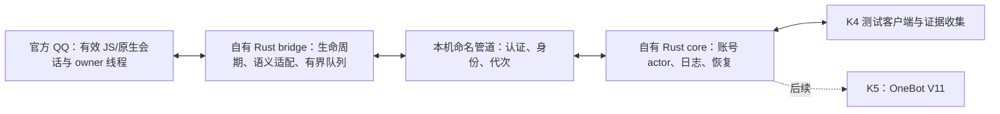

# Caligo K4 完整执行计划与指南：常驻内核、生命周期与恢复

> 日期：2026-10-07，Asia/Shanghai。执行者：用户；本轮交付：计划文档。
> 状态：待执行。本文没有实施源代码变更，也没有恢复 QQ 注入或发送实验。
> 源码锚点：6fd83294774d01e1627ad8c5492de539f41c52ac，main。
> GitNexus：Caligo 自身索引，2026-10-07 12:27:49 +08:00，与当前提交及覆盖文件一致；native CLI 1.6.12，PDG 部分结果见 §5。未借用 Stella 的索引。
> 证据 provenance：schema 2；全局脏状态摘要 002ee4f9b6579ea2ca8569615297076efa28426962bb941f5f6cee96808f13b5；22 个引用路径的完整摘要见 §11。仅排除本文路径。
> 标记说明：[verified] 源码/文档核实；[graph] 图查询结果；[inferred] 基于证据的判断；[assumed] 尚待实测的前提。新增模块、接口、命令和阈值均是本计划的提议。

**K4 的目标：把已有的真实收发能力整理成可持续运行、可停止、可恢复的自有 QQ 内核。最先解决的问题，是在 QQ 拥有的线程和有效上下文中完成首次初始化。这个前提不能成立，就停止 QQ 现场部分，保留离线成果。**

阅读顺序：先看 §1 的目标、§6 的设计和 §7 的操作；实施时对照 §8 的测试与 §13 的验收。§2–5、§10–11 给实施者定位源码及证据。本文覆盖完整 K4，同时补齐检测报告指出的 G1/G2/G3 前置缺口。K5 的正式 OneBot V11 服务仍在后续阶段。

## 1. 目标、边界与交付层级

### 1.1 最终链路与本轮范围

沿用已确认的路线：官方 QQ 提供登录、会话和网络；Caligo 自行拥有进程内 Rust bridge、IPC、进程外 Rust core，以及之后的 OneBot V11 实现。运行时不得依赖 SnowLuma、NapCat、LLBot、PMHQ 等第三方 QQ 内核。允许为宿主装载编写最小、来源清楚的本地 JS 引导代码；核心调度、传输、状态和接口仍用 Rust。[verified：原计划 §1、§3、§7]

首版冻结 Windows x64、一个明确 QQ 版本、一个指定测试账号、好友私聊和普通群文本。图片、语音、文件、频道、多账号、多版本自动适配、脱离官方 QQ 的独立登录/协议栈不在 K4。

本阶段需要实现：

1. 每个 QQ 宿主代次完成一次初始化；持续监听和 IPC 通信，不再通过逐条启动 CLI/探针读取结果。
2. 在生命周期正确的宿主线程调用接收/发送接口，明确对象持有、失效和关闭规则。
3. 区分 QQ 宿主代次、账号会话代次、core 连接代次；拒绝旧对象、旧请求和未知版本。
4. 用有界 IPC、请求日志和明确状态处理重连、取消、超时、迟到回执及队列溢出。
5. 保留真实消息身份及方向，补齐群/私聊收发样本；不能以正文猜回执。
6. 完成正常停止、至少三轮指定 QQ 重启与 core 重连，以及有记录的持续运行测试。

### 1.2 三种结果分别报告

| 层级 | 能证明什么 | 不能据此声称什么 |
|---|---|---|
| K4-LAB | 自建宿主中的状态机、线程调度、IPC、取消和资源收尾正确 | 已接通 QQ 的私有接口 |
| K4-FIELD / G4 | 指定 QQ 版本的接入、真实收发、重启重连、正常关闭可复核，G1–G3 缺口已闭合 | 多版本、长期生产或断线期间无丢失 |
| K5 / G5 | 自有内核之上正式完成 OneBot V11 行为验收 | K4 通过就自动等于 OneBot MVP |

最终交付至少包括：bootstrap 契约、生命周期契约、事故核对表、实现及构建记录、自动测试结果、真实收发样本表、重启/关闭/持续运行报告、消息身份与结果关联策略。现场失败也要给出具体阻塞点与下一条研究路线，不能只写“继续调试”。

## 2. 当前行为与检测报告结论

### 2.1 已经得到的能力证据

- [verified] 三份接受记录分别记载群消息发送、私聊接收及对端确认的私聊发送、参数化群发送。参见 `docs/acceptance/k3-send-001.md`、`k3-d-receive.md`、`k3-f-param-send.md`。这些是执行者的现场记录，本轮没有重新发送或独立重现。
- [verified] 检测报告核查到接收样本中的原生身份重复、文本裁剪、两态 ARM/READ 行为，以及发送日志中生成 ID/Promise 与终态关联不足。报告对“全部无丢失”和“生产层定型”的表述没有给出通过结论。
- [verified] 当前存在四个 crate：model、bridge、core、cli；core 目前有 IPC 编解码和握手契约，尚无本文提出的完整生命周期运行时。
- [inferred] 项目已有真实收发的研究原型。现阶段还不能称为稳定自有内核或正式 OneBot V11 MVP。

### 2.2 当前实际调用链

`onebotd::main → cli_inject → caligo-cli inject / cmd_inject → winutil::inject_and_probe → 远程线程导出 → async_run / exec_run → async_cb → QQ JS/原生会话服务 → JSONL → CLI 输出解析/HTTP 转发`。[verified]

关键位置：

| 文件及位置 | 当前行为 | K4 必须处理的缺口 |
|---|---|---|
| `caligo-core/src/bin/onebotd.rs:58–118` | ARM、每轮 poll、STOP 都重新调用 CLI inject | 同一宿主持续通信；不得让旧服务自动重启探针 |
| `onebotd.rs:129–132` | ctrl_quit 永远返回 false | 正常停止和故障退出实际接线 |
| `caligo-bridge/src/asyncrun.rs:846–1102` | 全局状态重置、泄漏式对象持有、每轮创建 handle | 按宿主拥有资源，明确并发和关闭 |
| `asyncrun.rs:512–626` | 回调读取全局 ENV/MODE；V8 检查顺序不足 | 所有宿主 API 前验证 owner/context/lifetime |
| `caligo-cli/src/winutil.rs:913–964` | 等待后释放远程参数，再判断等待结果 | 超时不等于远程线程已经结束 |
| `caligo-bridge/src/lib.rs:365–371` | exec 导出仍可调用 | 文档暂停必须落实为默认拒绝 |
| `caligo-core/src/ipc.rs:91–205` | v1 Hello 校验版本、基线和可选账号 | 进程身份、认证、代次、事件与动作语义 |
| `caligo-model/src/lib.rs:72–115` | RunId 和 NativeMessageRef 仍是早期模型 | 分离代次、完整原生身份、结果关联 |

上述路径统一位于 `crates/` 下。旧入口的存在只用于研究定位，不表示可继续执行。

### 2.3 事故结论的处理

[verified] `local-evidence/k3-g/final-boundary.md` 禁止继续对存活 QQ 做注入类探针，并列出六次实例损失。该列表不能直接解释为整个项目历史总数。

[verified] 它引用的 `k3-e/7f75e838-c0a9-4c19-b6a0-452dbc33e2f2.json` 在 frame 6 记录了 `caligo_bridge_diag2.dll`，offset 108632，与“无 caligo 帧”的文字不一致。该 JSON 本身还不足以把所有事故映射到唯一 PID/时间/构建。

[inferred] “累计磨损不可避免”“所有自有 bridge 路线不可行”尚未得到充分证明；也不能反向声称本计划已消除崩溃。K4 保留现场暂停，先核对事故，再验证新的宿主所有权方案。访问违规、FFI 线程错误、对象失效和释放时序要分别调查。

## 3. 相关架构与职责边界

### 3.1 建议的常驻链路



QQ owner 线程只做必要的接口调用、结果转为自有数据、有限入队。文件写入、命名管道等待、重连退避和日志落盘放在自有工作线程/core。宿主线程不能等待一个只能由自己推进的关闭回调。

职责：

- model：纯数据类型、身份、事件、动作、错误和状态；不保存地址或 JS handle。
- bridge：宿主入口、合法引用、语义适配、调度和资源清理；不在这里实现 OneBot 或业务重试。
- core：账号状态 owner、IPC 会话、持久请求状态、事件整理、健康与恢复；不直接访问 QQ 地址。
- cli：指定实例确认、版本/构建校验、启动/状态/停止入口和取证；正常动作不再调用旧 inject。
- 自建测试宿主：可控制线程、回调、GC、退出和假会话服务；与真实 QQ 边界明确。

[verified] libuv 的 loop/handle API 默认不跨线程安全，`uv_async_send` 是明确例外；初始化、关闭必须遵循宿主 loop 的所有权。参考 [libuv 设计](https://docs.libuv.org/en/v1.x/design.html)、[async handle](https://docs.libuv.org/en/v1.x/async.html)。本文用这些公开契约约束设计，不把最新文档版本当作 QQ 内嵌版本。

### 3.2 三种代次必须分开

| 身份 | 建议字段 | 什么时候变化 |
|---|---|---|
| 宿主 HostIdentity | PID、进程创建时间、QQ/关键模块 SHA-256、bridge build、随机 host nonce | QQ 新进程或旧环境销毁；同 PID 重用仍算新宿主 |
| 账号 SessionIdentity | HostIdentity、已验证账号、session_generation | 登录/登出、原生会话失效或重新绑定；不能跨账号沿用 |
| core ConnectionIdentity | core_instance_nonce、connection_epoch、协议版本 | core 重启或管道重新认证；不会自动让 QQ 重新初始化 |

`RunId` 不能继续同时代表三者。所有消息、动作及回执都携带相关身份。bridge 回调还需持有自身生命周期 token；仅比较 generation 不能修复悬空指针。

## 4. GitNexus 图谱发现与影响范围

[graph] 在当前 Caligo 索引对 `inject_and_probe`、`async_run`、`exec_run` 做 upstream impact，maxDepth=3；对 `async_cb` 做 context：

- `inject_and_probe ← cmd_inject ← cli::main`。
- `async_run ← caligo_async_run`；`exec_run ← caligo_exec_run`。
- `async_cb` 的图上 incoming 为空；源码把它作为函数指针传给 libuv，所以不能解释为“没有调用”。
- `onebotd` 通过外部进程启动 CLI，静态调用图没有完整覆盖该边界；由源码补证。

图上 LOW 风险只描述图覆盖范围。上述 unsafe 入口直接影响 QQ 进程，按高风险处理。动作状态、线程和释放顺序的改变影响 model → bridge/core → cli；K5 消费者还不存在，不为了图上的低调用数扩大现场实验。

实现前规则：每个现有符号编辑前做当前 index 的影响检查；只查即将编辑的符号及一层依赖，不重做全仓探索。若提交或引用文件改变，先核实索引/证据差异，再决定定向重建。原生地址、动态回调、外部进程启动均需要源代码和运行证据补齐。

## 5. 语句级 PDG 发现与顺序约束

### 5.1 async_cb：先验证，再进入任何宿主 API

[graph + verified] `pdg_query controls async_cb` 返回 38 条中的 12 条，属于部分结果。源码在 540 行读取 env isolate，553 行调用 HandleScope 构造，之后才在 570–573 行检查当前 isolate；当前条件允许 current 为 0。

实施约束：owner 线程、合法环境、当前 context、generation 和存活 token 的验证必须发生在 **第一个** V8/Node/QQ 调用之前，包括 HandleScope 构造。零 current 不能自行解释为可进入。读取到内存、vfptr 正确、页可读、loop alive 都不足以证明 GC 引用、会话和线程合法。

### 5.2 async_run：输入、共享状态与资源所有权

[graph + verified] `pdg_query flows async_run variable ctx` 返回 21 条中的 12 条；846–954 行涉及等待参数、mode、env、模块链、loop 和参数数据。后续源码有全局状态复位与回调读取，并将对象/script 长期持有。

实施约束：每项动作拥有不可变请求数据；回调捕获/引用到自身 owner，而不是读取可被下一次调用覆盖的全局槽位；宿主生存期之外不能复用 env、context、裸 tag 或服务对象。不要把 `Box::leak` 作为资源生命周期方案。

### 5.3 等待超时与释放顺序

[graph limitation] 对 loader 920 行的 PDG 种子返回 `pdg-no-block-at-line`，没有有效语句切片，不以空结果证明安全。

[verified] 源码在 async 等待后先关闭线程 handle、释放 remote_ctx/参数，再检查等待结果。`WAIT_TIMEOUT` 表示等待未满足，不是线程取消。[Microsoft WaitForSingleObject](https://learn.microsoft.com/en-us/windows/win32/api/synchapi/nf-synchapi-waitforsingleobject)

实施约束：只有确认线程终止/宿主释放所有引用才释放其参数。超时后保留资源记录、停止新调用，不使用 TerminateThread，也不通过延长等待或重试碰运气。生产链路移除逐次远程线程调用；研究入口若保留，也必须独立修复并默认禁用。

## 6. 拟议设计：执行前先固定的契约

### 6.1 B0：宿主拥有的 bootstrap，必须独立通过

首选研究 **自有 Node-API addon + 最小 QQ 宿主引导**：

1. 证明 QQ 本版本确实存在可使用、可恢复的本地装载位置，且引导在目标 QQ 的有效 JS 环境运行。记录位置、调用来源、线程和退出顺序。
2. 由宿主实际加载 addon，在真实初始化/回调参数里取得合法 `napi_env`；用宿主提供的引用机制保存服务对象/回调。
3. 在这个线程创建有界 ThreadSafeFunction（TSFN）等调度资源与清理钩子；自有工作线程只提交 owned 请求，宿主线程执行固定语义操作。
4. 指定宿主初始化一次。JS glue 不做业务、HTTP、日志轮询或通用远程 eval；QQ 会话服务/参数需要独立实测确认。

这是候选方案，**尚未证明 QQ 有可用装载点**。不能因为普通 Node 可加载 .node，就声称 QQ 可加载；也不能用扫描到的 Node 内部 Environment 指针冒充 `napi_env`。

[verified] Node-API 公开契约限制跨线程调用需要 env/value/ref 的 API，并提供 TSFN 和退出清理钩子；引用应限定于其 addon 环境。[线程调度](https://nodejs.org/api/n-api.html#asynchronous-thread-safe-function-calls)、[napi_env](https://nodejs.org/api/n-api.html#napi_env)、[对象生命周期](https://nodejs.org/api/n-api.html#object-lifetime-management)

备选保留原生 DLL 路线，但前提同样是 **有证据的宿主 owner 线程入口**。一次远程 LoadLibrary 只证明 DLL 被加载，不能授权在远程线程初始化 QQ loop 或进入 V8。若用 uv_async，必须先在合法 loop 线程初始化，跨线程只负责入队和唤醒，关闭在 owner 线程完成。成功初始化的 handle 用 uv_close 并在关闭回调后释放。[libuv handles](https://docs.libuv.org/en/v1.x/handle.html#c.uv_close)

B0 文档必须填写：宿主进程角色、装载点、真实回调来源、API/ABI版本、owner线程、合法环境来源、引用持有、会话失效信号、cleanup来源、一次性初始化与版本拒绝方式。任一核心项 unknown，B0=BLOCKED。实施者可先完成离线部分，但不得用旧探针补跑现场。

### 6.2 宿主与账号状态机

建议状态：Detached → Bootstrapping → Bound → Active；异常进入 Degraded；关闭进入 Stopping → Closed；无法证明安全清理进入 Quarantined。

- Bootstrapping：只建立桥和调度，不接收业务发送。
- Bound：宿主/版本/账号已核实，接口及引用有效，但 IPC 未准备好。
- Active：身份、接口、IPC 和健康条件同时满足，才开放发送。
- Degraded：IPC中断、会话失效、队列/日志故障；停止新发送，记录观察缺口。
- Stopping：原子关闭入口；不会因迟到回执回到 Active。
- Closed：所有需要关闭的资源已确认收尾；可保留无业务能力的模块代码至 QQ 正常退出。
- Quarantined：停动作、停自动重连/重新装载；保留证据。不能把它当作正常关闭通过。

bridge 资源 owner 和 core 账号 actor 各自串行控制状态；IPC工作线程不得直接改宿主对象。一轮 core 重连只更换连接代次，不能重新注册同一 QQ 消息监听器。同 QQ 进程逻辑重绑定只在 cleanup 完成、会话重新核实时进行。

### 6.3 资源所有权清单

| 资源 | owner | 创建与释放规则 |
|---|---|---|
| env/context/service/回调引用 | QQ宿主环境 | 真实初始化/回调获得；合法引用固定，失效立即停止访问；owner线程清理 |
| 消息监听器与确切token | session owner | 每个有效会话一次注册；保存实际token；只移除本桥注册项并确认结果 |
| TSFN / uv_async | bridge宿主owner | 首次合法入口创建；关闭协议/回调后释放；无逐消息初始化 |
| 入站/出站数据 | Rust owned对象 | 从宿主复制后入队；不能跨线程保存借用的 JS 数据/栈指针 |
| 命名管道/I/O任务 | 自有transport线程 | 支持取消/断连；等待I/O退出后销毁缓冲 |
| 执行中动作上下文 | bridge request registry | 回执完成或环境确认销毁后释放；超时不证明回调已结束 |
| 请求日志/接收账本 | core | 单owner写入，有界恢复/保留策略；落盘失败关闭发送入口 |
| 旧loader远程缓冲 | 研究工具ledger | 确认线程终止后释放；超时留存并隔离，不再生产使用 |

对所有 FFI 边界规定 panic 策略，阻止可展开 panic 穿越边界；不能以 catch_unwind 捕捉访问违规。DllMain 保持当前最小行为，不在 loader lock 下创建工作系统。

### 6.4 IPC v2：从字节契约到运行契约

保留现有 CLG1 framing 和 1 MiB 单帧上限，语义协议升 v2；v1 不悄悄兼容。拟用本机 Windows 命名管道：core 为 server，bridge 的工作线程为 client。

握手包括：协议/build、HostIdentity、SessionIdentity、ConnectionIdentity、能力、认证证明、恢复游标。双方检查指定 PID+创建时间、版本摘要和账号。管道设置当前用户 SID ACL、拒绝远程客户端；使用 OS 随机源生成一次性凭据，通过已证明的 bootstrap 私有通道交付；不把密钥写入 CLI 参数或普通日志。单用 pipe 名和 self_id 不构成认证。记录 threat boundary：同用户恶意进程不在本阶段强隔离保证内。

消息类型建议固定为 Hello/Ack、Health、Event/EventAck、SendText、CancelQueued、QueryRequest、ActionState、Stop/Stopped、Gap、Reject。消息均校验 schema、大小、身份和代次，拒绝未知动作；不开放 arbitrary JS 执行。

建议初始限额（配置化并在测试报告固定实际值）：

- 单帧 ≤1 MiB；增量解码不能先把任意大小输入整块复制进缓存。
- 事件队列/replay：最多256项且总字节≤8 MiB，任一限额到达即处理溢出。
- 动作队列≤32项；初期原生发送最多1项执行中；结果/控制通道预留容量。
- 单次宿主drain最多32项，随后让出线程；有剩余则继续调度，不能等下一条业务消息才唤醒。
- heartbeat 5秒，连续3次未响应进入 Degraded；使用单调时钟，断连只停止准入，不做释放证明。
- 重连退避1/2/4/8秒，上限30秒；只重连管道/重新验证，不能自动重发业务或重新注入。

TSFN 使用非阻塞、有界队列；uv_async 分支必须处理唤醒合并，不能认为一声唤醒等于一条消息。不能假设 QQ 的 libuv 版本有最新内存顺序保证；正确性来自经过测试的 Rust同步与版本契约。

### 6.5 事件身份、去重与断线窗口

事件包含：账号、会话种类/peer、原生消息身份、sender、自发方向、全文、平台时间（若有）、本地观察时间、来源类型、session_generation、event_seq。原生ID用不损失精度的opaque字符串；QQ peer UID/UIN 与群号分别记录，不相互猜转换。

- 会话键至少是账号 + private/group + 原生peer；相同数字的群/私聊不合并。
- 接收/更新/历史回补通知分别识别。去重按账号+原生会话+原生消息ID及已验证语义；同正文的两条消息必须保留。
- 本人手动发和本桥发送都不伪装成 incoming 他人消息；程序发消息有 request关联，手动自发可无关联。
- 桥缓存中的 EventAck 只在 core 记录到持久接收账本后前移。ACK丢失可以重放事件，不能重放发送动作。
- 缓存不足、core长断线、QQ退出或未观察期记录 Gap，含范围/原因/精度限制。若无法给平台消息范围，明确记录本地观察窗口，不能编造缺失条数。
- 现场正常样本要求完整；溢出故障用例要求明确报告 Gap，允许 Degraded，不能把声明的故障当“无丢失”。

首版不保证 QQ 离线消息或所有历史补回。新 session 重新注册是正常操作，旧 session 的事件/回执只进入旧代次证据，不发布到新业务链。

### 6.6 发送状态、持久日志与 delivery_unknown

拟议动作：`SendText(request_id, session_identity, target, text, payload_hash, deadline)`。request_id来自持久ID空间/OS随机，payload_hash覆盖全部语义参数。相同ID+不同参数拒绝；相同ID重查状态，不能再次执行。

状态建议：

```text
accepted → queued → native_started → confirmed_success
                   └─────────────→ confirmed_failure
accepted/queued → cancelled_unsent（仅桥确认从未开始调用）
native_started / dispatch不确定 → delivery_unknown
```

core 要先持久记录请求，再确认 accepted；调用bridge前持久记录 dispatch_intent。bridge按session保存已见 request_id及状态，并在真正进入QQ调用前记 native_started。重连只 QueryRequest；核心崩溃于“意图已记录、桥执行确认尚未收到”的窗口，默认未知，不能为了“至少送达”重新派发。

receipt契约至少区分三项：提交时生成的candidate_id、QQ服务结果/Promise完成结果、实际消息原生ID及对端观察。必须用本版本接口字段或经过验证的状态通知来关联 request_id，禁止按相同正文/接近时间猜测。

confirmed_success 的含义必须写入契约：例如“QQ服务明确成功且已关联实际原生消息身份”；不等价于对端已读。现场验收再独立核对对端实际收到。如果本版本只能拿到Promise存在、生成ID，或缺乏可靠关联，就不能完成发送成功契约，G3保持未闭合。

资源限额也覆盖幂等账本：bridge已见请求表初值最多4096项且总字节≤8 MiB，先达到任一限额就拒绝新发送并报告容量耗尽；本session内不能为了腾空间删除仍可被重提的ID。结果数据与引用分离，清理引用不清除request身份。core journal/事件账本建议总量上限1 GiB，达到上限或无法落盘即Degraded。归档必须保留请求去重与代次拒绝所需的索引；未实现可证明的压缩/归档前不得自动删除旧记录或声称无限运行。事件去重窗口至少覆盖桥的replay窗口，超出可恢复范围报告Gap。

迟到明确回执可追加证据、更正“当前已知结果”，但不能重开动作、再次发送或覆盖原未知记录。终态具有revision/历史，重复回执幂等；旧代次回执只更新旧请求的审计记录。仅桥确认未执行的请求才算cancelled_unsent；core单方面超时不能做该断言。

建议发送等待deadline30秒，作为用户等待策略，不是资源释放时刻。无法确认native是否执行即delivery_unknown。写入日志失败、版本不匹配、身份过期、队列满属于明确拒绝/未受理，不混成发送失败。

### 6.7 关闭协议与故障恢复

正常停止顺序：

1. core/bridge关闭新动作入口，持久记录Stopping。
2. 取消可证明未执行的队列项；对执行项有限等待，结果未知则明确记录。
3. 在owner线程解除确切监听器，停止新业务事件生产；已发布事件按账本/Gap收尾。
4. owner线程释放引用、关闭TSFN/uv资源，等待其清理回调和在途回调退出；不在owner线程同步等自身回调。
5. transport取消并回收I/O、工作线程；保留到最终Stopped确认的控制能力，或由独立状态通道核验闭合。
6. 发出/记录最终关闭证据，资源计数回到契约基线。DLL代码可留至QQ进程正常退出，不要求危险热卸载。

建议正常停止观察窗口10秒。超限时进入Quarantined并报告未闭合资源，不强行FreeLibrary，不释放在用缓冲，不TerminateThread；停止自动实验，等待执行者按指定实例纪律结束测试。进程确已退出可作为该进程资源消亡证据，但不能替代“正常逻辑停止通过”。

core非正常退出：bridge停止接收发送、保留有界缓存/已见请求，继续记录缺口，允许认证后连接恢复。QQ退出：core使Host/Session立即失效，已执行或是否执行不明的请求标未知；新QQ必须重新核实模块、账号、入口，禁止复用地址。版本变更拒绝并等待适配研究。

## 7. 完整执行顺序与操作指南

### 7.1 先按依赖顺序推进

`D0冻结 → D1事故核对 → D2入口契约 → D3模型/状态/日志 → D4自建宿主 → D5真实IPC → D6现场准入 → D7无发送接入 → D8接收 → D9发送 → D10恢复 → D11持续运行/收尾`。

D3–D5可在D2现场可行性未定时做离线开发，但不能越过D6。对单个任务依次实现和验收；不要先写正式OneBot再用HTTP演示代替核心验收。

| 工作项 | 建议投入，非保证工期 | 独立交付/退出条件 |
|---|---:|---|
| D0–D1 | 1–2工作单元 | 默认关闭旧实验入口，事故证据可映射 |
| D2 | 先给3个半天研究单元 | 入口契约有依据，或明确BLOCKED及失败原因 |
| D3–D5 | 6–10工作单元 | K4-LAB通过，完整运行链接线 |
| D6–D9 | 3–5工作单元 | 新路线无发送准入、群私聊完整收发 |
| D10–D11 | 2–4工作单元 | 三轮恢复、正常停止、持续运行报告 |

一个工作单元按执行者实际可投入时段记录，不能据此承诺几天完成QQ私有入口。D2失败时余下现场工期不成立。

### D0 — 冻结旧现场路线，把暂停落实到程序

**操作：**

1. 保存当前HEAD、工作树状态、QQ模块/旧bridge哈希和实验文档，不覆盖旧JSONL/PDB/DLL；给旧代码标记research legacy。
2. CLI的inject/async/exec业务入口默认拒绝。bridge导出也独立拒绝，不能只封CLI；研究feature默认关闭，只在自建宿主保留需要的研究能力。
3. 旧onebotd退出并提示旧路线停用；不调用cli_inject，不自动加“指定测试实例确认”。不将旧ARM/READ脚本设为新runner默认。
4. 核查所有相关导出和脚本启动边界，避免绕过入口。研究feature不是恢复QQ实验的许可。
5. 修正文档“生产层定型”和“已关闭全部hook”等结论，保留历史事实和本次复核；README说明当前真实层级。

**交付：** 新增 `docs/research/k4-execution-scope.md`、默认门控及门控测试、基线记录。
**验收：** 普通构建下CLI/导出/旧onebotd无法执行旧QQ调用，调用计数为0；模型/IPC现有测试继续可用。
**失败分支：** 找到漏入口先封闭，不通过跑QQ证明门控；依赖暂不支持feature拆分可直接返回明确禁用错误。

### D1 — 事故离线核对与资源审计

**操作：**

1. 建立事故表：事故ID、PID+创建时间、平台/本地时间及时区、bridge构建SHA/PDB、QQ模块SHA、操作阶段、报告路径、异常码/故障线程、完整栈及确定/未知项。
2. 核对7f75e838的frame6，把它映射到当次构建/源码；若二进制或PDB缺失，写“无法定位”，不要拿新构建偏移套旧栈。
3. 对每轮远程线程、参数缓冲、uv handle、服务对象和监听器做创建/持有/关闭账本。重点检查timeout时仍被引用的内存、HandleScope前提、context rooting及重复注册。
4. 把“已证实事实”“候选根因”“仍缺证据”分别填写。即使不能还原全部事故，也必须让新设计覆盖已知资源风险。

**交付：** `docs/research/k4-incident-register.md`，脱敏摘要；原始dump和构建只放local-evidence。
**验收：** 不再出现无依据的“无Caligo帧”；每项历史损失可追溯或明确缺失，设计约束指向具体风险。
**停止条件：** 不为补事故证据重现QQ崩溃。崩溃复现只在自建测试进程开展。

### D2 — 证明首次初始化入口和会话所有权

**操作：**

1. 离线检查已安装QQ构建、导出、装载记录、自己的旧证据，记录本版本实际Node/N-API/libuv能力；不新增存活QQ注入。
2. 比较Node-API addon装载和原生owner入口两条候选，填写§6.1的B0表；选择一条，禁止把两条的有利假设混拼。
3. 先在自建Node宿主证明addon ABI、owner线程、TSFN/清理契约；QQ装载点、账号/会话和API契约仍单独待证。
4. 若QQ路线只有“扫描内存后调用”，B0不通过。若确需恢复现场验证入口，先完成D3–D5/D6条件，再在D7做一次限定验证；候选契约与现场确认分开标记。
5. 三个研究单元后给阶段结论。可延长离线研究，但不能用循环换实例试错填空。

**交付：** `docs/research/k4-bootstrap-contract.md`，包含候选选择、逐项证据、owner/cleanup流程和待现场核实点；更新原生入口及加载路线文档。
**验收：** 离线候选可解释合法首次调用，不假定未知句柄；D7取得真实QQ证据后B0-FIELD才通过。
**失败分支：** 无合法装载点/owner入口 → 标K4-FIELD BLOCKED，保留LAB；提出A2内部协议边界研究的单独范围，仍需证据。两路均失败才另拟独立协议客户端计划。不可自动换现成后端。

### D3 — 先实现纯Rust模型、账号actor和请求账本

**操作：**

1. 按§6.2定义三种身份、事件、固定动作、拒绝原因和状态迁移；旧RunId迁移映射明确。
2. 单actor处理生命周期、身份验证和动作登记；校验在调度前和native调用前各有一层。
3. 实现append-only请求journal及接收账本，明确fsync/提交点、记录版本、长度、校验、损坏尾部恢复、限额和归档。默认不静默重建账本。
4. 先接fake native adapter，注入拒绝、延迟、回执重复、不同代次、日志故障和进程崩溃窗口。
5. 完成native_started/dispatch_intent不确定窗口的恢复；启动后逐项QueryRequest，不自动发送。

**交付：** model扩展；新增core/runtime、journal；生命周期契约；自动测试。
**验收：** 状态由已定义输入驱动，无法越过owner/代次；重启不重发；取消未执行有bridge证明；未知可审计。
**失败分支：** journal不可写/损坏中段 → Degraded、拒绝发送、保留原文件；不以删库/换request_id继续写。

### D4 — 建立自建宿主，验证调度和资源关闭

**操作：**

1. 制作Windows测试宿主：一个owner线程/Node环境，假会话服务，同构的listener和send语义；明确它是测试夹具。
2. 使用D2选定调度分支初始化resident，worker提交owned动作，回调按session token入队。测owner/thread/context检查发生在任何宿主API之前。
3. 强制GC、延迟回调、环境销毁、同进程环境重建、cleanup与callback竞争、唤醒合并、重复stop、关闭中入队。
4. 统计资源：bootstrap、listener add/remove、调度init/close、refs acquire/release、inflight、I/O、队列项/字节。10,000次非发送调度及100轮关闭/重建只在自建宿主执行。
5. 关闭后旧callback测试不得解引用已销毁owner；不能为了计数归零提前释放。

**交付：** 新增host harness、resident/thread adapter、生命周期测试/计数报告。
**验收：** callback只在owner执行；正常关闭资源回基线；旧代次触碰原生计数为0；分配不会随调度次数增长；测试宿主无崩溃/死锁。
**失败分支：** 宿主崩溃、owner未证、cleanup失配 → 停止该分支修设计，禁止进入QQ现场。

### D5 — 接入真实命名管道与持续core运行链

**操作：**

1. 补IPC v2语义及增量限额；实现SID ACL、认证、指定进程校验、管道worker与I/O取消，补必要windows-sys feature。
2. 接线 `host harness → resident → pipe → runtime actor → journal → test client`，不通过JSONL文件轮询。
3. core支持状态/停止/请求查询；Ctrl+C或控制请求走真实Stopping协议，非正常core终止走断连恢复。
4. 测半包/粘包/超长输入、认证错误、伪账号、错误版本、PID复用、队列满、慢core、ACK丢失、replay超限和重连。
5. 限定故障注入为新建测试宿主/core进程，记录PID与创建时间；不杀现有QQ或无关服务。

**交付：** 新增core/transport、`caligod`和test client（名称提议），IPC与运行时集成测试、K4-LAB报告。
**验收：** 所有§8离线用例通过；持续通信不启动CLI inject；core退出三轮不重复native动作/监听器；限额和Gap实际可观察。
**失败分支：** 队列阻塞宿主、恢复依赖重注入、token泄露或身份误接 → 回相应契约整改。

### D6 — 现场准入检查，只准备新设计

逐项填写PASS/FAIL/UNKNOWN，UNKNOWN等同未通过：

- D0默认封闭、D1事实核对、D2候选合法来源、D4/D5-LAB通过。
- 版本/build/module摘要、API版本、指定账号和peer样本、进程角色/创建时间明确。
- 每项unsafe有入口/线程/生命周期契约；尚待现场验证的入口风险和最小调用明确。
- 日志、资源计数、stop和Quarantined路径已接线；一次崩溃/身份漂移立即停的条件落实。
- 只对新建指定QQ测试实例，用新bridge构建；旧probe/通用exec/onebotd不可复用。
- 模块装载策略不改无关安装或服务，版本失败拒绝；人手可恢复指定测试实例。

**交付：** `docs/acceptance/k4-field-entry.md`。
**验收：** 条件闭合才能执行D7。这里的PASS只准入最小初始化验证，不代表B0已经现场通过。
**失败分支：** 保持现场暂停，报告缺项和对应D编号；不以“现在只测试一次”跳过条件。

### D7 — 指定QQ一次接入，先不开放发送

**操作：**

1. 新建指定测试实例，记录PID+创建时间、完整模块/bridge摘要、账号别名与时间。
2. 走D2确定的bootstrap。记录宿主回调来源、owner线程、真实环境、会话与cleanup可见性；不测试通用脚本。
3. 只开放Health/身份/停止能力，观察10分钟。core断开/恢复一次，确认bootstrap和listener init不随连接增加。
4. 正常Stop，验证清理证据；若需要新的现场阶段，只有当前生命周期已Closed，才能按契约重新绑定或新建实例。

**交付：** B0-FIELD证据、首次接入/正常停止报告。
**验收：** 合法owner入口及对象生命期成立；身份正确；进程稳定；stop闭合。若日志只能说“DLL加载成功”，不通过。
**停止条件：** AV、QQ非预期退出、线程/context不符、cleanup不闭合、token/账号不符；进入Quarantined。不得立即换PID继续试。

### D8 — 常驻接收，补齐G2样本

**操作：**

1. 同一生命周期注册一次消息监听；持续IPC输出，不重ARM，不用旧全局数组读文件。
2. 好友私聊10条、普通群10条唯一测试消息，另外纳入同正文两条、本人手动发、重复update。每条对照QQ可见消息与core事件。
3. 至少一条>600字符文本，包含中文/换行/emoji；比较完整正文长度/摘要，不将日志裁剪当核心裁剪。
4. 对方向、账号、private/group、peer、sender、原生ID、平台时间来源和event_seq逐项验收。
5. 注入队列溢出只在LAB；现场温和断连检查缓存/Gap。不保证断线期间完整历史回补。

**交付：** `docs/acceptance/k4-receive.md`及脱敏样本索引，原文只留local-evidence。
**验收：** 20条必测消息身份/正文正确；同正文不同ID均保留；更新不重复发布incoming；任何缺口明确记录；监听器数量稳定。
**失败分支：** 字段未知或文本裁剪 → 改适配投影并离线回归；不能靠猜sender/peer补齐。

### D9 — 参数化发送与可靠结果，补齐G3

**操作：**

1. 先发1条私聊和1条群文本，对端核对身份与全文；结果关联、回调清理成立后各扩3条，再完成每类10条。总样本各10条可包含前序样本。
2. 每次记录request_id、session、目标、payload摘要、状态时间线、native结果、实际原生ID及对端观察。发送串行，不做现场压力试错。
3. 两条相同正文采用不同request_id，证明按ID/接口字段关联；相同request_id再次提交只查询旧状态，实际QQ调用次数仍为1。
4. LAB验证取消/超时/崩溃窗口；现场至多用受控core断连观察已发送请求的未知状态，不人为破坏QQ回调内存。
5. 明确接口成功与对端接收两份证据；不把candidate_id或Promise对象写成成功。

**交付：** `docs/acceptance/k4-send.md`、receipt关联契约和样本账本。
**验收：** 私聊10+群10均被正确对端观察并可关联；失败/未发送/未知区分；异常情况下无自动重发；旧代次动作在native前拒绝。
**失败分支：** 无可靠回执映射 → G3未闭合，保留真实发送能力但暂停后续“稳定内核通过”结论。

### D10 — 三轮QQ重启与core重连，验收G4

每轮按同一表记录：

1. 指定QQ Active状态下完成一组群/私聊收发；正常停止或按用例由执行者正常关闭指定QQ。
2. core立刻使旧Host/Session失效；测试客户端提交旧代次发送，收到明确stale拒绝，QQ原生调用计数为0。
3. 启动新的指定QQ，重新核实PID+创建时间、模块、账号及入口。新host nonce/session出现；地址从新合法入口获取。
4. 新实例完成收发；断开/重启自有core，重新认证和查询journal，确认QQ监听器没有重复注册、旧请求没有重派发。
5. 本轮结束执行正常Stop，资源回基线。记录未观察窗口，不宣称窗口内无消息丢失。
6. 三轮之外，在LAB/拒绝层验证未知模块哈希、错误协议、账号错配、PID数字重用；不必安装/升级用户QQ来制造版本失败。

**交付：** `docs/acceptance/k4-recovery.md`，至少三组完整QQ重启+core重连循环，每组证据表。
**验收：** 三轮全部成功；旧发送被拒绝；重连不重复bridge装载/监听器/动作；版本失败明确拒绝；正常停止闭合。
**失败分支：** 任一轮非预期QQ退出或旧请求执行 → G4失败，停止现场；离线定位后以新构建重新执行完整三轮，不抹掉失败记录。

### D11 — 持续运行、最终关闭与执行报告

**操作：**

1. 固定同一QQ生命周期，连续2小时受控群/私聊文本收发与健康观察；频率由测试约定，首轮低负载且不得向无关群发压测。
2. 定期记RSS/句柄数与自有资源计数、队列项/字节、回调线程、native异常、event gaps、请求状态、重连次数。
3. 要求bootstrap=1，正常活跃session监听器=1；计数随连接/消息增加不产生持续增长。系统RSS波动只作辅助，不能凭RSS证明原生资源释放。
4. 正常Stop，确认资源基线、无新native调用和控制终态；同一实例之后手动正常QQ操作并观察10分钟。
5. 汇总所有PASS/FAIL/UNKNOWN和现场范围，更新README/native-entry及路线文档；只有§13全通过才开始拟定K5执行计划。

**交付：** `docs/acceptance/k4-runtime.md`、构建/资源报告、故障矩阵、最终结论。
**验收：** 无QQ异常退出/AV；正常样本无未解释漏收/错归；增长受限；stop闭合；不把2小时试验扩写成长时间生产保证。
**失败分支：** 保存当前证据停止现场；优先查owner/lifetime/释放/队列。不得恢复高频旧probe作为诊断捷径。

### 7.2 现在最先执行的范围

第一批只做D0、D1、D2候选研究、D3模型/日志及D4自建宿主。完成后给出“入口契约状态 + LAB测试结果 + 剩余缺项”。只有这些有了具体证据，才进入D5/D6并安排QQ现场。首次阶段报告不要求真实QQ发新消息。

每个步骤结束建立小提交；提交前校验影响范围及测试。生产入口默认保持关闭直至相应准入阶段。失败保留构建与证据，回退自己的变更；不停止无关用户进程。

## 8. 测试策略、命令与证据格式

### 8.1 必须覆盖的场景

| 编号/原计划映射 | 测试输入与操作 | 预期及位置 |
|---|---|---|
| L01 / T01 | 模块摘要不匹配请求绑定 | 明确拒绝，零native调用；LAB+现场拒绝层 |
| L02 / T02 | 版本/账号/凭据错误、远程pipe、错误进程身份 | 拒绝、不跨会话；真实IPC集成 |
| L03 / T03 | 同数字private/group peer | 两个会话；model/runtime |
| L04 / T04 | 同正文不同消息ID，同ID重复通知/update | 两条保留、重复incoming不发布、更新独立；LAB+FIELD |
| L05 / T05 | 本人手动发、程序发与他人incoming | 方向正确；FIELD |
| L06 / T06 | >600字、UTF-8换行emoji、空/超限正文 | 正文无裁剪；空/超限按契约拒绝；LAB+FIELD |
| L07 / T07 | 非owner线程、环境销毁、旧token、current不存在 | 宿主API前拒绝、零native触碰；host harness |
| L08 / T08 | 排队取消与native_started竞争 | 仅未开始项cancelled_unsent，无双终态/误称未发送 |
| L09 / T09 | 超时、core崩溃于dispatch_intent前后、bridge结果丢失 | 未确定项delivery_unknown，不自动重发 |
| L10 / T10 | 重复/迟到/旧代次回执 | 幂等审计，不重开、不进入新代次 |
| L11 / T11 | 两个同正文请求与同ID不同payload | 按请求身份关联；后者冲突拒绝 |
| L12 / T12 | 单字节分包、多帧大chunk、非法JSON、超长帧、两类队列满 | 内存有界、不阻塞宿主、明确拒绝/Gap |
| L13 | journal尾截断、校验损坏、不可写、ACK丢失与core重启 | 保守恢复/Degraded；已确认事件不重复业务发布 |
| L14 / T16 | QQ退出、PID复用、core重连、同进程环境重建 | 新旧身份隔离；QQ重启+core重连三轮FIELD |
| L15 / T17 | 慢消费者、超过replay项/字节限额 | explicit Gap/Degraded、控制和结果仍可收尾 |
| L16 / T18 | TSFN closing、uv唤醒合并、关闭时回调、停止两次 | 无UAF/死锁/逐请求handle泄漏；host harness |
| L17 | 10,000次非发送调度、100轮LAB关闭 | 资源计数平衡；不用于QQ压测 |
| L18 | 旧CLI/导出/onebotd直接执行，普通构建 | 默认拒绝，测试证明native调用计数0 |
| F01–F04 | B0现场、群私聊各10收/10发、三轮恢复、2小时运行 | 独立报告；不由LAB结果替代 |

原计划T18（normal stop与不能安全热卸载）由L16和D7/D10/D11覆盖。T13的OneBot signed ID映射、T14 echo、T15 OneBot认证/动作及正式Universal WS等留在K5。K4固定原生消息身份和传输认证，为后续映射保留数据。

### 8.2 当前可用的离线检查命令

在PowerShell、`E:\stella\Caligo` 执行：

```powershell
git status --short
git rev-parse HEAD
rustup show active-toolchain
cargo test --workspace --offline
cargo check --workspace --offline
```

[verified] workspace、工具链声明及现有IPC测试文件已核实。以上命令是执行时检查；本轮编写计划没有重跑构建/测试。若新增依赖不在缓存，offline失败只能说明缺缓存，先记录原因再按执行环境处理；不把它说成测试通过，也不自动下载QQ更新。

D3–D5实施后新增的定向命令提议：`cargo test -p caligo-core --test runtime_contract --offline`、`--test recovery_contract`、`cargo test -p caligo-bridge --test resident_lifecycle --offline`。这些test target当前不存在，只在对应文件完成后执行。Node宿主夹具要用已固定本机Node及与目标QQ兼容的API集合，版本记录入报告；桌面Node版本不是QQ版本证明。

新CLI的attach/status/stop/send/query命令语法由D5形成实际help与使用文档；当前仓库只有研究命令，本文不提供会被误执行的“现成K4命令”。不执行旧onebotd或inject示例来验证K4。

### 8.3 每条现场记录必须包含

建议所有证据放 `local-evidence/k4/<build>/<case-id>/`，不覆盖旧记录：

- case-id、步骤D编号、期待结果、PASS/FAIL/UNKNOWN。
- HEAD/工作树摘要、构建artifact哈希、QQ/模块摘要、PID+创建时间、账号/peer别名。
- 本地UTC与+08:00时间、单调时间；平台时间单独列并写来源。
- 三种代次、request_id/event_seq、状态转换、native结果/消息ID来源。
- 对端确认/截图或可复核观察索引；文本全文/摘要对照，敏感信息不进Git。
- listener/refs/调度/I/O/queue/inflight创建-释放计数、stop完成与实例存活情况。
- 错误、Gap窗口、未知结果、未闭合资源与停止原因。

自动测试、实际接线、现场接受记录分三栏，不把unit green替代QQ验收。最终报告给出“哪个构建、哪个版本、哪些用例通过”，保留失败史。

## 9. 风险、兼容与影响

| 风险 | 影响 | 控制/退出条件 |
|---|---|---|
| bootstrap无合法入口 | 整条QQ现场路线受阻 | B0独立门槛；不伪造ABI或把指针扫描当契约 |
| 宿主线程/对象失效 | QQ访问违规或晚发崩溃 | owner执行、合法引用、cleanup生命周期；异常停现场 |
| timeout提前释放 | UAF、远程线程迟到访问 | 终止/清理证明前保留资源；默认封闭旧导出 |
| 重连重派发 | 真实重复发消息 | journal + request查询；任何不确定窗口默认未知 |
| 监听/队列/引用增长 | 长跑损耗、漏收或卡QQ | 一次初始化、有界队列、计数、LAB循环与现场2小时 |
| v2和模型迁移 | 旧测试工具不兼容 | 明确版本拒绝，保留研究材料；旧onebotd不继续接线 |
| receipt缺乏关联 | 无法说明请求到底发了哪条 | 列为G3阻塞；不能按文本/时间猜 |
| core或QQ观察间隙 | 消息遗漏 | EventAck/有限replay和Gap；不承诺平台全历史 |
| 未知版本误接入 | ABI/布局失配导致崩溃 | full模块基线与能力验证，不只版本字符串 |
| 自建宿主与QQ差异 | LAB通过但现场失败 | 单独B0-FIELD/G1–G4，按阶段进入真实验证 |

必须可观测的事件：bootstrap_started/bound/rejected、session_invalidated、connection_changed、listener_created/removed、action_state、event_gap、shutdown_stage、resource_balance、quarantined。正文和认证凭据不能成为默认健康日志内容。

“自己的内核”指本链路实现及运行依赖可控，不等于脱离腾讯客户端或消除QQ版本/账号限制。独立QQ协议栈属于另一目标，不能偷偷扩大K4。

## 10. 预计修改的文件与职责

**以下是后续实施清单；本轮仅新增本计划。** NEW表示拟新增且不存在，具体命名可调整，但职责与验收不得减少。

| 文件 | 符号/模块 | 拟议变更及依赖 |
|---|---|---|
| `crates/caligo-model/src/lib.rs` | RunId、NativeMessageRef、SessionKey；NEW身份/状态类型 | 分离三代次、真实opaque消息身份、语义动作/结果；D3 |
| `crates/caligo-core/src/ipc.rs` | FrameDecoder::push、Hello、validate_hello | 有界增量解析、v2语义握手/认证/代次；D5 |
| `crates/caligo-core/src/lib.rs` | core模块导出 | 接线runtime/transport/journal，不让完整链成为未引用模块 |
| `crates/caligo-core/src/runtime.rs` NEW | AccountActor、请求registry | 准入、状态迁移、取消/未知/恢复；D3 |
| `crates/caligo-core/src/journal.rs` NEW | 请求journal、事件账本 | 提交点、损坏恢复、幂等/持久游标；D3 |
| `crates/caligo-core/src/transport.rs` NEW | NamedPipe transport | ACL、认证、身份、I/O取消/重连；D5 |
| `crates/caligo-core/src/bin/caligod.rs` NEW | main | 常驻core启动、Ctrl+C/Stop真实接线；D5 |
| `crates/caligo-core/src/bin/onebotd.rs` | main、cli_inject | 默认拒绝legacy启动；不扩大成正式OneBot；D0 |
| `crates/caligo-bridge/src/resident.rs` NEW | Resident、callback/owner/资源registry | 一次初始化、有界owned队列、关闭；D4 |
| `crates/caligo-bridge/src/host_adapter.rs` NEW | 选定Node-API或原生owner适配 | 真实bootstrap/引用/线程/cleanup；D2/D4；只实现被证实路线 |
| `crates/caligo-bridge/src/lib.rs` | caligo_async_run、caligo_exec_run、DllMain | legacy导出默认封闭，新入口接线；DllMain保持最小 |
| `crates/caligo-bridge/src/asyncrun.rs` | async_run、async_cb | 研究隔离；不得把全局回调方案复制到resident |
| `crates/caligo-bridge/src/exec.rs` | exec_run | 研究隔离，普通构建不可用；不公开通用eval |
| `crates/caligo-cli/src/main.rs` | cmd_inject；NEW控制入口 | 默认门控、指定实例校验、status/stop/query；D0/D5 |
| `crates/caligo-cli/src/winutil.rs` | inject_and_probe | 修正研究入口timeout资源ledger；生产逐次远程调用退役 |
| `Cargo.toml`、bridge/core Cargo.toml | feature/依赖 | default-off research、Windows管道所需feature、锁定依赖版本 |
| `crates/caligo-core/tests/ipc_contract.rs` | 现有测试 | 保留half-frame/版本/基线等回归，增加增量和v2用例 |
| core `tests/runtime_contract.rs`、`recovery_contract.rs` NEW | 状态/恢复集成测试 | journal、崩溃窗口、重连、未知、Gap |
| bridge `tests/resident_lifecycle.rs`、`tests/fixtures/k4-host.cjs` NEW | 同构宿主/生命周期测试 | 合法线程、GC、cleanup、计数；测试夹具无QQ依赖 |
| cli `tests/legacy_gate.rs` NEW | CLI/导出门控集成 | 防止旧工具绕过pause；不执行QQ调用 |
| `docs/research/k4-*.md`、`docs/acceptance/k4-*.md` NEW | §7交付物 | 每步PASS/FAIL/UNKNOWN和证据索引 |
| README、native-entry-contract、loading-route-decision | 文档 | 与当前能力/运行链一致；历史结论不当作新验收 |

需要下载新的N-API库或增设harness crate时，先说明库来源/API支持/为什么已有工具不足，记录锁文件；不为了便利导入第三方QQ内核。使用最少可证明的host ABI集合。

## 11. 可复用实施上下文

下列JSON是给执行者的定位与证据包。provenance由技能原始helper生成，未手算；它同时覆盖被Git忽略的报告/事故文件。新实现路径不作为“已存在源码”引用。

```json
{
  "implementation_context": {
    "task_summary": "仅执行Caligo K4：先封闭legacy现场入口并证明宿主bootstrap，再实现自有Rust常驻bridge/IPC/core及真实收发、关闭和三轮恢复；本文件当前仅为计划。",
    "acceptance_criteria": [
      "K4-LAB L01–L18及资源生命周期测试通过",
      "B0-FIELD证明QQ合法owner入口与引用/cleanup",
      "G2群私聊各10条完整接收，G3各10条实际发送及可靠关联",
      "G4至少三轮指定QQ重启+core重连、旧代次/版本拒绝及正常停止",
      "两小时受控运行，资源有界，无自动写重试，Gap和未知明确",
      "不依赖第三方QQ内核；OneBot正式实现延后K5"
    ],
    "evidence_provenance": {
      "schema_version": 2,
      "head_commit": "6fd83294774d01e1627ad8c5492de539f41c52ac",
      "generated_plan_path": "docs/plans/2026-10-07-gitnexus-plan-caligo-k4-runtime-recovery.md",
      "global_dirty_digest": {
        "algorithm": "sha256",
        "canonicalization": "gitnexus-evidence-provenance-v2 NUL-framed UTF-8 records",
        "value": "002ee4f9b6579ea2ca8569615297076efa28426962bb941f5f6cee96808f13b5"
      },
      "cited_path_manifest": [
        {
          "path": ".gitnexusignore",
          "object_kind": {
            "head": "absent",
            "index": "absent",
            "worktree": "absent",
            "untracked": "regular"
          },
          "state": "untracked",
          "rename_from": null,
          "rename_to": null,
          "head_digest": "absent",
          "index_digest": "absent",
          "worktree_digest": "absent",
          "untracked_digest": "sha256:c84287822e90a9b760ed408461f3a53602479475ddcbae5343ac41fb201695c0"
        },
        {
          "path": "Cargo.toml",
          "object_kind": {
            "head": "regular",
            "index": "regular",
            "worktree": "regular",
            "untracked": "absent"
          },
          "state": "clean",
          "rename_from": null,
          "rename_to": null,
          "head_digest": "sha256:a130f4007eb68bce2906243f55796028742e53b970d3d5aa394161a28f2c34aa",
          "index_digest": "sha256:a130f4007eb68bce2906243f55796028742e53b970d3d5aa394161a28f2c34aa",
          "worktree_digest": "sha256:a130f4007eb68bce2906243f55796028742e53b970d3d5aa394161a28f2c34aa",
          "untracked_digest": "absent"
        },
        {
          "path": "crates/caligo-bridge/Cargo.toml",
          "object_kind": {
            "head": "regular",
            "index": "regular",
            "worktree": "regular",
            "untracked": "absent"
          },
          "state": "clean",
          "rename_from": null,
          "rename_to": null,
          "head_digest": "sha256:87877644ff0e9439f4046b43ab34f6f585a8ac16e889aef63c2c1fc37565f395",
          "index_digest": "sha256:87877644ff0e9439f4046b43ab34f6f585a8ac16e889aef63c2c1fc37565f395",
          "worktree_digest": "sha256:87877644ff0e9439f4046b43ab34f6f585a8ac16e889aef63c2c1fc37565f395",
          "untracked_digest": "absent"
        },
        {
          "path": "crates/caligo-bridge/src/asyncrun.rs",
          "object_kind": {
            "head": "regular",
            "index": "regular",
            "worktree": "regular",
            "untracked": "absent"
          },
          "state": "clean",
          "rename_from": null,
          "rename_to": null,
          "head_digest": "sha256:f140a833c5c7308fba68d9b62aa9f8159ef8d692b4dc7d151d901376ab3d9071",
          "index_digest": "sha256:f140a833c5c7308fba68d9b62aa9f8159ef8d692b4dc7d151d901376ab3d9071",
          "worktree_digest": "sha256:f140a833c5c7308fba68d9b62aa9f8159ef8d692b4dc7d151d901376ab3d9071",
          "untracked_digest": "absent"
        },
        {
          "path": "crates/caligo-bridge/src/exec.rs",
          "object_kind": {
            "head": "regular",
            "index": "regular",
            "worktree": "regular",
            "untracked": "absent"
          },
          "state": "clean",
          "rename_from": null,
          "rename_to": null,
          "head_digest": "sha256:ccc68eeb66d260cbf7d78e4c1e2cec2c63fbc1d96c6ef0c95236d878df59604d",
          "index_digest": "sha256:ccc68eeb66d260cbf7d78e4c1e2cec2c63fbc1d96c6ef0c95236d878df59604d",
          "worktree_digest": "sha256:ccc68eeb66d260cbf7d78e4c1e2cec2c63fbc1d96c6ef0c95236d878df59604d",
          "untracked_digest": "absent"
        },
        {
          "path": "crates/caligo-bridge/src/lib.rs",
          "object_kind": {
            "head": "regular",
            "index": "regular",
            "worktree": "regular",
            "untracked": "absent"
          },
          "state": "clean",
          "rename_from": null,
          "rename_to": null,
          "head_digest": "sha256:b14f62bba46a2f5230aae40334f9d2d8e9e5736781326396355bd3bf35ca6cad",
          "index_digest": "sha256:b14f62bba46a2f5230aae40334f9d2d8e9e5736781326396355bd3bf35ca6cad",
          "worktree_digest": "sha256:b14f62bba46a2f5230aae40334f9d2d8e9e5736781326396355bd3bf35ca6cad",
          "untracked_digest": "absent"
        },
        {
          "path": "crates/caligo-cli/src/main.rs",
          "object_kind": {
            "head": "regular",
            "index": "regular",
            "worktree": "regular",
            "untracked": "absent"
          },
          "state": "clean",
          "rename_from": null,
          "rename_to": null,
          "head_digest": "sha256:d210b0335be717c3929f9229708a8edc9c57892d406f948b12c2d652c994d138",
          "index_digest": "sha256:d210b0335be717c3929f9229708a8edc9c57892d406f948b12c2d652c994d138",
          "worktree_digest": "sha256:d210b0335be717c3929f9229708a8edc9c57892d406f948b12c2d652c994d138",
          "untracked_digest": "absent"
        },
        {
          "path": "crates/caligo-cli/src/winutil.rs",
          "object_kind": {
            "head": "regular",
            "index": "regular",
            "worktree": "regular",
            "untracked": "absent"
          },
          "state": "clean",
          "rename_from": null,
          "rename_to": null,
          "head_digest": "sha256:6112c5893f0f82fc0fbf1dcd1243ef6538061fa7fdad76ce38ccb8b9abebcf22",
          "index_digest": "sha256:6112c5893f0f82fc0fbf1dcd1243ef6538061fa7fdad76ce38ccb8b9abebcf22",
          "worktree_digest": "sha256:6112c5893f0f82fc0fbf1dcd1243ef6538061fa7fdad76ce38ccb8b9abebcf22",
          "untracked_digest": "absent"
        },
        {
          "path": "crates/caligo-core/Cargo.toml",
          "object_kind": {
            "head": "regular",
            "index": "regular",
            "worktree": "regular",
            "untracked": "absent"
          },
          "state": "unstaged",
          "rename_from": null,
          "rename_to": null,
          "head_digest": "sha256:04daddb62d0143cb1b9e33ca7583654021433cb7079d8c81333b39dc45dbdb77",
          "index_digest": "sha256:04daddb62d0143cb1b9e33ca7583654021433cb7079d8c81333b39dc45dbdb77",
          "worktree_digest": "sha256:a08b8962861ea3bce291e93fadc6d805ea57cb7f3e2fd6c550b47142121ba2e2",
          "untracked_digest": "absent"
        },
        {
          "path": "crates/caligo-core/src/bin/onebotd.rs",
          "object_kind": {
            "head": "regular",
            "index": "regular",
            "worktree": "regular",
            "untracked": "absent"
          },
          "state": "clean",
          "rename_from": null,
          "rename_to": null,
          "head_digest": "sha256:82ca87879b49abbf2c2e03f18bebbf2a1831e2d5924d4c571d807cabce4aa2ac",
          "index_digest": "sha256:82ca87879b49abbf2c2e03f18bebbf2a1831e2d5924d4c571d807cabce4aa2ac",
          "worktree_digest": "sha256:82ca87879b49abbf2c2e03f18bebbf2a1831e2d5924d4c571d807cabce4aa2ac",
          "untracked_digest": "absent"
        },
        {
          "path": "crates/caligo-core/src/ipc.rs",
          "object_kind": {
            "head": "regular",
            "index": "regular",
            "worktree": "regular",
            "untracked": "absent"
          },
          "state": "clean",
          "rename_from": null,
          "rename_to": null,
          "head_digest": "sha256:19aed2bf664b496f726e39de7645aa0045e8de6e50b84a645ad30232c8b731ef",
          "index_digest": "sha256:19aed2bf664b496f726e39de7645aa0045e8de6e50b84a645ad30232c8b731ef",
          "worktree_digest": "sha256:19aed2bf664b496f726e39de7645aa0045e8de6e50b84a645ad30232c8b731ef",
          "untracked_digest": "absent"
        },
        {
          "path": "crates/caligo-core/src/lib.rs",
          "object_kind": {
            "head": "regular",
            "index": "regular",
            "worktree": "regular",
            "untracked": "absent"
          },
          "state": "clean",
          "rename_from": null,
          "rename_to": null,
          "head_digest": "sha256:362c29706905a49718372a60a05373defd62258d94ded4d847fa3efb8510fdf9",
          "index_digest": "sha256:362c29706905a49718372a60a05373defd62258d94ded4d847fa3efb8510fdf9",
          "worktree_digest": "sha256:362c29706905a49718372a60a05373defd62258d94ded4d847fa3efb8510fdf9",
          "untracked_digest": "absent"
        },
        {
          "path": "crates/caligo-core/tests/ipc_contract.rs",
          "object_kind": {
            "head": "regular",
            "index": "regular",
            "worktree": "regular",
            "untracked": "absent"
          },
          "state": "clean",
          "rename_from": null,
          "rename_to": null,
          "head_digest": "sha256:ccd3297d880110c5a208956e6b5e3730841805c94ebb81715af804ee0e7cf433",
          "index_digest": "sha256:ccd3297d880110c5a208956e6b5e3730841805c94ebb81715af804ee0e7cf433",
          "worktree_digest": "sha256:ccd3297d880110c5a208956e6b5e3730841805c94ebb81715af804ee0e7cf433",
          "untracked_digest": "absent"
        },
        {
          "path": "crates/caligo-model/src/lib.rs",
          "object_kind": {
            "head": "regular",
            "index": "regular",
            "worktree": "regular",
            "untracked": "absent"
          },
          "state": "clean",
          "rename_from": null,
          "rename_to": null,
          "head_digest": "sha256:f45fff3f47edd346c0912cee6b31bc9f4c4fa8d1817b9169ed13d115ac16d018",
          "index_digest": "sha256:f45fff3f47edd346c0912cee6b31bc9f4c4fa8d1817b9169ed13d115ac16d018",
          "worktree_digest": "sha256:f45fff3f47edd346c0912cee6b31bc9f4c4fa8d1817b9169ed13d115ac16d018",
          "untracked_digest": "absent"
        },
        {
          "path": "docs/acceptance/k3-d-receive.md",
          "object_kind": {
            "head": "regular",
            "index": "regular",
            "worktree": "regular",
            "untracked": "absent"
          },
          "state": "clean",
          "rename_from": null,
          "rename_to": null,
          "head_digest": "sha256:44bc967f964b76d394242acfdf3ecae38d7d5ccb6523600d8e6b434a468ddb12",
          "index_digest": "sha256:44bc967f964b76d394242acfdf3ecae38d7d5ccb6523600d8e6b434a468ddb12",
          "worktree_digest": "sha256:44bc967f964b76d394242acfdf3ecae38d7d5ccb6523600d8e6b434a468ddb12",
          "untracked_digest": "absent"
        },
        {
          "path": "docs/acceptance/k3-f-param-send.md",
          "object_kind": {
            "head": "regular",
            "index": "regular",
            "worktree": "regular",
            "untracked": "absent"
          },
          "state": "clean",
          "rename_from": null,
          "rename_to": null,
          "head_digest": "sha256:a0ca4d66f03745fe897412f1188fbb48d2d3530fb0abce04c67ca0bee4c02606",
          "index_digest": "sha256:a0ca4d66f03745fe897412f1188fbb48d2d3530fb0abce04c67ca0bee4c02606",
          "worktree_digest": "sha256:a0ca4d66f03745fe897412f1188fbb48d2d3530fb0abce04c67ca0bee4c02606",
          "untracked_digest": "absent"
        },
        {
          "path": "docs/acceptance/k3-send-001.md",
          "object_kind": {
            "head": "regular",
            "index": "regular",
            "worktree": "regular",
            "untracked": "absent"
          },
          "state": "clean",
          "rename_from": null,
          "rename_to": null,
          "head_digest": "sha256:9f6c167c45cfaf88c0d8cc90b91cd89e431e4cbc5fa24dd5f73ef894fc30ea14",
          "index_digest": "sha256:9f6c167c45cfaf88c0d8cc90b91cd89e431e4cbc5fa24dd5f73ef894fc30ea14",
          "worktree_digest": "sha256:9f6c167c45cfaf88c0d8cc90b91cd89e431e4cbc5fa24dd5f73ef894fc30ea14",
          "untracked_digest": "absent"
        },
        {
          "path": "docs/plans/2026-10-06-gitnexus-plan-caligo-native-qq-kernel.md",
          "object_kind": {
            "head": "regular",
            "index": "regular",
            "worktree": "regular",
            "untracked": "absent"
          },
          "state": "clean",
          "rename_from": null,
          "rename_to": null,
          "head_digest": "sha256:ef42c477da3d32223a5bac7b7aca67c7c7526d8fa1cb54ab849363e50377d690",
          "index_digest": "sha256:ef42c477da3d32223a5bac7b7aca67c7c7526d8fa1cb54ab849363e50377d690",
          "worktree_digest": "sha256:ef42c477da3d32223a5bac7b7aca67c7c7526d8fa1cb54ab849363e50377d690",
          "untracked_digest": "absent"
        },
        {
          "path": "local-evidence/k3-e/7f75e838-c0a9-4c19-b6a0-452dbc33e2f2.json",
          "object_kind": {
            "head": "absent",
            "index": "absent",
            "worktree": "absent",
            "untracked": "regular"
          },
          "state": "untracked",
          "rename_from": null,
          "rename_to": null,
          "head_digest": "absent",
          "index_digest": "absent",
          "worktree_digest": "absent",
          "untracked_digest": "sha256:0e543c43bc559ad945fdcaf7b8917e194460cb268d25166e9de8131c98855c2e"
        },
        {
          "path": "local-evidence/k3-g/final-boundary.md",
          "object_kind": {
            "head": "absent",
            "index": "absent",
            "worktree": "absent",
            "untracked": "regular"
          },
          "state": "untracked",
          "rename_from": null,
          "rename_to": null,
          "head_digest": "absent",
          "index_digest": "absent",
          "worktree_digest": "absent",
          "untracked_digest": "sha256:31b832c49cf9c0161d0e6c7fbc09330997f94a4ec1309517c879868c2e9a9a7e"
        },
        {
          "path": "local-evidence/reviews/2026-10-07-gitnexus-progress-review.md",
          "object_kind": {
            "head": "absent",
            "index": "absent",
            "worktree": "absent",
            "untracked": "regular"
          },
          "state": "untracked",
          "rename_from": null,
          "rename_to": null,
          "head_digest": "absent",
          "index_digest": "absent",
          "worktree_digest": "absent",
          "untracked_digest": "sha256:385d6893e8397937dbe55b3b82bd2b94672ab916ebe7ccac4934ad49a2a637ea"
        },
        {
          "path": "rust-toolchain.toml",
          "object_kind": {
            "head": "regular",
            "index": "regular",
            "worktree": "regular",
            "untracked": "absent"
          },
          "state": "clean",
          "rename_from": null,
          "rename_to": null,
          "head_digest": "sha256:4d7c4fe317ae2c16148a2cef013cd94301313b00d4d873d3d51825d465581fc6",
          "index_digest": "sha256:4d7c4fe317ae2c16148a2cef013cd94301313b00d4d873d3d51825d465581fc6",
          "worktree_digest": "sha256:4d7c4fe317ae2c16148a2cef013cd94301313b00d4d873d3d51825d465581fc6",
          "untracked_digest": "absent"
        }
      ]
    },
    "primary_symbols": [
      {
        "symbol": "inject_and_probe",
        "file": "crates/caligo-cli/src/winutil.rs",
        "lines": "281–964（重点913–964）",
        "role": "研究loader，超时后远程资源所有权；生产逐次调用退役"
      },
      {
        "symbol": "async_run",
        "file": "crates/caligo-bridge/src/asyncrun.rs",
        "lines": "846–1102",
        "role": "全局状态/输入/每轮handle；research隔离"
      },
      {
        "symbol": "async_cb",
        "file": "crates/caligo-bridge/src/asyncrun.rs",
        "lines": "512–626",
        "role": "宿主API前置owner/isolate/context与对象生命周期"
      },
      {
        "symbol": "exec_run",
        "file": "crates/caligo-bridge/src/exec.rs",
        "lines": "326–433",
        "role": "仍可执行的通用研究入口，默认封闭"
      },
      {
        "symbol": "cli_inject",
        "file": "crates/caligo-core/src/bin/onebotd.rs",
        "lines": "105–118",
        "role": "外部CLI依赖及指定实例标志自动拼接，停用"
      },
      {
        "symbol": "validate_hello",
        "file": "crates/caligo-core/src/ipc.rs",
        "lines": "162–205",
        "role": "现有v1握手扩展为v2运行身份/认证"
      }
    ],
    "related_symbols": [
      {
        "symbol": "cmd_inject",
        "relationship": "CALLS inject_and_probe",
        "relevance": "CLI普通构建拒绝旧路线；source main.rs:881–1357"
      },
      {
        "symbol": "caligo_async_run",
        "relationship": "CALLS async_run",
        "relevance": "DLL导出门控不得只依赖CLI；bridge/lib.rs:349"
      },
      {
        "symbol": "caligo_exec_run",
        "relationship": "CALLS exec_run",
        "relevance": "DLL导出仍活跃；bridge/lib.rs:365"
      },
      {
        "symbol": "DllMain",
        "relationship": "module entry",
        "relevance": "保持仅记录OWN_INSTANCE的最小行为；bridge/lib.rs:376"
      },
      {
        "symbol": "FrameDecoder::push",
        "relationship": "test-of ipc_contract",
        "relevance": "push先复制后解析的缓存限额要增量修复；core/ipc.rs"
      },
      {
        "symbol": "RunId / NativeMessageRef",
        "relationship": "model types used by core",
        "relevance": "三代次与真实消息ID模型；model/lib.rs:72–115"
      }
    ],
    "execution_path": [
      "现状：onebotd→外部CLI inject→远程线程→async/exec→QQ服务→JSONL轮询",
      "目标：宿主合法初始化→resident/引用/有界调度→管道worker→core账号actor/journal→测试客户端",
      "动作：持久accepted→dispatch_intent→bridge按ID登记→owner校验并native_started→结果/未知→持久状态",
      "关闭：关准入→cancel未执行→等待/未知→owner解除listener/refs/调度→I/O收尾→Closed"
    ],
    "pdg_constraints": [
      {
        "description": "controls async_cb部分12/38；HandleScope构造先于current-isolate校验，current=0放行",
        "affected_statements": [
          "crates/caligo-bridge/src/asyncrun.rs:540",
          "crates/caligo-bridge/src/asyncrun.rs:553",
          "crates/caligo-bridge/src/asyncrun.rs:570",
          "crates/caligo-bridge/src/asyncrun.rs:573"
        ],
        "implementation_consequence": "任何V8/Node/QQ API前先验证owner、合法环境、context、token；零current不能默认合法"
      },
      {
        "description": "flows async_run ctx部分12/21，输入流向env/loop/参数及全局回调状态",
        "affected_statements": [
          "crates/caligo-bridge/src/asyncrun.rs:846",
          "crates/caligo-bridge/src/asyncrun.rs:899",
          "crates/caligo-bridge/src/asyncrun.rs:926",
          "crates/caligo-bridge/src/asyncrun.rs:943",
          "crates/caligo-bridge/src/asyncrun.rs:953"
        ],
        "implementation_consequence": "采用每请求owned数据和每宿主owner；不复用全局ENV/MODE或裸GC tag"
      },
      {
        "description": "loader行920 PDG无block；该约束仅由源码和Win32契约支持",
        "affected_statements": [
          "crates/caligo-cli/src/winutil.rs:913"
        ],
        "implementation_consequence": "WAIT_TIMEOUT不是取消；确认线程/回调结束前不释放被引用缓冲，停止生产逐次remote调用"
      }
    ],
    "architectural_patterns": [
      {
        "pattern": "现有纯Rust model + workspace crate边界",
        "example_location": "crates/caligo-model/src/lib.rs; Cargo.toml",
        "usage_guidance": "身份/状态保持纯数据，QQ指针局限适配器"
      },
      {
        "pattern": "现有CLG1 bounded frame与握手测试",
        "example_location": "crates/caligo-core/src/ipc.rs; tests/ipc_contract.rs",
        "usage_guidance": "保留framing，语义升v2，补任意chunk总量限制及身份/认证"
      },
      {
        "pattern": "最小DllMain",
        "example_location": "crates/caligo-bridge/src/lib.rs::DllMain",
        "usage_guidance": "不在loader lock里做resident初始化"
      },
      {
        "pattern": "NEW owner-thread resident + account actor + durable journal",
        "example_location": "§6.1–6.7，拟新增",
        "usage_guidance": "本计划提议；先fake/host harness验证，再QQ现场"
      }
    ],
    "files_to_modify": [
      {
        "file": "crates/caligo-model/src/lib.rs",
        "symbols": [
          "RunId",
          "NativeMessageRef",
          "SessionKey",
          "NEW身份/状态类型"
        ],
        "intended_change": "三代次、真实原生身份、owned事件和动作"
      },
      {
        "file": "crates/caligo-core/src/ipc.rs",
        "symbols": [
          "FrameDecoder::push",
          "Hello",
          "validate_hello"
        ],
        "intended_change": "增量有界framing，v2身份/认证与运行语义"
      },
      {
        "file": "crates/caligo-core/src/lib.rs",
        "symbols": [
          "模块导出"
        ],
        "intended_change": "接线新增runtime/transport/journal"
      },
      {
        "file": "crates/caligo-core/src/runtime.rs",
        "symbols": [
          "NEW AccountActor"
        ],
        "intended_change": "新增状态、准入、请求和恢复owner"
      },
      {
        "file": "crates/caligo-core/src/journal.rs",
        "symbols": [
          "NEW 请求journal/事件账本"
        ],
        "intended_change": "持久提交点、恢复、event ACK与去重"
      },
      {
        "file": "crates/caligo-core/src/transport.rs",
        "symbols": [
          "NEW NamedPipe"
        ],
        "intended_change": "ACL/认证/身份/I/O关闭/重连"
      },
      {
        "file": "crates/caligo-core/src/bin/caligod.rs",
        "symbols": [
          "NEW main"
        ],
        "intended_change": "常驻core及真实status/stop/query"
      },
      {
        "file": "crates/caligo-core/src/bin/onebotd.rs",
        "symbols": [
          "main",
          "cli_inject"
        ],
        "intended_change": "默认拒绝legacy runner"
      },
      {
        "file": "crates/caligo-bridge/src/resident.rs",
        "symbols": [
          "NEW Resident"
        ],
        "intended_change": "资源owner、有界队列、callback token、关闭"
      },
      {
        "file": "crates/caligo-bridge/src/host_adapter.rs",
        "symbols": [
          "NEW 所选host adapter"
        ],
        "intended_change": "仅实现D2证实的bootstrap/owner/ref/cleanup分支"
      },
      {
        "file": "crates/caligo-bridge/src/lib.rs",
        "symbols": [
          "caligo_async_run",
          "caligo_exec_run",
          "DllMain"
        ],
        "intended_change": "封闭旧导出，接线新入口，DllMain保持最小"
      },
      {
        "file": "crates/caligo-bridge/src/asyncrun.rs",
        "symbols": [
          "async_run",
          "async_cb"
        ],
        "intended_change": "隔离research；不复制全局状态到生产resident"
      },
      {
        "file": "crates/caligo-bridge/src/exec.rs",
        "symbols": [
          "exec_run"
        ],
        "intended_change": "默认拒绝通用exec，研究隔离"
      },
      {
        "file": "crates/caligo-cli/src/main.rs",
        "symbols": [
          "cmd_inject",
          "NEW控制入口"
        ],
        "intended_change": "legacy门控、指定实例校验、控制"
      },
      {
        "file": "crates/caligo-cli/src/winutil.rs",
        "symbols": [
          "inject_and_probe"
        ],
        "intended_change": "研究timeout资源ledger，生产逐次remote调用退役"
      },
      {
        "file": "Cargo.toml",
        "symbols": [
          "workspace dependencies"
        ],
        "intended_change": "必要Windows feature及锁定依赖；research default off"
      },
      {
        "file": "crates/caligo-bridge/Cargo.toml",
        "symbols": [
          "features/dependencies"
        ],
        "intended_change": "选择实际兼容host API；research隔离"
      },
      {
        "file": "crates/caligo-core/Cargo.toml",
        "symbols": [
          "dependencies"
        ],
        "intended_change": "命名管道/I/O与journal所需最小依赖"
      }
    ],
    "tests": [
      {
        "file": "crates/caligo-core/tests/ipc_contract.rs",
        "scenarios": [
          "保留9项现有contract回归",
          "v2身份/版本/认证错误拒绝",
          "分包粘包大chunk与内存限额"
        ]
      },
      {
        "file": "crates/caligo-core/tests/runtime_contract.rs",
        "scenarios": [
          "同数字群私聊隔离/同正文不同ID",
          "queued取消与native_started竞争",
          "旧代次/错误线程native计数0",
          "队列满及明确Gap"
        ]
      },
      {
        "file": "crates/caligo-core/tests/recovery_contract.rs",
        "scenarios": [
          "dispatch前后core崩溃不重发",
          "journal截断/损坏/不可写",
          "core重连不重建QQ监听器",
          "迟到重复旧回执幂等审计",
          "ACK丢失/replay/Gap"
        ]
      },
      {
        "file": "crates/caligo-bridge/tests/resident_lifecycle.rs",
        "scenarios": [
          "合法owner初始化与cleanup",
          "GC/旧token/迟到callback/停止竞争",
          "10,000非发送调度、100轮关闭资源基线",
          "TSFN closing或uv唤醒合并"
        ]
      },
      {
        "file": "crates/caligo-bridge/tests/fixtures/k4-host.cjs",
        "scenarios": [
          "同构Node假会话服务",
          "owner/context/生命周期故障注入，无QQ"
        ]
      },
      {
        "file": "crates/caligo-cli/tests/legacy_gate.rs",
        "scenarios": [
          "CLI/导出/legacy onebotd默认拒绝，零QQ调用"
        ]
      },
      {
        "file": "docs/acceptance/k4-runtime.md",
        "scenarios": [
          "D7 B0-FIELD",
          "D8接收群私聊各10",
          "D9发送群私聊各10及可靠关联",
          "D10三轮QQ重启+core重连",
          "D11两小时及正常Stop"
        ]
      }
    ],
    "verification_commands": [
      "git status --short",
      "git rev-parse HEAD",
      "rustup show active-toolchain",
      "cargo test --workspace --offline",
      "cargo check --workspace --offline"
    ],
    "risks": [
      "B0 QQ合法装载点仍待证，LAB不能证明QQ可行",
      "owner/refs/cleanup错误可使QQ访问违规",
      "超时后在用内存释放导致UAF",
      "core崩溃窗口误重发真实消息",
      "事件断线缺口和队列限额",
      "receipt字段缺失导致G3保持未闭合",
      "v2/三代次使legacy工具不兼容"
    ],
    "assumptions": [
      "D2/D7核实本版本QQ合法bootstrap、真实owner与cleanup；不能使用猜地址",
      "D2记录QQ宿主实际Node/N-API/libuv能力，不用桌面Node版本替代",
      "D8/D9逐项核实会话/peer/方向/时间/结果字段，不按文本猜",
      "执行前重新核实指定实例scope、PID创建时间、模块基线和账号",
      "D5/D11测试并记录队列/heartbeat/deadline参数，属于提议"
    ],
    "open_questions": [
      "合法QQ装载点/owner入口/退场路径是什么",
      "会话失效通知和确切listener cleanup如何证明",
      "request如何可靠映射实际原生消息ID和结果",
      "历史崩溃能否映射构建/PDB/PID时间",
      "若B0失败，A2协议边界需要单独研究，不自动换外部后端"
    ],
    "avoid": [
      "不重复全仓探索，现有符号编辑前定向impact和source验证",
      "不把模拟、DLL注入、Promise存在或IPC成功说成QQ现场通过",
      "不恢复旧高频probe/通用eval/onebotd轮询",
      "不猜ABI/地址/裸context，不从remote线程进入V8或初始化QQ loop",
      "不在timeout后盲目释放/TerminateThread/FreeLibrary",
      "不自动重发未知写动作；不按正文关联回执",
      "不操作无关QQ/服务或覆盖原始事故证据",
      "不使用第三方QQ内核替代自有内核，不把K5范围前移",
      "本轮只能写计划，未授权本轮改源码或执行QQ实验"
    ]
  }
}
```

## 12. 假设、待决问题与失败路线

### 12.1 必须重新核实的假设

- [assumed] 当前指定QQ构建能提供某个合法owner/bootstrap路径：D2离线论证、D7实际回调证据确认；否则停止FIELD。
- [assumed] 本版本具备所选Node-API/TSFN或原生loop能力：核实宿主版本/导出/API返回，不能用桌面Node最新文档代替。
- [assumed] QQ会话服务、监听器token、消息/结果字段可稳定提取：由已有样本指导，D8/D9逐项实测；不能只看接口名称。
- [assumed] 现有测试范围和指定账号/peer仍有效：执行前读scope、核实PID创建时间/版本，不沿用旧值。
- [assumed] 单帧/队列/heartbeat/deadline默认值适合当前负载：D5测边界，D11记录实际值与影响；它们是首轮策略，不是官方QQ要求。

### 12.2 关键待决问题

1. QQ合法装载点在哪里、谁调用初始化、怎样退场？当前尚未知；计划不捏造地址/函数名。
2. session失效是否有可靠通知？若只能轮询，也须在owner线程通过合法引用查询，不能跨线程探测裸地址。
3. private peer UID/UIN与群peer映射、本人身份、平台时间分别由哪些真实字段证明？
4. send返回值/状态更新如何把request关联到实际消息ID？无法证明就保留G3未闭合。
5. cleanup是否可保证监听器解除及所有回调结束？无法证明则Quarantined，不接受“进程还活着就是成功”。
6. 历史事故能定位到什么构建/调用？缺PDB/时间要记录缺失，不能继续作唯一根因依据。

A1合法会话入口失败 → 给出失败证据与限制，再单独研究A2内部协议边界；A2也失败 → 另拟独立协议客户端研究。不能把官方开放平台API当作同一普通QQ账号群私聊能力已经满足，也不自动替换外部QQ后端。

显式延后：正式OneBot V11 crate/HTTP/Universal WS、signed消息ID持久映射、echo、跨应用鉴权与端到端互通；多账号、多版本、独立登录和媒体消息。LAB通过后可继续完善离线运行时，但FIELD阻塞不能借此改写为K4成功。

## 13. 完成定义与验收清单

### 13.1 K4-LAB完成

- [ ] 默认关闭旧CLI/bridge导出/onebotd QQ实验入口，直接绕过测试也被拒绝。
- [ ] 三种身份、账号actor、请求/事件账本、实际管道和停止流程均已接线。
- [ ] L01–L18通过，资源有界；10,000调度/100关闭仅在自建宿主完成。
- [ ] 取消未发送、明确结果、delivery_unknown均有准确来源；任何不确定窗口都不自动重发。
- [ ] 源码/构建/测试报告齐全，明确QQ bootstrap仍待证或已证。

### 13.2 K4-FIELD / G1–G4完成

- [ ] B0-FIELD/G1：合法QQ owner入口、账号/会话、ABI/线程/持有/cleanup均有现场证据。
- [ ] G2：群/私聊各10条真实接收，身份/方向/全文准确；同正文不误去重、更新不重复incoming。
- [ ] G3：群/私聊各10条真实发送，对端观察与request/实际原生ID关联；错误/未知不误报成功。
- [ ] G4：至少3组指定QQ重启与core重连循环；旧代次发送在native前拒绝；未支持版本拒绝；正常Stop闭合。
- [ ] 两小时持续运行报告和资源计数完整，无QQ异常退出或未解释漏收/串会话；观测缺口明确。
- [ ] 旧callback不触碰新代次；回执迟到只更新对应旧证据，不重发；core重连不重装bridge。
- [ ] 无操作无关QQ/服务；原始证据保留、敏感数据不进Git；失败记录未被替换。
- [ ] 最终结论限定具体build/QQ版本/账号/样本与时间窗口，不声称多版本生产保证。

Quarantined、只能外部杀QQ后资源消失、仅Promise存在、仅注入/IPC成功、只有unit测试通过，都不能勾选FIELD完成。K4-LAB通过但B0/G3/G4未闭合时，结论应为“离线运行时已完成；QQ现场仍未通过”，并列出阻塞证据。G1–G4全部闭合后，再制定并执行K5 OneBot V11计划。
