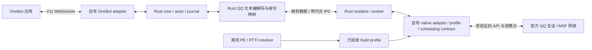

# Caligo 新改进计划：原生契约、可靠链路与 OneBot MVP

> 日期：2026-10-08，Asia/Shanghai；执行者：用户。本文是执行指南，不是实施或现场验收报告。
> 证据基线：`681434bb8c0a32fd4e98ddaceadedf7e48f95782`；当前业务源码未修改。已有 K4 计划为工作树修改，两轮逆向报告尚未提交；这些状态均纳入 provenance。
> GitNexus：复用 2026-10-08T02:46:44.698Z、HEAD 一致的索引；使用本地缓存 1.6.12 CLI。CLI 入口摘要与索引记录一致，未重新验证整个依赖树/build 摘要，未刷新或构建分析器。新增研究文档按工作树读取。图与 PDG 只作导航，关键结论由当前源码/固定逆向证据确认。
> Evidence provenance schema 2；global dirty digest `038bdeabf78830b4f8e019a6f16201e4e7654ca4df78743c7cf1a7cc99d2efb4`；36 个有序引用路径；只排除本文路径。完整数据在 §11，仓库外证据另列文件摘要。
> 新计划路径：`docs/plans/2026-10-08-gitnexus-plan-caligo-native-contract-recovery.md`。后续执行以本文为准；旧计划保留为历史对照，不在本轮重写。

阅读建议：先看 §2 的进度和缺口，再按 §7 执行。§8 是反例与验证表，§13 决定是否过门。`[verified]` 为已核对源码/静态产物/报告记录，不能自动提升为 QQ 现场通过；`[graph]` 为图结果；`[inferred]` 为推论；`[assumed]` 为待验证前提。新文件、新接口名、阈值和测试场景均为提议。

## 1. 目标与范围

形成自有 Rust QQ 内核：官方 QQ 提供登录、会话及网络；自有 loader/bridge/core 实现交互、对象生命周期、可靠 IPC、消息语义和 OneBot V11。首个 MVP 在一个固定 Windows x64 QQ 版本、一个账号上，完成好友私聊与普通群文本双向传输，并与一个实际 OneBot 应用互通。运行时不得依赖 SnowLuma native、NapCat、LLBot、PMHQ 或其他 QQ 后端。[verified：既定目标和两轮报告]

本轮主线决策是**原生 MSF/SSO 优先研究，满足线程/生命周期门后才实现**。现有 V8 owner 路线保留为备选研究资产，不继续作为默认必经路径，也不在一次失败后自动切换。独立协议登录、多账号、图片/文件、完整 SnowLuma 功能覆盖、多版本自动准入均在 MVP 之后。[inferred：R1/R2 已定位原生边界；完整准入未证]

交付层级分开：RE-CONTRACT（原生规格）→ COMMON-LAB（可靠公共链路）→ NATIVE-LAB（自有 adapter/编解码）→ K4-FIELD（真实收发与恢复）→ K5-MVP（实际 OneBot 互通）。测试通过一层不能替代下一层。

## 2. 当前进度与需要改进的事实

### 2.1 可以复用什么

[verified] 已存在 `caligo-model` 的三类身份、请求状态，core 的 AccountActor/journal/daemon，bridge 的 Resident/HostAdapter/worker，命名管道与相关 LAB 测试；源码通过 `qq_entry` 的 owner pump 接入 V8 适配器，worker 连接 daemon。不要重建这些设施，不从旧 D0 开始。

[verified] R1 已验证 Ghidra 12.1.4，导出 SnowLuma DLL/.node 的 748/970 个分析函数；R2 已完成本机 QQ 313 个不同 RVA 的定向分析。引擎安装、整个 SnowLuma 再反编译、已复现 getter 选择都不再列为待办。R2 phase5 达到 cap=135，313 不是 QQ 全模块覆盖。

[verified] 固定 QQ 为 `9.9.33-52230`，wrapper SHA256 为 `63112ab9161e127f5f7e17998a7196e143808923fb54cbbf7b4e21426187a5f0`。R2 的被动模块记录证明当时加载路径一致，不指定任何 PID 为下一轮测试目标。

[verified：历史验收报告内容] D8 接收为受限通过：SelfSent 配置错误、platform_time 未闭合；D9 的 G3 样本未完成。pump closed 记录不能替代 listener removal 和 callback drain。最新现场概要不用于推定根因或只剩重连一个缺陷。

### 2.2 原生证据已经闭合到哪里

| 已确认的部分 | 本轮仍缺的部分 | 直接依据 |
|---|---|---|
| MSF 两类 RTTI/COL/vtable 与构造写入一致 | 实际会话对象、分支选择和失效信号 | R2 §4，qq-object-resolver.md |
| 服务 getter `72DE38` 输出对象/控制块 pair 并加引用；身份 getter `9C3B14` 是另一接口 | 完整释放合同、稳定 session-ready 证据 | R2 §4.1–4.3 |
| kind1 `732A80` 的参数形状、输入深复制、callback move 与结果消费 | `this+0x60` transport 来源、vtable+0x38 actual target、合法线程 | R2 §5 |
| 收包原函数接管/释放输入；Core 已知字段、closure 和 executor 包装 | 两类 executor slot0 actual target、线程/重入及 stop/drain | R2 §6 |
| SnowLuma 定位方法与原生维护历史 | 未来 QQ ABI 自动适配、跨版本验收 | R2 §7 |

地址均为固定 QQ wrapper 的 RVA。SnowLuma 自身 RVA 属于另一二进制，不得混写。伪代码字段名、默认原型不能直接当 Rust FFI 声明。

### 2.3 当前代码可确认的缺口

| ID | 源码事实 | 改进所在阶段 |
|---|---|---|
| C1 | daemon epoch 只初始化/读取；`serve_bridge` 忽略 reconnect 错误后仍 accepted=true（daemon.rs:125,269,320,328）；runtime 拒绝同 nonce 未递增 epoch（runtime.rs:399） | P3：真实握手和连接代次 |
| C2 | daemon `read_frame` 的头/正文与 `read_exact` 的 off 都是局部；唤醒/取消可丢失已消费的上层半帧（daemon.rs:48；transport.rs:210） | P3：每连接长寿命解码器 |
| C3 | worker `recv_json` 使用局部 out，`out.pop()` 只返回最后一帧（daemon_client.rs:398–421） | P3：完整帧 FIFO |
| C4 | unacked/pending 内容在 session_loop 新建，而 seq/ACK 游标跨连接保存（daemon_client.rs:435,561–566） | P3：跨连接内容及请求对账 |
| C5 | worker 先发 NativeStarted，再 submit/wake（daemon_client.rs:738–758）；实际 adapter 调用在 resident.rs:320 | P3/P4：真实开始边界和取消竞争 |
| C6 | V8 Promise 可序列化即 done；resident 接受空 native ID 为 Success（qq_v8.rs:526；resident.rs:399） | P4/P5：原生完成与业务确认分层；V8 分支若选定也必须修 |
| C7 | shutdown 只停 worker/关 uv；pump close 分支不调用 resident.close；close 只分类 NativeStarted，遗漏 SendPending（lib.rs:518；qq_entry.rs:471；resident.rs:485） | P4：完整停止链 |
| C8 | V8 ring 超限删旧，截正文/序列化 JSON；remove 异常仍返回 STOPPED（qq_v8.rs:381–383,414–416,429–432） | 备选 V8 需要独立修复；公共层禁止继承这些语义 |
| C9 | daemon 创建时间空串、host nonce 来自 core；same 判据只核 account/generation（daemon.rs:296–314） | P3：真实宿主身份 |
| C10 | close 收到非 ListenerRemoved 的 Ok 只记 false，最终仍 Closed（resident.rs:499–518） | P4：清理未确认则 Quarantined |

这些缺口是可构造反例，不宣称每项都造成最近现场故障。先在实际链路中让反例暴露，再修复。历史修复和测试绿灯不覆盖这里尚未测试的组合。

## 3. 新架构与边界



native adapter 只负责固定能力：对象句柄、合法调度、SSO 请求和原生包/结果、失效与停止。消息 protobuf、QQ 文本事件、UIN/UID 映射、业务回执在进程外 Rust 层；QQ 回调里只做必要校验、拥有数据复制和有界入队，不做日志落盘、网络 IO 或等待 daemon。[inferred：依据 R1/R2 的借用数据有效期和外部业务分工]

继续使用 Caligo 自己的管道方向和帧体系，不复制 SnowLuma 的 QHP1、双管道或旧 owner 丢弃策略。transport 连接重建与 QQ Host/Session 重建分开；仅 IPC 断开不得重装 listener 或再次装载 bridge。

现有 HostAdapter 绑定 JS owner/env/current 检查（host_adapter.rs:67；resident.rs:549）。native 路线应新增经过证据定义的 scheduling/capability contract，明确允许线程、对象有效性和 callback/cleanup 规则。不能把 V8 检查无条件改成 true 来“适配原生”，也不能假设 JS/uv owner 就是 MSF owner。

## 4. GitNexus 导航与影响范围

本轮复用当前源码对应索引，没有重跑整个图发现。查询针对三个计划问题：帧从哪里消费、修改 session_loop 影响谁、状态/关闭条件受什么控制。

| 调用 | 输出与计划用途 |
|---|---|
| `context recv_json --repo Caligo --file crates/caligo-bridge/src/daemon_client.rs --limit 12` | [graph] found：session_loop 调用 recv_json，后者调用 read_some/FrameDecoder.push；C3 已由源码确认 |
| `impact session_loop --direction upstream --depth 3 --include-tests` | [graph] d1=run_worker，d2=caligo_qq_daemon_client_start；两个下游启动/worker 生命周期都必须回归 |
| `impact serve_bridge --direction upstream --depth 3 --include-tests` | [graph] UNKNOWN、未解析 caller；不是无调用证明，手工覆盖 daemon accept、control、actor 与真实管道测试 |

Cluster_3/Cluster_12、run_worker 及启动导出的 process 结果仅定位模块。未提供完整 clusters/processes 资源枚举，也没有把图风险 LOW 当成原生安全判断；本计划属于已完成调查上的增量规划，完整图梯子不再重跑。

手工纳入所有直接接口消费者：Hello/HelloAck 的 bridge、daemon、control 客户端；Dispatch/NativeStarted/SendResult 的 worker、resident、actor、journal；停止导出、pump/close callback；LAB fixtures；未来 OneBot adapter。IPC 必须两端一起升级，旧消息显式拒绝，不能由 serde 默认值偷偷放行。

## 5. PDG 与源码顺序约束

[graph] `impact serve_bridge --mode pdg --line 320 --direction upstream --limit 15` 返回 10 个局部相关语句：Hello 解包、epoch、基线/账号检查、actor 锁、attach 与 same 判据。结果因 depth 截断；没有证明所有后继状态/跨进程影响。源码确认“reconnect 失败被忽略 → accepted=true”，成功回包必须在完整绑定/恢复成功之后。

[graph] `impact close --file crates/caligo-bridge/src/resident.rs --mode pdg --line 485 --direction upstream --limit 10` 返回 5 个局部语句，包括 actor 锁、Closed/Quarantined 判据、requests 遍历；因 depth 截断。源码确认遗漏 SendPending 和移除结果未确认仍 Closed，不声称这些错误都由 PDG 自动发现。

[verified：源码] 约束：认证/身份/profile 准入先于绑定；持久 dispatch intent 先于允许原生写；owner claim/cancel 串行裁决后才进入 QQ；callback 复制先于源数据清理；cleanup 确认先于 Closed。resident 当前在 mutex 下调用 native_op（resident.rs:285–320）；若 QQ 内联回调重入同锁可能死锁，这是需加反例的风险推论，未在现场复现。

## 6. 拟实施改进

### 6.1 原生规格和路线决策

新增明确的函数/对象/线程/释放合同，记录每项证据地址、caller/callee、机器码、动态补证、允许操作和失败结果。原生 contract 未通过时保持拒绝写调用；不把日志匹配、vtable 可读或 DLL loaded 当准入。[inferred]

恢复 `72DE38/74203C` pair 的完整 retain/release/disposer，区分服务和 `9C3B14` 账户对象。不要照搬 SnowLuma 三处丢弃控制块的模式；不能用自己的 allocator 释放 QQ 分配的 C++ 对象。callback manager 的 move/copy/destroy 和 kind1/kind2 原型分别记录。

路线决策产物明确选定本版实际使用的服务族和 scheduling contract。若证明入口支持任意调用线程且对象寿命有保障，可以据证据使用该合同；若必须 owner/executor，必须证明投递点。两条都不成立时不试猜偏移或扩大现场注入。V8 只有完成同等证据门和 C6–C8 修复后才可单独选定；不得隐式 fallback。

### 6.2 公共协议、请求与恢复

在 `serve_bridge` 中由 daemon 分配/推进 connection epoch，成功恢复 actor 后才返回 accepted；并发旧连接不得将新连接重新置 Degraded。host nonce 由 QQ bridge 宿主实例产生并保持到 QQ 退出，core nonce 由 daemon 实例产生，Session generation 随账号/原生对象失效变化。OS client PID 与创建时间、基线/profile、native ready 状态共同检查。

协议字段变更时引入明确新版本；`ipc_v2.rs` 保留兼容定义，新增版本文件是候选实现，不原地改变 v2 语义。Hello/ACK、事件、请求结果携带足以核对的完整身份；日志只写 nonce 的非敏感摘要，不输出认证 token。

每条连接持有增量 decoder + 完整帧 FIFO，唤醒不得丢已消费字节；新连接不得复用旧前缀。unacked event 的内容和 ACK cursor 生命周期一致；ACK 在持久化后前移。超限显式 Gap/Degraded，不静默删旧。

请求先落 dispatch intent，再允许 bridge 执行。worker 不再在收到 Dispatch 时报告 NativeStarted；执行侧在成功 claim 后、真正调用边界记录开始。取消与 claim 用同一裁决；无法证明未执行则保留 delivery_unknown，不把重连当重发条件。QQ owner 不阻塞等待磁盘或 IPC ACK；durable intent 已允许 core 在“开始通知丢失”时保守恢复 unknown。

### 6.3 callback、关闭与消息语义

native callback 可以内联、迟到、重复或并行；复制返回数据后进入独立有界通道，不在 callback 内重入持有的 resident mutex。claim/调用/完成之间的锁范围及代次核验需重新设计；跨代次 callback 只审计，不改新请求。

停止顺序：关新动作 → 取消可证未调用项 → 分类 NativeStarted/SendPending → 所需线程解除观察点 → 在途 callback/任务排空 → 释放句柄和资源 → worker/IPC 收尾 → Closed。结果传输保持到必要停止回执被送出；只置 worker stop 然后关 pump 不足以完成。未确认 detach/drain 或超时进入 Quarantined；不强杀线程/强制卸载，模块可留到 QQ 正常退出。

原始 SSO 的 command/status/body、request token 和消息 ID 分开。进程外 Rust 编解码识别私聊/群聊文本、账号、peer、sender、方向、平台时间及原生消息身份；发送验证协议业务结果及稳定关联。Promise、native ACK、status=0、生成的候选 mid 都不单独作为 confirmed_success。业务结果缺字段则 unknown/unsupported，而不是伪造 ID 或按正文猜关联。

仅 IPC 断开但同 Host/Session 的拥有结果可保存在自有 outbox，重新认证后按原 request 身份/内容摘要对账；不能把旧连接的原始 frame 改投新连接。新 Session 的结果不得采用。原生包观察点在断开期间是否仍采集由能力与资源预算决定，无法保持则生成明确 Gap；不承诺 QQ 的断线历史补全。

### 6.4 QQ 更新机制

现有 `version-adapter-manifest.json` 已采用精确模块 SHA 拒绝策略，保留并扩展 capability profile。[verified：manifest:1–55] profile 包含：模块身份/架构、resolver 算法版本、全部候选与选择理由、服务族/子对象/slot、FFI 参数布局、allocator/控制块/callback、调度与关闭合同、receive/send/session/lifecycle 分别的验收状态。

语义锚点 resolver 用于离线发现和 known profile 的交叉验证；新 hash 首先进入 unsupported-build。更新流程是“固定新文件 → 分类结构差异 → 定向补证 → 新 profile → LAB → 指定实例现场 → 发布能力”。一次结构扫描通过不能自动准入原生写。保留旧 profile 给对应旧模块使用，不在运行中将旧对象地址换成新 RVA。

SnowLuma 的约 250ms 启动重试和约 5s 对象刷新用于加载/对象变化，不作为适配升级方案；它的 native 维护历史只是持续维护必要性的证据。更新期间不得继续使用过期 profile 或静默改用第三方后端。

## 7. 从当前成果开始的执行指南

### P0 — 冻结本轮执行基线；不重做已完成分析

**操作：**记录当前 HEAD/dirty 状态与两轮报告摘要，核 wrapper 文件和实际加载身份；保留旧计划、历史事故和受限验收记录。把 R1 引擎/整体链路及 R2 已证明项目标完成，将线程/释放/业务协议项标待办。此步仅磁盘/被动身份检查，尚未选择现场 PID。

**交付：**新增本轮执行台账和 evidence 目录，列构建、文件 hash、数据来源、角色、已通过/未通过门。后续实现的源码 diff 和测试产物按步骤登记，不覆盖历史样本。

**通过：**文件与现有 hash 一致，所有证据明确归属；改变任一模块则转 P2 的新 build 调查。**失败分支：**证据不可读、摘要不符或原始记录缺失，标 unavailable，不能“重记一遍 PASS”。

### P1 — 补齐原生实际目标与寿命合同（首要研究任务）

**操作顺序：**

1. 在已保存 `QqWrapper52230` 项目中，从 `732EB9` 的 `this+0x60 → vtable+0x38` 追安装来源。沿构造、初始化、接口参数和 pointer alias 查实际写入；排除 dword `+0x30` 被误读成 pointer `+0x60`。每个候选附实际指令与反证，不扩大到无目标全模块分析。
2. 分别追 `D32D98/D32DAD` 的 TLS executor 和 `748FD1→9C1928→9C0C68` 的 Core executor，恢复 `D32138` 间接 slot0 的 actual target；区分内联、排队、worker、owner 与重入。继续找 stop/cancel/drain caller。共同 wrapper 不等于相同线程。
3. 补服务 pair 的 release、析构辅助/allocator 对，callback operation 与 disposer；列借用/移动/复制/释放表。找请求取消、callback 不再触发的证明，以及观察点恢复原 vptr/排空条件。
4. 从登录成功处理链向实际会话状态和失效通知继续追；非零 UIN、身份对象存在、SSO 层可读都不能单独证明 ready。明确好友 UIN↔UID 可用来源，不从空账号或控制面 hint 构造会话。

**交付：**拟新增 `docs/research/qq-native-thread-contract.md`、`qq-native-lifetime-contract.md`；外部 evidence 中保留新增函数/汇编、xrefs、候选淘汰表和问题日志。现有已分析的函数只在目标问题需要时读取，不再重复导出 313 个函数。

**通过：**发送 actual target、线程准入；两种相关 receive/executor；对象及 callback 释放；失效、detach/drain 均有可核对合同。首版可只准入实际服务族，另一族必须明确 unsupported，不能套用同一原型。

**失败分支：**若关键间接目标无法静态确定，先交付无发送、有限时、明确记录 TID/对象代次/实际 vtable 的受控观测方案，再由执行者指定新测试实例补证。一次实验只解决一个未知合同；失败保存证据并正常退出该实例。无法证明线程/寿命则停原生写实现，不宣称下一次必收敛。

### P2 — 冻结单一路线与 capability profile

**操作：**根据 P1 证据填写路线对照：native SSO 的线程/寿命/取消/身份/消息层成本；V8 的首入/context/监听/结果/清理成本。记录选定路线、实际服务族、加载与 bootstrap 的区别、禁用范围。优先选满足合同的 native 路线；决定必须是具体证据，不按“更少 JS”或“SnowLuma 能运行”选择。

**交付：**拟新增 `docs/research/k4-native-route-decision.md`、版本 capability profile；更新执行时的 loading-route-decision/source-register/manifest，使旧 V8 假设不再约束所有原生调用。保留装载账本，不默认新增 manual mapper 或热卸载。

**通过：**G-ABI/G-THREAD/G-LIFE 文档合同齐备，profile 的未知能力拒绝，加载/接入/登录/收发分别标状态。**失败分支：**native 未过可单独评估 V8；两条皆未过则 FIELD BLOCKED，P3 的 Rust LAB 工作仍可继续。禁止双路线自动发送 fallback。

### P3 — 修复公共 IPC、身份与恢复（可与 P1 研究独立推进）

**操作：**先补 §8 T01–T10 的失败测试，再依序处理 C2/C3 帧状态、C1/C9 握手身份与 epoch、C4 内容窗口、C5 claim/start/cancel 及 durable intent。显式升级 wire schema，两端/控制客户端和测试夹具一致更新。未知请求只 query/reconcile，不重新 Dispatch。

**交付：**实际命名管道上的新版协议、身份表、恢复状态转换与测试记录；至少覆盖“先 Active，再中途断管道，再连接”的反例，不能只测试 server 晚启动。

**通过：**accepted 与 actor Active 一致；100 次 LAB 连接恢复无 frame 丢弃、重复 bootstrap 或重复 native 写；事件 ACK 仅由持久化推进；旧连接不能退化新连接；core 重启不把 host nonce 换掉。

**失败分支：**拆为单项 transport/握手/outbox/请求状态失败，不用增加 backoff 掩盖协议缺陷。帧前缀无法保留则明确结束该连接并给出 Gap，而不是从错误边界继续解析。此步无需 QQ 现场动作。

### P4 — 实现自有 native adapter 与完整生命周期

**前置：**P2 路线门、P3 基础协议通过；若选 V8，则本阶段改成其独立适配修复，仍遵守相同生命周期/请求合同。

**操作：**先在自建宿主建立假的 C++/ABI 边界验证移动/复制/disposer、内联/延迟 callback 和失效。再实现研究构建内自有 adapter，集中 unsafe；引用句柄、hook token、调度许可和 profile 绑定 Host/Session。对 kind1/kind2 分别使用已验证原型；panic/错误不得跨原生 callback 边界传播。

改 resident 的锁范围：claim/快照 → 已验证调用 → 独立完成通道，不把 native_op 置于可被 callback 重入的同一 mutex 内。结果 channel 与请求 outbox 均有 item/byte 上限。close 包含 SendPending、错误清理结果、在途 barrier 和资源对称回收。若对象寿命不能持有，关闭到 Quarantined，不执行危险释放。

**交付：**拟新增 native adapter/ABI/handle/profile 相关模块及对应 LAB 测试；真实 shutdown 导出经过 resident cleanup/drain 再关闭执行器，不只是 helper.close 通过。更新文档的线程模型，不能对 MSF 路线假装持有 V8 context。

**通过：**T11–T16；10,000 次非发送调度、100 次 fake lifecycle 重建后的拥有引用/handle/queue 回基线；迟到 callback 不触碰旧对象；错误移除不记 Closed。**失败分支：**保留 unsafe 部分为拒绝占位，不能到 P6 试发送找签名。

### P5 — 实现最小 Rust SSO／QQ 文本编解码与业务回执

**操作：**从固定公开协议/逆向记录建立独立字段规格，只实现好友私聊、普通群文本、身份映射与发送结果。外部 Rust 层路由 MsgPush、解析 text/richText 的最小必要字段，编码 `MessageSvc.PbSendMsg`，分别验证群/私聊 result 和稳定消息身份。每个未知字段必须保留 UNKNOWN，不能靠空字符串/零数默认通过。

建立 request_id ↔ native invocation token ↔ SSO seq（若可获得）↔ 业务消息 identity 的关联表，允许 callback 先于本地 ACK、重复/迟到结果。收包用 native message identity 去重，区分消息新增/update/self；同正文两条消息必须保留。UIN↔UID、peer 群号与发送者独立校验。

**交付：**拟新增独立 Rust protocol/codec 模块与脱敏 fixture；明确 fixture 来源、hash、时间与字段规格；依赖选择/锁定随实施记录，不复制完整 SnowLuma 生成代码或以目标 C 伪代码充当 Rust 实现。

**通过：**T17–T20，完整文本/Unicode、未知 protobuf 字段可跳过、截断包拒绝、身份/方向/平台时间映射有证据；群私聊各有业务回执关联。**失败分支：**发送完成但身份未闭合 → unknown/该能力未准入，回到 P1/P5 的字段问题；不发假 message_id，不用合成 self event 证明接收。

### P6 — 单实例准入与真实接收（G1/G2）

**操作：**执行者先登记一个新测试 QQ 实例的 PID+创建时间、账号/对端/群、加载模块/profile 与 bridge/core 构建；不复用报告里的 PID。只接入和观察，验证线程、真实对象/引用、账号状态、hook 原函数继续运行；通过 G1 后再收消息。

私聊/群各 10 条带唯一编号的文本，另测同正文独立消息、长文本、Unicode、self/update 分类及 burst；同时保存平台侧观察和本地事件，以原生消息身份关联。平台时间字段未找到必须阻塞 OneBot 时间映射门，不能拿 Date.now 冒充原始时间。单独做停止，验证 listener/hook drain 与 QQ 正常运行/退出。

**交付：**G1/G2 新报告、逐样本表、线程/代次和关闭证据。**通过：**20 条必需样本无静默丢失、身份/正文/方向/时间来源明确；stop 不等价于 pump closed。**失败分支：**出现异常先正常结束测试实例、留证；不追加同实例反复注入“修复”结果。

### P7 — 串行真实发送（G3）

**操作：**在 G1/G2 同一合格构建上，从控制面分别发送 10 私聊、10 群文本；一次只保留一个未终态请求。逐项记录 accepted/queued/实际 native started/native completion/业务结果/原生消息 identity/正确对端观察。

把一项明确 native 拒绝、一项可证未调用取消、一项调用后断 IPC 纳入故障样本，故障样本不冒充必需成功样本。断线或超时但可能已发送 → delivery_unknown；恢复只对账，绝不自动再次发送。

**交付：**G3 样本矩阵和原始凭据。**通过：**20 次成功样本都有稳定业务身份与正确对端观测；失败/unknown 如实保留；重复 request_id 不重复调用。**失败分支：**按字段/调度/协议/网络/业务分层回 P1、P3、P4 或 P5，不把“回调 fired”算 PASS。

### P8 — 恢复、QQ 更新拒绝与持续运行（G4）

**操作：**至少三轮 QQ 正常重启（三个新 Host），另做三轮 core 重启和三轮 pipe 中途断开/恢复；证明 Session/Connection 区分，新连接不重注册，旧会话写/回执拒绝。重登/会话对象失效按 Session 更换处理。默认保留 bridge 到 QQ 正常退出，不承诺热卸载。

用 LAB 文件身份/profile fixture 模拟新 hash、锚点歧义、slot/layout 改变、能力缺失，确认写路径拒绝。真正新 QQ build 只有获得样本后才走升级流程，不修改官方安装文件来模拟支持。最后在指定实例拟定两小时观察资源、重连、Gap/unknown、正常关闭。

**交付：**G4 恢复/资源报告、未知版本拒绝与升级手册。**通过：**上述各轮有完整代次轨迹、无未知写重发、无重复 hook、停止资源可对账；实际跨版本支持只按已验收矩阵列出。**失败分支：**恢复失败保持 Degraded；原生失效或清理不明保持 Quarantined，不自动换 profile 或回到 Active。

### P9 — 正式 OneBot V11 MVP（K5）

**前置：**K4 的 G1–G4 全部通过。规范研究/纯 codec LAB 可提前做，生产连接和发送准入在此门之后。

**操作：**新增基于 caligod 账号 actor 的 OneBot adapter；建议首版提供正向 WebSocket `/` 通道，兼容 `/api`、`/event` 分工，默认绑定本机并支持 token。首版 action 为 send_private_msg/send_group_msg/send_msg、get_login_info/get_status/get_version_info；消息是 string/text segment 的受支持子集，未实现 CQ segment 显式失败而不是丢弃。

动作 response 保持 status/retcode/data 与原样 echo，发送 data.message_id 必须由持久化映射产生；内部完整 NativeMessageId 不损失精度，对外按 V11 int32 message_id 建立可持久、无活跃碰撞映射。消息事件包含真实 self/user/group/time/message/sender 等字段，不能把 request_id/SSO seq 直接当 message_id。[规范：官方 API、消息事件、WebSocket 文档]

OneBot 标准 WebSocket 没有通用事件消费 ACK。区分“bridge→core 持久 ACK”和“应用收到/处理”；不要声称端到端 exactly-once。重连只恢复订阅和已定义事件交付策略，不能因 echo 相同自动认定同一写请求；内部 request_id 和 echo 分开。

**交付：**拟新增 OneBot 网络 adapter、兼容矩阵、实际应用联调报告。旧 onebotd 注入/poll runner 不恢复为生产入口；新 adapter 使用现有常驻 core。若真实应用要求反向 WS/HTTP，则在同一内核上扩展传输，不能接回旧 runner。

**通过：**实际应用经协议接到 10 私聊+10 群事件，并各完成 10 次发送、身份/echo/业务回执正确；鉴权拒绝、应用断连恢复、内核 unsupported/unknown 状态不会返回虚假成功。明确发布为“文本子集 MVP”，不声称所有 V11 API 已实现。

## 8. 反例、测试与验证命令

下表是**待新增/加强的场景 ID**，不是声称现有同名测试已存在。先在改动前构造能暴露问题的失败样本；不写只镜像实现的测试。所有管道读/取消/重连场景必须走实际命名管道及真正 worker/daemon。

| ID | 输入/动作 → 预期 | 主要测试落点（现有/拟新增） |
|---|---|---|
| T01 | 单次 read 合并 HelloAck+Dispatch+ACK → 按序全交付一次 | daemon_client_lab（现有） |
| T02 | 在 header/body 任意断点唤醒/取消 → 保留当前连接前缀；新连接丢旧前缀 | transport_contract（现有） |
| T03 | 已 Active 后中途断管道再接入 → epoch 递增、actor Active；stale reconnect → accepted=false | daemon_client_lab |
| T04 | 旧连接迟到断开/Health → 不影响新连接 phase | daemon_client_lab |
| T05 | 同 PID 数字但创建时间/host nonce 不同；同账号但 Session 不同 → 拒绝旧绑定 | ipc_contract/runtime_contract（现有） |
| T06 | 事件持久化后 ACK 丢失、core 重启 → 允许事件重交、去重稳定、ACK 回显原 seq | daemon_chain/recovery_contract（现有） |
| T07 | 断开前 unacked 内容存在 → 同 Host/Session 对账，不只保留 seq | daemon_client_lab/recovery_contract |
| T08 | queue 满/oversize → 明确拒绝或 Gap/Degraded，无静默截正文/JSON | resident_lifecycle（现有） |
| T09 | cancel 与 owner claim 竞争 → 只有胜者执行；取消成功项零 native | resident_lifecycle/daemon_chain |
| T10 | durable intent 后、Started 通知前崩溃 → 保守 unknown；重复请求不再写 | recovery_contract/daemon_chain |
| T11 | native_op 内联 callback → 不死锁、不二次结果；同步复制后的临时源被释放 → 数据仍完整 | native_adapter_contract（拟新增） |
| T12 | getter/handle/move/destroy 与 100 次 lifecycle → 拥有引用可对账、无双释放 | native_adapter_contract |
| T13 | 旧 Session callback、重复 callback、reply 先于 ACK → 不改新会话，结果幂等 | native_adapter_contract/daemon_chain |
| T14 | SendPending 时真实 shutdown 导出 → 分类 unknown，detach/drain 后才 Closed | qq_entry_lab（现有，仅选用其路径时）及 native_adapter_contract |
| T15 | listener remove 返回非预期 Ok、失败或 barrier 超时 → Quarantined，不能 Closed | resident_lifecycle |
| T16 | wrong thread/profile/失效对象 → 调用前拒绝，native counter 零 | native_adapter_contract |
| T17 | 私聊/群 MsgPush、同正文双 ID、Unicode/长文本 → 正确事件身份与完整正文 | qq_text_codec（拟新增） |
| T18 | 未知字段/截断/错误长度/tag → 有界处理；未知字段可跳过，非法输入拒绝 | qq_text_codec |
| T19 | 群/私聊 result=成功但缺稳定身份，空 reason/body 等 → 不伪造 confirmed_success | qq_text_codec/daemon_chain |
| T20 | UIN/UID/群号及 self/update 不同组合 → 不串身份，不把 local_time 当 platform_time | qq_text_codec |
| T21 | 新 hash、重复锚点、slot/layout 变动 → unsupported 能力，零 native 写 | native_resolver_contract（拟新增） |
| T22 | WS action/event、任意类型 echo、int32 ID 映射、鉴权/重连 → 规范字段正确、未知写不重放 | onebot_v11_contract（拟新增） |

已有测试目标与 research feature 已通过 `cargo metadata --locked --offline --no-deps --format-version 1` 核对。以下是执行者在实现后运行的命令，本轮没有运行它们或宣布测试绿灯：

```powershell
cargo test -p caligo-core --features research --test transport_contract --test daemon_client_lab --test daemon_chain --test recovery_contract
cargo test -p caligo-bridge --features research --test resident_lifecycle --test qq_entry_lab
cargo test --workspace --locked --offline
cargo test -p caligo-core --features research --locked --offline
cargo test -p caligo-bridge --features research --locked --offline
cargo check --workspace --locked --offline
git diff --check
```

新增测试目标在真正创建并登记后才追加命令。新增 protobuf/WS 依赖时由执行者明确锁定版本、取得缓存并记录来源；offline 缺依赖不能伪报成功，也不在本次规划安装。工具链按已存在 `rust-toolchain.toml` 的 1.97.1 / x86_64-pc-windows-msvc。

P0 可用的只读复核命令：

```powershell
git rev-parse HEAD
git status --short
Get-FileHash -LiteralPath 'D:/Program Files/Tencent/QQNT/versions/9.9.33-52230/resources/app/wrapper.node' -Algorithm SHA256
```

读取命令不等于现场准入。P1 新增分析 seed、P6/P7 现场命令须先依据实际合同/现有 CLI 生成与审核；本文没有编造尚不存在的 attach-native 或 send-sso 命令。

## 9. 风险、影响与观测要求

最高风险为 QQ 私有 ABI、未知控制块释放、调度线程和 callback 重入/销毁竞争。P1 静态合同、P4 LAB 与 P6 现场分别降低不同风险，任何一层不能替代另一层。窗口内对象可读不证明稳定寿命。

共享变更会影响 run_worker（图 d1）、启动导出（图 d2）、daemon accept/control、AccountActor、journal、所有 wire 夹具和 OneBot 结果映射。迁移需双端协议版本核验；journal 语义改变要定义旧记录升级/拒绝与不重放规则，不静默创建空 journal。IPC 取消需保留 OVERLAPPED 回收合同，不退回强杀等待线程。

每条证据至少有构建/profile/Host/Session/Connection、阶段、request_id 或 native event identity、状态前后值、失败类别、本地时间及平台时间来源。计数区分 loaded、bootstrap、native-ready、pipe-authenticated、session-ready、receive-active、send-enabled；不要让一个 Health/pipe-online 覆盖其他能力。认证 token、完整私人聊天及测试账号映射只保留 local evidence，不纳入提交。

资源目标以既有配置为起点测定：queue item/byte、pending callback、未确认事件、重连时延、句柄/引用数。100 次 LAB/两小时现场是本计划验收预算，不是 QQ 或 SnowLuma 官方保证；超限必须显式可观察。

## 10. 预计变更文件与提交边界

本次实际仅新增本文。以下为后续执行预期，新增文件用“拟新增”标明；具体符号名在实施时冻结。

| 文件 | 已验证入口或拟承担责任 | 阶段 |
|---|---|---|
| `crates/caligo-core/src/daemon.rs` | serve_bridge/read_frame、完整身份/epoch/decoder/连接退役 | P3 |
| `crates/caligo-core/src/transport.rs` | PipeConnection.read_exact/read_some 的取消/已消费合同 | P3 |
| `crates/caligo-core/src/runtime.rs`、`journal.rs` | AccountActor.reconnect、已有请求/事件账本的对账与迁移；journal 仅必要范围 | P3/P5 |
| `crates/caligo-bridge/src/daemon_client.rs` | recv_json/session_loop/run_worker、FIFO/跨连接窗口/真实 Started | P3 |
| `crates/caligo-model/src/lib.rs`、`ipc_v2.rs`；协议新版本文件（拟新增） | 三身份、结果分层、新版 wire schema；v2 保留定义 | P3 |
| `crates/caligo-bridge/src/resident.rs`、`host_adapter.rs` | drain/close/complete_sends、route-specific contract、锁范围、在途分类 | P4/P5 |
| `crates/caligo-bridge/src/lib.rs`、`qq_entry.rs` | 真实启动/停止导出接线；qq_entry 只改选定路线所需部分 | P4 |
| `crates/caligo-bridge/src/qq_v8.rs` | build_send_js/D8_* 缺口，只有选定 V8 分支才修 | 备选 |
| `crates/caligo-bridge/src/native_msf.rs`、`native_abi.rs`、`native_handle.rs`（拟新增） | 固定原生 adapter、布局、引用及 callback/disposer | P4 |
| `crates/caligo-cli/src/pe.rs`、`rtti.rs`；`native_resolver.rs`（拟新增） | 复用只读 PE/RTTI 解析资产，输出全部候选和证据 profile | P2/P4 |
| `crates/caligo-core/src/qq_protocol/`（拟新增） | 最小 protobuf/文本/身份/业务回执编码解码 | P5 |
| `crates/caligo-core/src/onebot_v11.rs`（拟新增）；`caligod.rs` | 独立 V11 adapter 的入口，现有守护进程集成 | P9 |
| `docs/contracts/version-adapter-manifest.json`；capability profile（拟新增） | 当前版本身份与逐能力准入、拒绝和验收记录 | P2/P8 |
| `docs/research/loading-route-decision.md`、`source-register.md` 及 P1/P2 新报告 | 路线和来源记录、合同表 | P1/P2 |
| §8 的现有与拟新增测试文件；Cargo.toml/Cargo.lock（必要时） | 反例、依赖/测试目标登记 | 对应阶段 |

建议提交边界：P1/P2 合同文档；P3 帧；P3 身份握手；P3 outbox/请求；P4 ABI/lifecycle；P5 消息层；P6/P7/P8 脱敏验收；P9 OneBot。每个实现提交带对应失败场景和验证结果；不将历史证据改写成新实现的 PASS。不要提前创建全部空模块。

## 11. 可复用实施上下文

以下 context pack 由本轮验证和官方 helper 的 schema-2 snapshot 生成。repo 内路径均为相对路径；仓库外样本独立摘要不能由 commit 替代。执行者先核 HEAD、dirty digest、引用文件及外部 manifest，漂移时只重核变化范围。

```json
{
  "implementation_context": {
    "task_summary": "Caligo self-owned Rust QQ kernel improvement plan from R1/R2; native contracts first, reliable common runtime, real K4 gates then OneBot text MVP",
    "acceptance_criteria": [
      "P1/P2 ABI/thread/lifetime/profile documented",
      "T01-T21 meaningful LAB/codec scenarios",
      "G1-G4 fresh same-build field evidence",
      "P9 real OneBot application text interoperability",
      "No third-party QQ runtime dependency"
    ],
    "evidence_provenance": {
      "schema_version": 2,
      "head_commit": "681434bb8c0a32fd4e98ddaceadedf7e48f95782",
      "generated_plan_path": "docs/plans/2026-10-08-gitnexus-plan-caligo-native-contract-recovery.md",
      "global_dirty_digest": {
        "algorithm": "sha256",
        "canonicalization": "gitnexus-evidence-provenance-v2 NUL-framed UTF-8 records",
        "value": "038bdeabf78830b4f8e019a6f16201e4e7654ca4df78743c7cf1a7cc99d2efb4"
      },
      "cited_path_manifest": [
        {
          "path": "Cargo.lock",
          "object_kind": {
            "head": "regular",
            "index": "regular",
            "worktree": "regular",
            "untracked": "absent"
          },
          "state": "clean",
          "rename_from": null,
          "rename_to": null,
          "head_digest": "sha256:97d865b2ea78dbf7b8052c1287002647610ae15ef41cfbcffd7e0ced387ba315",
          "index_digest": "sha256:97d865b2ea78dbf7b8052c1287002647610ae15ef41cfbcffd7e0ced387ba315",
          "worktree_digest": "sha256:97d865b2ea78dbf7b8052c1287002647610ae15ef41cfbcffd7e0ced387ba315",
          "untracked_digest": "absent"
        },
        {
          "path": "Cargo.toml",
          "object_kind": {
            "head": "regular",
            "index": "regular",
            "worktree": "regular",
            "untracked": "absent"
          },
          "state": "clean",
          "rename_from": null,
          "rename_to": null,
          "head_digest": "sha256:5d8b0dd7e0e0ba73b0856e1f1b0b5a93e621a520aaab25a19dec5eb51045182f",
          "index_digest": "sha256:5d8b0dd7e0e0ba73b0856e1f1b0b5a93e621a520aaab25a19dec5eb51045182f",
          "worktree_digest": "sha256:5d8b0dd7e0e0ba73b0856e1f1b0b5a93e621a520aaab25a19dec5eb51045182f",
          "untracked_digest": "absent"
        },
        {
          "path": "crates/caligo-bridge/Cargo.toml",
          "object_kind": {
            "head": "regular",
            "index": "regular",
            "worktree": "regular",
            "untracked": "absent"
          },
          "state": "clean",
          "rename_from": null,
          "rename_to": null,
          "head_digest": "sha256:ee0b9863d453ee9c415d542cd3e0e95690fb2108d141f915a670e123978074ae",
          "index_digest": "sha256:ee0b9863d453ee9c415d542cd3e0e95690fb2108d141f915a670e123978074ae",
          "worktree_digest": "sha256:ee0b9863d453ee9c415d542cd3e0e95690fb2108d141f915a670e123978074ae",
          "untracked_digest": "absent"
        },
        {
          "path": "crates/caligo-bridge/src/daemon_client.rs",
          "object_kind": {
            "head": "regular",
            "index": "regular",
            "worktree": "regular",
            "untracked": "absent"
          },
          "state": "clean",
          "rename_from": null,
          "rename_to": null,
          "head_digest": "sha256:0f76f0af9fe876e4df216ddf16354f53ca14d2f0dbc57a4383a78f6fdf0b95b0",
          "index_digest": "sha256:0f76f0af9fe876e4df216ddf16354f53ca14d2f0dbc57a4383a78f6fdf0b95b0",
          "worktree_digest": "sha256:0f76f0af9fe876e4df216ddf16354f53ca14d2f0dbc57a4383a78f6fdf0b95b0",
          "untracked_digest": "absent"
        },
        {
          "path": "crates/caligo-bridge/src/host_adapter.rs",
          "object_kind": {
            "head": "regular",
            "index": "regular",
            "worktree": "regular",
            "untracked": "absent"
          },
          "state": "clean",
          "rename_from": null,
          "rename_to": null,
          "head_digest": "sha256:f47122de7e6648346e4be16ce56d15954198b512253d13eaa1f8b7b3f0355e37",
          "index_digest": "sha256:f47122de7e6648346e4be16ce56d15954198b512253d13eaa1f8b7b3f0355e37",
          "worktree_digest": "sha256:f47122de7e6648346e4be16ce56d15954198b512253d13eaa1f8b7b3f0355e37",
          "untracked_digest": "absent"
        },
        {
          "path": "crates/caligo-bridge/src/lib.rs",
          "object_kind": {
            "head": "regular",
            "index": "regular",
            "worktree": "regular",
            "untracked": "absent"
          },
          "state": "clean",
          "rename_from": null,
          "rename_to": null,
          "head_digest": "sha256:e2ad4805dd6092340d802ebdecdf110e362f5d0ffba055be3cf50895a4f5ca67",
          "index_digest": "sha256:e2ad4805dd6092340d802ebdecdf110e362f5d0ffba055be3cf50895a4f5ca67",
          "worktree_digest": "sha256:e2ad4805dd6092340d802ebdecdf110e362f5d0ffba055be3cf50895a4f5ca67",
          "untracked_digest": "absent"
        },
        {
          "path": "crates/caligo-bridge/src/qq_entry.rs",
          "object_kind": {
            "head": "regular",
            "index": "regular",
            "worktree": "regular",
            "untracked": "absent"
          },
          "state": "clean",
          "rename_from": null,
          "rename_to": null,
          "head_digest": "sha256:e2cee7ec66a18882001c455e2634d6ab221c5b858be3b053b6a1c039e922314e",
          "index_digest": "sha256:e2cee7ec66a18882001c455e2634d6ab221c5b858be3b053b6a1c039e922314e",
          "worktree_digest": "sha256:e2cee7ec66a18882001c455e2634d6ab221c5b858be3b053b6a1c039e922314e",
          "untracked_digest": "absent"
        },
        {
          "path": "crates/caligo-bridge/src/qq_v8.rs",
          "object_kind": {
            "head": "regular",
            "index": "regular",
            "worktree": "regular",
            "untracked": "absent"
          },
          "state": "clean",
          "rename_from": null,
          "rename_to": null,
          "head_digest": "sha256:0e7a7639df338e66939484682aca4521c238f9d8ead993852d94f288bd18cf28",
          "index_digest": "sha256:0e7a7639df338e66939484682aca4521c238f9d8ead993852d94f288bd18cf28",
          "worktree_digest": "sha256:0e7a7639df338e66939484682aca4521c238f9d8ead993852d94f288bd18cf28",
          "untracked_digest": "absent"
        },
        {
          "path": "crates/caligo-bridge/src/resident.rs",
          "object_kind": {
            "head": "regular",
            "index": "regular",
            "worktree": "regular",
            "untracked": "absent"
          },
          "state": "clean",
          "rename_from": null,
          "rename_to": null,
          "head_digest": "sha256:7349f9d7f7f59c82a15f89041d7f113be6ca25131dd261e6728ccf01988c3124",
          "index_digest": "sha256:7349f9d7f7f59c82a15f89041d7f113be6ca25131dd261e6728ccf01988c3124",
          "worktree_digest": "sha256:7349f9d7f7f59c82a15f89041d7f113be6ca25131dd261e6728ccf01988c3124",
          "untracked_digest": "absent"
        },
        {
          "path": "crates/caligo-bridge/tests/qq_entry_lab.rs",
          "object_kind": {
            "head": "regular",
            "index": "regular",
            "worktree": "regular",
            "untracked": "absent"
          },
          "state": "clean",
          "rename_from": null,
          "rename_to": null,
          "head_digest": "sha256:49f13d2a4dbc4c5614861e1cce156ec7167c8b44ccd7a84016d84728a86a8e2e",
          "index_digest": "sha256:49f13d2a4dbc4c5614861e1cce156ec7167c8b44ccd7a84016d84728a86a8e2e",
          "worktree_digest": "sha256:49f13d2a4dbc4c5614861e1cce156ec7167c8b44ccd7a84016d84728a86a8e2e",
          "untracked_digest": "absent"
        },
        {
          "path": "crates/caligo-bridge/tests/resident_lifecycle.rs",
          "object_kind": {
            "head": "regular",
            "index": "regular",
            "worktree": "regular",
            "untracked": "absent"
          },
          "state": "clean",
          "rename_from": null,
          "rename_to": null,
          "head_digest": "sha256:89a164be16405a8a2179ad80a5c030ed689255c57818f096a26e6786478b76e2",
          "index_digest": "sha256:89a164be16405a8a2179ad80a5c030ed689255c57818f096a26e6786478b76e2",
          "worktree_digest": "sha256:89a164be16405a8a2179ad80a5c030ed689255c57818f096a26e6786478b76e2",
          "untracked_digest": "absent"
        },
        {
          "path": "crates/caligo-cli/src/main.rs",
          "object_kind": {
            "head": "regular",
            "index": "regular",
            "worktree": "regular",
            "untracked": "absent"
          },
          "state": "clean",
          "rename_from": null,
          "rename_to": null,
          "head_digest": "sha256:4d792f55f298edd296326d42a26dea699c6493636719b79ab45d4a6330ab7a15",
          "index_digest": "sha256:4d792f55f298edd296326d42a26dea699c6493636719b79ab45d4a6330ab7a15",
          "worktree_digest": "sha256:4d792f55f298edd296326d42a26dea699c6493636719b79ab45d4a6330ab7a15",
          "untracked_digest": "absent"
        },
        {
          "path": "crates/caligo-cli/src/pe.rs",
          "object_kind": {
            "head": "regular",
            "index": "regular",
            "worktree": "regular",
            "untracked": "absent"
          },
          "state": "clean",
          "rename_from": null,
          "rename_to": null,
          "head_digest": "sha256:fdaf956e3a86ef599725650a649443b286843ac702b4b322f3bea1f4a61d36df",
          "index_digest": "sha256:fdaf956e3a86ef599725650a649443b286843ac702b4b322f3bea1f4a61d36df",
          "worktree_digest": "sha256:fdaf956e3a86ef599725650a649443b286843ac702b4b322f3bea1f4a61d36df",
          "untracked_digest": "absent"
        },
        {
          "path": "crates/caligo-cli/src/rtti.rs",
          "object_kind": {
            "head": "regular",
            "index": "regular",
            "worktree": "regular",
            "untracked": "absent"
          },
          "state": "clean",
          "rename_from": null,
          "rename_to": null,
          "head_digest": "sha256:4fc2cf50008895e1856c70a46e8781368b9b3fe9ebc3abafaa23d4b798915f74",
          "index_digest": "sha256:4fc2cf50008895e1856c70a46e8781368b9b3fe9ebc3abafaa23d4b798915f74",
          "worktree_digest": "sha256:4fc2cf50008895e1856c70a46e8781368b9b3fe9ebc3abafaa23d4b798915f74",
          "untracked_digest": "absent"
        },
        {
          "path": "crates/caligo-core/Cargo.toml",
          "object_kind": {
            "head": "regular",
            "index": "regular",
            "worktree": "regular",
            "untracked": "absent"
          },
          "state": "clean",
          "rename_from": null,
          "rename_to": null,
          "head_digest": "sha256:30e902199836855dab806a3c196612e02abc8517dd402e41f6a35163951b9d4a",
          "index_digest": "sha256:30e902199836855dab806a3c196612e02abc8517dd402e41f6a35163951b9d4a",
          "worktree_digest": "sha256:30e902199836855dab806a3c196612e02abc8517dd402e41f6a35163951b9d4a",
          "untracked_digest": "absent"
        },
        {
          "path": "crates/caligo-core/src/bin/onebotd.rs",
          "object_kind": {
            "head": "regular",
            "index": "regular",
            "worktree": "regular",
            "untracked": "absent"
          },
          "state": "clean",
          "rename_from": null,
          "rename_to": null,
          "head_digest": "sha256:9b7c851fa9e15453cce787746907246bbe525363dff9392140a952fa503b44fa",
          "index_digest": "sha256:9b7c851fa9e15453cce787746907246bbe525363dff9392140a952fa503b44fa",
          "worktree_digest": "sha256:9b7c851fa9e15453cce787746907246bbe525363dff9392140a952fa503b44fa",
          "untracked_digest": "absent"
        },
        {
          "path": "crates/caligo-core/src/daemon.rs",
          "object_kind": {
            "head": "regular",
            "index": "regular",
            "worktree": "regular",
            "untracked": "absent"
          },
          "state": "clean",
          "rename_from": null,
          "rename_to": null,
          "head_digest": "sha256:80d0b1019db1564149713bbced4b92051d90ae86dd0f63609290b963e3c24368",
          "index_digest": "sha256:80d0b1019db1564149713bbced4b92051d90ae86dd0f63609290b963e3c24368",
          "worktree_digest": "sha256:80d0b1019db1564149713bbced4b92051d90ae86dd0f63609290b963e3c24368",
          "untracked_digest": "absent"
        },
        {
          "path": "crates/caligo-core/src/runtime.rs",
          "object_kind": {
            "head": "regular",
            "index": "regular",
            "worktree": "regular",
            "untracked": "absent"
          },
          "state": "clean",
          "rename_from": null,
          "rename_to": null,
          "head_digest": "sha256:1f88f1f6fd8800ffd8feadccafd0f670a2b29de2335eef20bece07163232e32c",
          "index_digest": "sha256:1f88f1f6fd8800ffd8feadccafd0f670a2b29de2335eef20bece07163232e32c",
          "worktree_digest": "sha256:1f88f1f6fd8800ffd8feadccafd0f670a2b29de2335eef20bece07163232e32c",
          "untracked_digest": "absent"
        },
        {
          "path": "crates/caligo-core/src/transport.rs",
          "object_kind": {
            "head": "regular",
            "index": "regular",
            "worktree": "regular",
            "untracked": "absent"
          },
          "state": "clean",
          "rename_from": null,
          "rename_to": null,
          "head_digest": "sha256:baa627cf8e7c84c4eed1cafd8181b3d2a9c01c59adf77da9559ad9f7749a83c2",
          "index_digest": "sha256:baa627cf8e7c84c4eed1cafd8181b3d2a9c01c59adf77da9559ad9f7749a83c2",
          "worktree_digest": "sha256:baa627cf8e7c84c4eed1cafd8181b3d2a9c01c59adf77da9559ad9f7749a83c2",
          "untracked_digest": "absent"
        },
        {
          "path": "crates/caligo-core/tests/daemon_chain.rs",
          "object_kind": {
            "head": "regular",
            "index": "regular",
            "worktree": "regular",
            "untracked": "absent"
          },
          "state": "clean",
          "rename_from": null,
          "rename_to": null,
          "head_digest": "sha256:9dbe7bb2b623c31a7dce9d934344f8e105341674f27afb0b4ef8f3dbba6328ca",
          "index_digest": "sha256:9dbe7bb2b623c31a7dce9d934344f8e105341674f27afb0b4ef8f3dbba6328ca",
          "worktree_digest": "sha256:9dbe7bb2b623c31a7dce9d934344f8e105341674f27afb0b4ef8f3dbba6328ca",
          "untracked_digest": "absent"
        },
        {
          "path": "crates/caligo-core/tests/daemon_client_lab.rs",
          "object_kind": {
            "head": "regular",
            "index": "regular",
            "worktree": "regular",
            "untracked": "absent"
          },
          "state": "clean",
          "rename_from": null,
          "rename_to": null,
          "head_digest": "sha256:85e07c81c26f33c731b05118412dcf2a40873d846408518f951b7429e58aeea9",
          "index_digest": "sha256:85e07c81c26f33c731b05118412dcf2a40873d846408518f951b7429e58aeea9",
          "worktree_digest": "sha256:85e07c81c26f33c731b05118412dcf2a40873d846408518f951b7429e58aeea9",
          "untracked_digest": "absent"
        },
        {
          "path": "crates/caligo-core/tests/recovery_contract.rs",
          "object_kind": {
            "head": "regular",
            "index": "regular",
            "worktree": "regular",
            "untracked": "absent"
          },
          "state": "clean",
          "rename_from": null,
          "rename_to": null,
          "head_digest": "sha256:4ca8320708c109fcb03ef6d66fca12e6fe43d549e26f11671e389c3a63fe6d1c",
          "index_digest": "sha256:4ca8320708c109fcb03ef6d66fca12e6fe43d549e26f11671e389c3a63fe6d1c",
          "worktree_digest": "sha256:4ca8320708c109fcb03ef6d66fca12e6fe43d549e26f11671e389c3a63fe6d1c",
          "untracked_digest": "absent"
        },
        {
          "path": "crates/caligo-core/tests/transport_contract.rs",
          "object_kind": {
            "head": "regular",
            "index": "regular",
            "worktree": "regular",
            "untracked": "absent"
          },
          "state": "clean",
          "rename_from": null,
          "rename_to": null,
          "head_digest": "sha256:e57f27765fd2f4a055956009ae5d018ccf5c20a902f8b7eb16687ed623de157b",
          "index_digest": "sha256:e57f27765fd2f4a055956009ae5d018ccf5c20a902f8b7eb16687ed623de157b",
          "worktree_digest": "sha256:e57f27765fd2f4a055956009ae5d018ccf5c20a902f8b7eb16687ed623de157b",
          "untracked_digest": "absent"
        },
        {
          "path": "crates/caligo-model/src/framing.rs",
          "object_kind": {
            "head": "regular",
            "index": "regular",
            "worktree": "regular",
            "untracked": "absent"
          },
          "state": "clean",
          "rename_from": null,
          "rename_to": null,
          "head_digest": "sha256:1a614e2844f3ed7d3cf4179b5879404a0839012cb4d7f923f11276d848c7e505",
          "index_digest": "sha256:1a614e2844f3ed7d3cf4179b5879404a0839012cb4d7f923f11276d848c7e505",
          "worktree_digest": "sha256:1a614e2844f3ed7d3cf4179b5879404a0839012cb4d7f923f11276d848c7e505",
          "untracked_digest": "absent"
        },
        {
          "path": "crates/caligo-model/src/ipc_v2.rs",
          "object_kind": {
            "head": "regular",
            "index": "regular",
            "worktree": "regular",
            "untracked": "absent"
          },
          "state": "clean",
          "rename_from": null,
          "rename_to": null,
          "head_digest": "sha256:8a64dd5787afb5723d16a7e3230f3508505a8bcb7853c23ec49c57b144f757d9",
          "index_digest": "sha256:8a64dd5787afb5723d16a7e3230f3508505a8bcb7853c23ec49c57b144f757d9",
          "worktree_digest": "sha256:8a64dd5787afb5723d16a7e3230f3508505a8bcb7853c23ec49c57b144f757d9",
          "untracked_digest": "absent"
        },
        {
          "path": "crates/caligo-model/src/lib.rs",
          "object_kind": {
            "head": "regular",
            "index": "regular",
            "worktree": "regular",
            "untracked": "absent"
          },
          "state": "clean",
          "rename_from": null,
          "rename_to": null,
          "head_digest": "sha256:a94905b07f4d97aa29183973d7b91f08fb6299a7ddc2369df7fb967b686a07d4",
          "index_digest": "sha256:a94905b07f4d97aa29183973d7b91f08fb6299a7ddc2369df7fb967b686a07d4",
          "worktree_digest": "sha256:a94905b07f4d97aa29183973d7b91f08fb6299a7ddc2369df7fb967b686a07d4",
          "untracked_digest": "absent"
        },
        {
          "path": "docs/acceptance/k4-d8-receive.md",
          "object_kind": {
            "head": "regular",
            "index": "regular",
            "worktree": "regular",
            "untracked": "absent"
          },
          "state": "clean",
          "rename_from": null,
          "rename_to": null,
          "head_digest": "sha256:96e10d4be9924e0789eec4d291ae7e2e8a2b73b320517a01fa3371c3be964745",
          "index_digest": "sha256:96e10d4be9924e0789eec4d291ae7e2e8a2b73b320517a01fa3371c3be964745",
          "worktree_digest": "sha256:96e10d4be9924e0789eec4d291ae7e2e8a2b73b320517a01fa3371c3be964745",
          "untracked_digest": "absent"
        },
        {
          "path": "docs/acceptance/k4-d9-send-wiring.md",
          "object_kind": {
            "head": "regular",
            "index": "regular",
            "worktree": "regular",
            "untracked": "absent"
          },
          "state": "clean",
          "rename_from": null,
          "rename_to": null,
          "head_digest": "sha256:0399a71cffd48118643c030c25479cd338bdbb6503bcac007f55875c27e06cae",
          "index_digest": "sha256:0399a71cffd48118643c030c25479cd338bdbb6503bcac007f55875c27e06cae",
          "worktree_digest": "sha256:0399a71cffd48118643c030c25479cd338bdbb6503bcac007f55875c27e06cae",
          "untracked_digest": "absent"
        },
        {
          "path": "docs/contracts/version-adapter-manifest.json",
          "object_kind": {
            "head": "regular",
            "index": "regular",
            "worktree": "regular",
            "untracked": "absent"
          },
          "state": "clean",
          "rename_from": null,
          "rename_to": null,
          "head_digest": "sha256:48b84b4336ca53245e2658361e7a466eaca814716f0a4e6a99aa91b15f94f912",
          "index_digest": "sha256:48b84b4336ca53245e2658361e7a466eaca814716f0a4e6a99aa91b15f94f912",
          "worktree_digest": "sha256:48b84b4336ca53245e2658361e7a466eaca814716f0a4e6a99aa91b15f94f912",
          "untracked_digest": "absent"
        },
        {
          "path": "docs/plans/2026-10-07-gitnexus-plan-caligo-k4-runtime-recovery.md",
          "object_kind": {
            "head": "regular",
            "index": "regular",
            "worktree": "regular",
            "untracked": "absent"
          },
          "state": "unstaged",
          "rename_from": null,
          "rename_to": null,
          "head_digest": "sha256:fdabfd335181499b89d595a5fb7ddeb45581cd82ced395dd32d5623c351afa4c",
          "index_digest": "sha256:fdabfd335181499b89d595a5fb7ddeb45581cd82ced395dd32d5623c351afa4c",
          "worktree_digest": "sha256:0c11ab0b67bbb0236ff9ef63d7b3e8ab23ee9b7cc479fdb74b0918714edf3f26",
          "untracked_digest": "absent"
        },
        {
          "path": "docs/research/2026-10-08-qq-native-contract-and-version-adaptation.md",
          "object_kind": {
            "head": "absent",
            "index": "absent",
            "worktree": "absent",
            "untracked": "regular"
          },
          "state": "untracked",
          "rename_from": null,
          "rename_to": null,
          "head_digest": "absent",
          "index_digest": "absent",
          "worktree_digest": "absent",
          "untracked_digest": "sha256:95c24bf2ca89b3ff3fca47326582e6cabadccb0743d408072786be828f0d6562"
        },
        {
          "path": "docs/research/2026-10-08-snowluma-native-workflow-reconstruction.md",
          "object_kind": {
            "head": "absent",
            "index": "absent",
            "worktree": "absent",
            "untracked": "regular"
          },
          "state": "untracked",
          "rename_from": null,
          "rename_to": null,
          "head_digest": "absent",
          "index_digest": "absent",
          "worktree_digest": "absent",
          "untracked_digest": "sha256:7c18d6efe5f6f9c7439d958a6dac895e54f8d77d7906b320f81f9f0c8b3b5068"
        },
        {
          "path": "docs/research/k4-bootstrap-contract.md",
          "object_kind": {
            "head": "regular",
            "index": "regular",
            "worktree": "regular",
            "untracked": "absent"
          },
          "state": "clean",
          "rename_from": null,
          "rename_to": null,
          "head_digest": "sha256:5b1adaf2476d0b57c5cac18b12b2d02dc785aff634fac5479dcf296f693f9cd4",
          "index_digest": "sha256:5b1adaf2476d0b57c5cac18b12b2d02dc785aff634fac5479dcf296f693f9cd4",
          "worktree_digest": "sha256:5b1adaf2476d0b57c5cac18b12b2d02dc785aff634fac5479dcf296f693f9cd4",
          "untracked_digest": "absent"
        },
        {
          "path": "docs/research/k4-stage-report-01.md",
          "object_kind": {
            "head": "regular",
            "index": "regular",
            "worktree": "regular",
            "untracked": "absent"
          },
          "state": "clean",
          "rename_from": null,
          "rename_to": null,
          "head_digest": "sha256:3c673f5a099d14ceb67c8e683ef4428eb426357541ce28334c48c2ad5b0da7aa",
          "index_digest": "sha256:3c673f5a099d14ceb67c8e683ef4428eb426357541ce28334c48c2ad5b0da7aa",
          "worktree_digest": "sha256:3c673f5a099d14ceb67c8e683ef4428eb426357541ce28334c48c2ad5b0da7aa",
          "untracked_digest": "absent"
        },
        {
          "path": "docs/research/loading-route-decision.md",
          "object_kind": {
            "head": "regular",
            "index": "regular",
            "worktree": "regular",
            "untracked": "absent"
          },
          "state": "clean",
          "rename_from": null,
          "rename_to": null,
          "head_digest": "sha256:9870b76a77a75bd6518819ad242eed64297a0ed18a671468e746e78983c74a4c",
          "index_digest": "sha256:9870b76a77a75bd6518819ad242eed64297a0ed18a671468e746e78983c74a4c",
          "worktree_digest": "sha256:9870b76a77a75bd6518819ad242eed64297a0ed18a671468e746e78983c74a4c",
          "untracked_digest": "absent"
        },
        {
          "path": "rust-toolchain.toml",
          "object_kind": {
            "head": "regular",
            "index": "regular",
            "worktree": "regular",
            "untracked": "absent"
          },
          "state": "clean",
          "rename_from": null,
          "rename_to": null,
          "head_digest": "sha256:4d7c4fe317ae2c16148a2cef013cd94301313b00d4d873d3d51825d465581fc6",
          "index_digest": "sha256:4d7c4fe317ae2c16148a2cef013cd94301313b00d4d873d3d51825d465581fc6",
          "worktree_digest": "sha256:4d7c4fe317ae2c16148a2cef013cd94301313b00d4d873d3d51825d465581fc6",
          "untracked_digest": "absent"
        }
      ]
    },
    "external_evidence": [
      {
        "path": "E:/stella/_reference/snowluma-native-r1-20261008/artifact-manifest.json",
        "sha256": "sha256:82d9b73ebed35d2e554af41cb81c4080d83d9f5a2bd51767181dc1bd2aee30a9",
        "scope": "fixed static evidence; not QQ field acceptance"
      },
      {
        "path": "E:/stella/_reference/qq-native-r2-20261008/artifact-manifest.json",
        "sha256": "sha256:f22f3d1800fb1af32472d6fcb1e91e9e22865fa2f15cf2b335881fdb9a2ec00f",
        "scope": "fixed static evidence; not QQ field acceptance"
      },
      {
        "path": "E:/stella/_reference/qq-native-r2-20261008/validation.json",
        "sha256": "sha256:52adaea8e9318bd5eb2d1078386ad593926962e9b7fba0980ddfea31a8c44f25",
        "scope": "fixed static evidence; not QQ field acceptance"
      },
      {
        "path": "E:/stella/_reference/qq-native-r2-20261008/snow-native-v1.14.22-comparison.json",
        "sha256": "sha256:91f6e01d6d4b5a0932e42c4f7933431c71b2908dfd9e94d8e9d47b055c727836",
        "scope": "fixed static evidence; not QQ field acceptance"
      },
      {
        "path": "E:/stella/_reference/qq-native-r2-20261008/reports/qq-object-resolver.md",
        "sha256": "sha256:5d8da75f726302d7e1bddb685f43284be2b88d3c19754a94d2a75dacb0dfacc4",
        "scope": "fixed static evidence; not QQ field acceptance"
      },
      {
        "path": "E:/stella/_reference/qq-native-r2-20261008/reports/qq-send-thread-contract.md",
        "sha256": "sha256:3b3dd179c25705f9bd99442e475002259773c489f7ec8a5703c609f06090e83e",
        "scope": "fixed static evidence; not QQ field acceptance"
      },
      {
        "path": "E:/stella/_reference/qq-native-r2-20261008/reports/qq-receive-thread-contract.md",
        "sha256": "sha256:958b77b2de3e54bfce87abe5cf9dc4979eab24aeb22c9e2bacd497a1d8005370",
        "scope": "fixed static evidence; not QQ field acceptance"
      },
      {
        "path": "E:/stella/_reference/qq-native-r2-20261008/reports/snowluma-version-adaptation.md",
        "sha256": "sha256:ebea4f3bc4158e141daf9602951b5802ddf3d62214f461370ae925accac4e4a0",
        "scope": "fixed static evidence; not QQ field acceptance"
      }
    ],
    "primary_symbols": [
      {
        "symbol": "serve_bridge",
        "file": "crates/caligo-core/src/daemon.rs",
        "lines": "253-337",
        "role": "identity/reconnect admission before accepted",
        "source_verified": true
      },
      {
        "symbol": "recv_json",
        "file": "crates/caligo-bridge/src/daemon_client.rs",
        "lines": "398-421",
        "role": "ordered delivery of all decoded frames",
        "source_verified": true
      },
      {
        "symbol": "session_loop",
        "file": "crates/caligo-bridge/src/daemon_client.rs",
        "lines": "545-770",
        "role": "outbox lifetime and invocation notifications",
        "source_verified": true
      },
      {
        "symbol": "Resident.drain",
        "file": "crates/caligo-bridge/src/resident.rs",
        "lines": "285-352",
        "role": "claim/native boundary and callback reentrancy",
        "source_verified": true
      },
      {
        "symbol": "Resident.close",
        "file": "crates/caligo-bridge/src/resident.rs",
        "lines": "454-522",
        "role": "all inflight states and confirmed cleanup",
        "source_verified": true
      }
    ],
    "related_symbols": [
      {
        "symbol": "run_worker",
        "relationship": "CALLS session_loop; graph d1",
        "relevance": "decoder/outbox survive reconnect"
      },
      {
        "symbol": "caligo_qq_daemon_client_start",
        "relationship": "graph d2 and registers drain hook",
        "relevance": "lifecycle must integrate real start/stop"
      },
      {
        "symbol": "AccountActor.reconnect",
        "relationship": "called by serve_bridge",
        "relevance": "errors propagated before HelloAck"
      },
      {
        "symbol": "PipeConnection.read_exact",
        "relationship": "used by read_frame",
        "relevance": "local progress cannot reset mid-frame"
      },
      {
        "symbol": "FrameDecoder.push",
        "relationship": "used by recv_json",
        "relevance": "may produce multiple complete payloads"
      },
      {
        "symbol": "HostAdapter",
        "relationship": "implemented by selected adapter",
        "relevance": "JS context guard is not an MSF thread contract"
      },
      {
        "symbol": "complete_sends",
        "relationship": "result consumer",
        "relevance": "empty identity not business success"
      },
      {
        "symbol": "pump_cb",
        "relationship": "registered callback",
        "relevance": "close branch bypasses resident cleanup"
      },
      {
        "symbol": "close_cb",
        "relationship": "uv callback",
        "relevance": "pump closed not complete cleanup"
      },
      {
        "symbol": "caligo_qq_entry_shutdown",
        "relationship": "exported shutdown",
        "relevance": "actual stop chain not helper-only test"
      },
      {
        "symbol": "HostIdentity",
        "relationship": "identity contract",
        "relevance": "host nonce independent of daemon"
      },
      {
        "symbol": "SessionIdentity",
        "relationship": "identity contract",
        "relevance": "native invalidation/account change"
      },
      {
        "symbol": "ConnectionIdentity",
        "relationship": "identity contract",
        "relevance": "transport reconnect only"
      },
      {
        "symbol": "BridgeMsg",
        "relationship": "wire producer",
        "relevance": "full identity and NativeStarted semantics"
      },
      {
        "symbol": "CoreToBridgeMsg",
        "relationship": "wire consumer",
        "relevance": "verified acceptance and result version"
      },
      {
        "symbol": "build_send_js",
        "relationship": "V8 alternative only",
        "relevance": "Promise resolve requires strict business validation"
      }
    ],
    "execution_path": [
      "P0 revalidate saved baseline",
      "P1 native targets/thread/lifetime; P3 common LAB may proceed independently",
      "P2 freeze one route/profile",
      "P4 selected adapter lifecycle",
      "P5 minimal Rust text protocol",
      "P6 G1/G2 receive",
      "P7 G3 send",
      "P8 G4 recovery/unsupported/version maintenance",
      "P9 K5 real OneBot MVP"
    ],
    "pdg_constraints": [
      {
        "description": "serve_bridge PDG line320 local slice10; depth truncated; source confirms ignored reconnect error",
        "affected_statements": [
          "crates/caligo-core/src/daemon.rs:269",
          "crates/caligo-core/src/daemon.rs:320",
          "crates/caligo-core/src/daemon.rs:328"
        ],
        "implementation_consequence": "accepted only after complete successful actor transition"
      },
      {
        "description": "Resident.close PDG line485 slice5; depth truncated; source confirms SendPending omission",
        "affected_statements": [
          "crates/caligo-bridge/src/resident.rs:485",
          "crates/caligo-bridge/src/resident.rs:499",
          "crates/caligo-bridge/src/resident.rs:518"
        ],
        "implementation_consequence": "all inflight states classified and cleanup confirmed before Closed"
      }
    ],
    "architectural_patterns": [
      {
        "pattern": "Host/Session/Connection identities",
        "example_location": "crates/caligo-model/src/lib.rs:126",
        "usage_guidance": "transport reconnect does not recreate native session"
      },
      {
        "pattern": "incremental bounded frame decoding",
        "example_location": "crates/caligo-model/src/framing.rs:49",
        "usage_guidance": "long-lived per connection; retain every complete frame FIFO"
      },
      {
        "pattern": "actor/journal request recovery",
        "example_location": "crates/caligo-core/src/runtime.rs:399",
        "usage_guidance": "persist intent, reconcile unknown, never resend uncertain writes"
      },
      {
        "pattern": "owned operation adapter",
        "example_location": "crates/caligo-bridge/src/host_adapter.rs:67",
        "usage_guidance": "native route requires separate proven scheduling contract"
      }
    ],
    "files_to_modify": [
      {
        "file": "crates/caligo-core/src/daemon.rs",
        "symbols": [
          "serve_bridge",
          "read_frame"
        ],
        "intended_change": "identity/epoch and per-connection decoding"
      },
      {
        "file": "crates/caligo-core/src/transport.rs",
        "symbols": [
          "PipeConnection.read_exact",
          "PipeConnection.read_some"
        ],
        "intended_change": "partial read/cancel contract"
      },
      {
        "file": "crates/caligo-core/src/runtime.rs",
        "symbols": [
          "AccountActor.reconnect"
        ],
        "intended_change": "binding/reconciliation results and journal state semantics"
      },
      {
        "file": "crates/caligo-bridge/src/daemon_client.rs",
        "symbols": [
          "recv_json",
          "session_loop",
          "run_worker"
        ],
        "intended_change": "FIFO/outbox and real invocation boundary"
      },
      {
        "file": "crates/caligo-bridge/src/resident.rs",
        "symbols": [
          "drain",
          "close",
          "complete_sends"
        ],
        "intended_change": "locking/claim/cleanup/result classification"
      },
      {
        "file": "crates/caligo-bridge/src/host_adapter.rs",
        "symbols": [
          "HostAdapter"
        ],
        "intended_change": "route-specific validated scheduling contract"
      },
      {
        "file": "crates/caligo-bridge/src/lib.rs",
        "symbols": [
          "caligo_qq_entry_shutdown",
          "caligo_qq_daemon_client_start"
        ],
        "intended_change": "real startup and shutdown integration"
      },
      {
        "file": "crates/caligo-model/src/lib.rs",
        "symbols": [
          "HostIdentity",
          "SessionIdentity",
          "ConnectionIdentity"
        ],
        "intended_change": "full identity and request semantics"
      },
      {
        "file": "crates/caligo-model/src/ipc_v2.rs",
        "symbols": [
          "BridgeMsg",
          "CoreToBridgeMsg"
        ],
        "intended_change": "preserve v2; introduce explicit newer wire version"
      },
      {
        "file": "docs/contracts/version-adapter-manifest.json",
        "symbols": [],
        "intended_change": "retain digest gate; add per-capability profile"
      },
      {
        "file": "crates/caligo-bridge/src/native_msf.rs",
        "symbols": [],
        "intended_change": "PROPOSED NEW after P2: self-owned adapter"
      },
      {
        "file": "crates/caligo-bridge/src/native_abi.rs",
        "symbols": [],
        "intended_change": "PROPOSED NEW after P2: recovered version ABI"
      },
      {
        "file": "crates/caligo-bridge/src/native_handle.rs",
        "symbols": [],
        "intended_change": "PROPOSED NEW after P2: handles/callback disposal"
      },
      {
        "file": "crates/caligo-cli/src/native_resolver.rs",
        "symbols": [],
        "intended_change": "PROPOSED NEW: offline candidate/profile resolver"
      },
      {
        "file": "crates/caligo-core/src/qq_protocol/",
        "symbols": [],
        "intended_change": "PROPOSED NEW: minimal QQ text codec and business identity"
      },
      {
        "file": "crates/caligo-core/src/onebot_v11.rs",
        "symbols": [],
        "intended_change": "PROPOSED NEW at P9: actor-based adapter"
      }
    ],
    "tests": [
      {
        "file": "crates/caligo-core/tests/daemon_client_lab.rs",
        "scenarios": [
          "T01",
          "T03",
          "T04",
          "T07"
        ]
      },
      {
        "file": "crates/caligo-core/tests/transport_contract.rs",
        "scenarios": [
          "T02"
        ]
      },
      {
        "file": "crates/caligo-core/tests/daemon_chain.rs",
        "scenarios": [
          "T06",
          "T09",
          "T10",
          "T13",
          "T19"
        ]
      },
      {
        "file": "crates/caligo-core/tests/recovery_contract.rs",
        "scenarios": [
          "T06",
          "T07",
          "T10"
        ]
      },
      {
        "file": "crates/caligo-bridge/tests/resident_lifecycle.rs",
        "scenarios": [
          "T08",
          "T09",
          "T15"
        ]
      },
      {
        "file": "crates/caligo-bridge/tests/native_adapter_contract.rs",
        "scenarios": [
          "T11",
          "T12",
          "T13",
          "T14",
          "T16"
        ],
        "status": "proposed new after route decision"
      },
      {
        "file": "crates/caligo-core/tests/qq_text_codec.rs",
        "scenarios": [
          "T17",
          "T18",
          "T19",
          "T20"
        ],
        "status": "proposed new"
      },
      {
        "file": "crates/caligo-cli/tests/native_resolver_contract.rs",
        "scenarios": [
          "T21"
        ],
        "status": "proposed new"
      },
      {
        "file": "crates/caligo-core/tests/onebot_v11_contract.rs",
        "scenarios": [
          "T22"
        ],
        "status": "proposed new at K5"
      }
    ],
    "verification_commands": [
      "cargo metadata --locked --offline --no-deps --format-version 1",
      "cargo test -p caligo-core --features research --test transport_contract --test daemon_client_lab --test daemon_chain --test recovery_contract",
      "cargo test -p caligo-bridge --features research --test resident_lifecycle --test qq_entry_lab",
      "cargo test --workspace --locked --offline",
      "cargo test -p caligo-core --features research --locked --offline",
      "cargo test -p caligo-bridge --features research --locked --offline",
      "cargo check --workspace --locked --offline",
      "git diff --check"
    ],
    "risks": [
      "native ABI/thread/disposer unknown until P1",
      "inline callback under resident lock may deadlock; inferred, not field reproduced",
      "wire/journal migration affects both ends",
      "new build hash requires independent admission",
      "OneBot WS does not provide general consumer ACK"
    ],
    "assumptions": [
      "P1/P2 can establish fixed-build native thread/lifetime contract; otherwise reject",
      "P5 verifies private/group identity and UIN/UID mapping from evidence",
      "P8 measures queue/resource/timing budgets instead of treating proposals as guarantees"
    ],
    "open_questions": [
      "transport this+0x60 actual target",
      "TLS/Core executor slot0 targets and stop/drain",
      "service handle disposer and callback manager",
      "session-ready/invalidation signals",
      "native business message identity/platform time",
      "future QQ ABI differences"
    ],
    "avoid": [
      "Do not repeat full repository or 313-function analysis",
      "Do not redo landed D0-D5 facilities",
      "Do not use D9 narrative as root-cause or readiness proof",
      "Do not bypass route-specific thread/capability checks",
      "Do not silently switch native/V8 routes",
      "Do not retry delivery_unknown writes",
      "Do not execute QQ during planning",
      "Do not load SnowLuma native at runtime",
      "Do not claim pipe online or pump closed as native/lifecycle acceptance",
      "Do not use request_id/SSO seq as OneBot message_id",
      "Do not fabricate platform time",
      "Do not claim end-to-end exactly-once from bridge ACK"
    ],
    "execution_state": {
      "R1": "engine and workflow complete fixed sample",
      "R2": "313 distinct functions; partial contracts verified",
      "P0-P9": "planned, no implementation in this turn"
    },
    "graph_limitations": [
      "entry digest/index HEAD match; full build/dependency provenance not recomputed",
      "serve_bridge callgraph UNKNOWN; manual consumers retained",
      "PDG slices truncated by depth",
      "no new full clusters/processes resource enumeration"
    ],
    "claims_source_layer": "current source and fixed static research; field evidence separately gated"
  }
}
```

## 12. 前提、未决问题与失败路线

**前提：**[assumed] 固定 QQ 的 native 路线可得到满足 P1 的线程/释放/失效合同；若不能，维持拒绝。P1/P2 证明当前实际服务族，不能假设 `107775_switch` 的静态存在就决定运行分支。[assumed] 私聊/群业务字段及 UIN/UID 映射可由固定协议/样本得到；P5 逐字段验明，无法关联则保留 unknown。

**未决：**transport `this+0x60` 的来源/目标；TLS/Core executor slot0；callback 内联/重入/取消与排空；服务句柄 disposer；账号/会话失效和 ready；稳定原生消息 identity/平台时间；实际 QQ 升级后的 ABI 差异。恢复与线程测试尚未运行；外部原生引用缺口不认定为 D9 根因。

**工具限制：**Windows REA provider 不接纳 DLL/.node 已有直接 Ghidra 解法；不再以安装 provider 阻塞工作。Ghidra 的导出完整只对 bounded script 成立。GitNexus CLI 入口与索引 pin 一致，完整 build/dependency provenance 本轮未重算；PDG 因 depth 截断且动态回调边不完整，执行前若图证据成为关键则按技能要求验证 runner 后 index-only 刷新，不在规划阶段构建 analyzer。

**失败路线：**P1 native 未过 → 限定补证；若决定改用 V8，先写 P2 决策、补其独立合同及缺口，再执行其适配阶段。两者未过则 FIELD BLOCKED，保留 COMMON-LAB 成果。绝不引入第三方 QQ 后端规避此门。脱离官方 QQ 的独立登录协议客户端另立范围。

**明确延期：**完整媒体、撤回/群管理、好友目录全部接口、多账号、多 build 自动适配、热卸载、完整 V11 API、跨平台；不混入当前主线。正向 WS 是首版建议传输，若指定应用要求其他模式按 P9 扩展，同样要联调。

规范来源（本轮只读核对）：[OneBot V11 官方 API](https://github.com/botuniverse/onebot-11/blob/master/api/public.md)、[消息事件](https://github.com/botuniverse/onebot-11/blob/master/event/message.md)、[正向 WebSocket](https://github.com/botuniverse/onebot-11/blob/master/communication/ws.md)、[反向 WebSocket](https://github.com/botuniverse/onebot-11/blob/master/communication/ws-reverse.md)。规范字段与本项目提出的能力子集/可靠性规则分开，unknown/Gap 等不得假装是标准内置事件。

## 13. 完成定义与执行起点

### 本次规划完成

两轮逆向成果及现有源码已核定；已完成的引擎/getter/布局研究不重复排期；新计划保留旧资产，C1–C10 对应具体阶段/反例；13 节、context/provenance、安全写入和文件验证一致。此完成状态仅属于计划交付。

### RE-CONTRACT / LAB 完成

- P1/P2 的 G-ABI/G-THREAD/G-LIFE/profile 有明确证据，当前服务族唯一且未准入族拒绝；新 hash 只读调查。
- P3/P4/P5 的 T01–T21 对应实际链路、身份、结果、停止和编解码，测试记录绑定具体构建；代码存在/单测通过不等于现场通过。
- 持久 intent、调用开始、原生完成、业务确认分开；未调用取消可证明；未知写不重发；停止未确认保持 Quarantined。

### K4-FIELD 完成

- G1：合法调度、对象/回调寿命与停止；G2：10 私聊+10 群接收及方向/身份/正文/时间来源；G3：10 私聊+10 群发送的业务身份与正确对端观察。
- G4：3 QQ 重启、3 core 重启、3 pipe 恢复、拟定两小时运行与正常关闭，旧代次不进入新实例，新连接不重复初始化。
- 失败、Gap、unknown 和受限项如实保留；任一核心门未过，状态 NOT READY。

### 用户要求的 MVP 完成

P9 的真实 OneBot 应用完成文本双向互通，回执/echo/身份正确，鉴权与恢复经过验证；自有内核在运行时不加载 SnowLuma 或其他第三方 QQ 后端。兼容矩阵明确支持的 V11 子集，后续逐项扩展。

**执行起点：P0 一次基线核对，然后 P1 的 transport/executor/释放合同研究；P3 的实际管道反例可独立推进。先完成这两类交付，再进入 P2 路线冻结和 P4 原生实现。不要从重新安装引擎、重复完整反编译或继续 G3 现场发送开始。**
