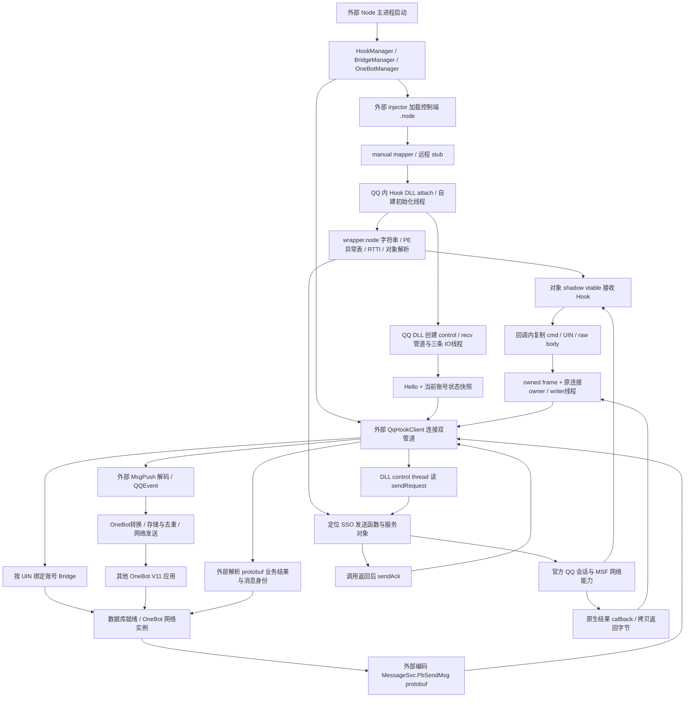

# SnowLuma 原生工作链路复原与分析引擎验证

日期：2026-10-08（Asia/Shanghai）。Caligo HEAD：`681434bb8c0a32fd4e98ddaceadedf7e48f95782`。本轮目标：找到实际可用的原生分析引擎，复原固定版本 SnowLuma 从装载、QQ 收发到 OneBot 的整体链路，为修正 K4 提供证据。

**结论：引擎已验证，整体链路已在静态层面串通；QQ 私有 ABI、线程与对象生命期契约尚未通过。** 本轮不以 D9“唯一重连缺陷”“一轮现场即可收敛”的概要作为结论前提。没有运行 SnowLuma 制品、注入 QQ、操作 QQ 进程或修改 Rust 业务代码；只新增研究文档及仓库外的分析产物。已有 K4 计划的工作树修改予以保留，本轮不直接重写它。

## 1. 分析引擎：已完成实际验证

| 能力 | 本轮选择与结果 | 使用边界 |
|---|---|---|
| 原生 PE 导入、交叉引用、伪代码 | Ghidra 12.1.4，直接调用 analyzeHeadless | 两个 SnowLuma 文件均 Analysis/Export/Save 成功 |
| 汇编与 PE 原始信息复核 | MSVC dumpbin；既有 GNU objdump 静态结果 | 验证注册 descriptor、间接调用参数、QQ 候选函数边界 |
| 研究流程与制品证据 | REA 5.0.0 的 artifact/evidence 工作流 | 当前 Windows Ghidra provider 不接纳 DLL；本轮原生反编译未通过 REA provider |
| 公开源码和现有 Caligo 导航 | 既有源码/GitNexus 调查与针对性源码读取 | 不能替代原生间接调用、QQ ABI 和实际运行证据 |
| 隐藏字符串与目标版本核对 | 自编只读 Python 分析脚本 | 仅文件解析、字节运算和证据导出，不执行目标代码 |

REA 官方 Windows P0 说明支持 native **non-DLL** PE application，并要求独立安装 Ghidra；`.node` 与 Hook DLL 都是 PE DLL角色。因此配置好 REA 不等于这两个目标已能通过它的 provider 分析，本轮明确使用 Ghidra 直接入口。[REA Windows P0](https://raw.githubusercontent.com/morluto/rea/main/docs/windows-ghidra-p0.md)

安装位置：`E:/stella/_reference/tools/ghidra_12.1.4_PUBLIC`。沿用本机完整 JDK 25.0.4，不改全局环境。官方发行 ZIP `ghidra_12.1.4_PUBLIC_20260921.zip` 的 SHA256 已匹配发行页：`ddac49f903da9d5bac833e5cc79395098b9c33cfd3279be5f31bd00387d2d4db`。[Ghidra 12.1.4 官方发行](https://github.com/NationalSecurityAgency/ghidra/releases/tag/Ghidra_12.1.4_build)

| 固定目标 | 导出的分析函数 | 伪代码成功 | 失败 | 证据 |
|---|---:|---:|---:|---|
| Hook DLL | 748 | 748 | 0 | decompiled-hook/export-summary.json、hook-headless.log |
| 控制端 .node | 970 | 970 | 0 | decompiled-node/export-summary.json、node-headless.log |

函数数量含 CRT、辅助函数和 thunk，不能解释为全部 QQ 业务功能。成功导出是引擎可用性证明；间接调用和 C++ 类型仍要原始指令校对。Ghidra 曾把 kind2 发送误示为零参数，也把一处 NAPI mapper 调用误示为 PID=0，均已用汇编纠正。`.node` 导入的奇异 TLS 地址日志与原始 TLS directory=0 不一致，未作为真实 callback。

## 2. 固定样本、来源与证据等级

SnowLuma 公开源码固定于 v1.14.21 / commit `9632b006385e603c9d9fe9150ab433e43792591f`，路径 `C:/Users/Vegetable/AppData/Local/Temp/stella-snowluma-research-20261006`；工作树复核干净。Hook DLL 与控制端 .node 的源码树/发行包副本摘要此前已交叉匹配，本轮再次核对导入文件摘要。公开源码到发行 JS 的逐字节构建重现没有完成，不据此声称整个发行 bundle 已完全审计。

| 文件 | 大小 | SHA256 |
|---|---:|---|
| snowluma-win32-x64.dll | 248832 | `215a32fe72120f23bed5130fa14c121877db28c69c2088aa51893cfbfee26ec4` |
| snowluma-win32-x64.node | 306688 | `6346a28cfcd09b1c99c0c15f3094ed579200f3dfd3edbf27512e81d865a26991` |
| 本机 QQ wrapper.node | 115118632 | `63112ab9161e127f5f7e17998a7196e143808923fb54cbbf7b4e21426187a5f0` |

本机官方 QQ 样本来自 `D:/Program Files/Tencent/QQNT/versions/9.9.33-52230/resources/app/wrapper.node`，摘要与项目既有冻结记录一致。仅核对安装文件，未核对任何当前运行 PID 的加载状态。

下文“事实”是公开源码、指令或明确伪代码控制流；“推论”是跨层语义映射；“未知”需要继续 QQ 目标样本分析或受控运行补证。SnowLuma 函数 RVA 属于固定 SnowLuma 文件，本机 QQ RVA 属于其固定 wrapper文件，两者不得混用。机器生成 C 文件只是分析证据，不是可移植源码。

## 3. 整体工作链路



图中的线程与业务归属：外部 Node 负责控制和协议业务；QQ 官方代码提供现有登录/会话/网络；Hook DLL 负责发现接口、截获包、调用原生发送入口和管道 IO。当前找到的核心收发链以 native MSF/SSO 为边界，**没有显示经 V8/uv pump 调度的中间步骤**。这不是对整个 QQ 模块所有内部调度的排除证明。

SnowLuma 的 `.node` 在外部控制进程注册 Node-API v8 方法。它不是“在 QQ owner 环境载入 NAPI addon”的证据。实际 QQ 装载链是 manual mapper → remote stub → DLL entry；mapper支持并使用导入修复、页面保护、可选异常表、TLS attach与入口调用，不能把 mapper成功当作QQ会话契约成功。

## 4. QQ 接口是怎样找到的

### 4.1 动态解析，而非固定导出/地址表

入口 `0x1120 → CreateThread(0x1AA0) → 0x3950 → 0xF6C0`。解析器定位 `wrapper.node`，读取 PE `.text/.rdata/.data` 和异常函数表，解码隐藏字符串。关键内容已用只读算法复现：

- `SendSSORequestInternal`：定位发送相关函数。
- `MSF recv seq:`：定位接收相关函数及其指针引用。
- `.?AVMSFService@nt@@`、`.?AVMSFCoreService@nt@@`：关联 MSVC RTTI/COL/vtable。
- 登录成功日志与 `107775_switch`：参与状态/其他候选路径定位。

字符串 → RIP-relative LEA引用 → PE RUNTIME_FUNCTION包含范围；RTTI → vtable及构造关系 → getter/全局数据槽；随后通过对象getter、静态槽或堆内vptr扫描取得候选。安装器克隆对象vtable，保留RTTI槽和原函数，替换对象vptr。这一算法含启发式匹配，不是稳定的公开 QQ API，也未见其入口验证模块SHA或数字签名。

### 4.2 本机固定 QQ 样本已经找到具体关联范围

| 锚点 | 本机 wrapper 字符串 RVA | LEA 指令 RVA | PE 函数范围，end exclusive |
|---|---|---|---|
| SendSSORequestInternal | 0x478EE52 | 0x732BE6 / 0x732C61 / 0x732F39 | 0x732A80–0x732FBA |
| MSF recv seq: | 0x464DD00 | 0x1B41B8F | 0x1B41AE6–0x1B41F69 |
| LoginRequest OnLoginSuccess uin: {} | 0x4685F92 | 0x6E6651 | 0x6E65E8–0x6E6AC6 |

上述五条LEA已由dumpbin反汇编复核。两个MSF RTTI各有一个完整字符串命中。发送序言的参数保存、接收代码的packet字段访问，与SnowLuma对应调用形状一致。仍不能从字符串含义和包含范围宣布完整业务签名；需要继续实际callee、引用/析构和线程调度分析。

## 5. 接收：真正入口、复制与输出

两条QQ接收callback分别是Hook DLL RVA `0x36C0`、`0x4E80`，由 `0x3FA0` 与 `0x5760 → 0x5250 → 0x2980` 挂接。第二族验证对象+0x40的vptr和slot5，再替换slot5。原回调在末尾被调用。`0x9CC0`是recv pipe accept/探测/reaccept线程，不能把它命名为QQ消息入口。

两种packet layout分别处理；第二种仅tag3/4，body跳过4字节，含义待证，不能泛化到所有版本。共同路径：

`QQ callback → 0xA120 → 0x6CD0/0x6830 → 0x6FB0 → 0x8E80 writer`。

callback内复制cmd/UIN/body到自有shared vector，再将frame与**当时的connection owner**一起入队。writer执行时没有重读“当前新管道”来改投。原owner已关闭时旧项不会发给新连接。无recv owner时该次包不输出，未证明断线replay；队列有扩容，所查链未见业务级item/byte上限。

外部收到raw packet后，依UIN路由账号Bridge，解码 `trpc.msg.olpush.OlPushService.MsgPush`，形成QQEvent，再经OneBot转换、缓存、去重与active adapter发送。OneBot action产生的合成self event不能作为真实QQ接收证据。

详细callback布局、函数行号、owner引用计数与线程证据见 [native-receive-lifecycle.md](E:/stella/_reference/snowluma-native-r1-20261008/native-receive-lifecycle.md)。

## 6. 发送：SSO 原生调用、ACK 与结果

外部MessageApi编码 `MessageSvc.PbSendMsg`，QqHookClient先登记requestId的ACK/reply pending，写control pipe；DLL `0x9310 → 0x88D0`读取请求、选服务/连接对象，构造字符串、body与callback，调用resolver提供的函数指针。

kind1由全局槽 `0x3BE48`提供发送入口；kind2按wantReply选择 `0x3BEC8/0x3BED0`，this调整+0x10。对应寄存器/第五参数槽已用汇编复核，不能直接采用Ghidra的默认函数原型。当前路径control thread直接调用私有函数；QQ callee内部是否线程切换仍未知。

可用结果必须分层：

1. 外部请求写入与本地pending登记。
2. DLL实际调用QQ候选函数。
3. 调用返回后 `0x77A0`发sendAck。
4. QQ结果callback `0x3130 → 0x8660`，复制返回status/message/body为sendReply。
5. 外部解码protobuf result和消息身份，再向OneBot调用方返回业务结果。

ACK只能证明当前桥接调用分支返回，不能证明服务器或对端成功。callback capture保存原owner和requestId，结果队列仍绑定原连接；requestId不是QQ SSO seq。迟到结果不会自动转发给重连后的新client；需要自己的journal和 `delivery_unknown` 契约。ACK直接写、reply异步writer写，结构上允许reply先于ACK，未做动态复现。

群业务路径要求有效groupSequence；私聊缺少同等严格privateSequence gate，不直接沿用为Caligo可靠成功标准。完整证据见 [native-send-workflow.md](E:/stella/_reference/snowluma-native-r1-20261008/native-send-workflow.md)。

## 7. 登录、重连和关闭：本轮纠偏

### 首次连接有登录快照

固定DLL两条accept路径均在Hello后发当前loginState snapshot：recv `0x9CC0`、control `0x9310`；快照由 `0x7DA0`读取当前UIN构造。上层“native仅push登录edge”的注释与本样本不一致，不能据此假设晚连接一定漏账号事件。

### identity hint 被ACK不证明采用

公开TS发送op17/loginIdentityHint；固定DLL `0x9310` 的op17分支只ACK并释放frame，未调用UIN更新 `0xA2C0`。因此“hint已经校验/恢复登录”目前没有这份二进制支持。UIN实际更新来自callback/对象轮询等路径；数字候选与非零UIN也不等价于完整会话健康。

### 控制方向与外部恢复

SnowLuma由QQ内DLL创建管道，外部TS作为client连接；Caligo当前worker→daemon方向不同，不能直接照搬accept时序。每条管道独立重建fresh owner；所查链未见control/recv共同generation/nonce认证。上层关闭任一socket会重建整对client，并在watcher每tick补做reconcile，避免只等pipe-up边沿。

### daemon退出保留驻留DLL

常规HookManager.dispose只关闭clients和watcher，未调用native unload，因此daemon重启可以重新收养原驻留DLL。账号Bridge按UIN管理多个PID；最后PID脱离才关闭账号实例。同UIN后续OneBot实例需等待旧generation退役，数据库usable、网络ready和消息交付是不同阶段。

### 清理路径有实现，但安全卸载未证

DLL stop会取消/断开管道，cleanup尝试等待三线程5秒；随后删除queue/event/locks，所查路径未检查wait结果。DllMain也含等待/Sleep；vptr恢复和shadow table释放未显示在途callback barrier。控制端mapper失败还有TerminateThread和立即free路线。这些是观察到的实现与静态风险，不能报告成已经发生的崩溃，也不能作为自有Rust内核安全生命周期范本。

## 8. 对后续 K4 的直接影响

| 原先问题/假设 | 本轮证据 | 后续处理 |
|---|---|---|
| SnowLuma是否靠QQ内JS pump完成核心收发 | 已找到native MSF/SSO函数与vtable callback链 | 把原生SSO作为有证据的研究候选；不再只围绕pump/重连日志推进 |
| 外部.node是否提供QQ owner入口 | 它是外部Node控制端mapper | 装载成功与QQ交互契约分开；不能由NAPI注册推导QQ owner上下文 |
| QQ私有函数是否只能凭猜地址 | resolver算法及本版wrapper锚点已恢复 | 固定样本、分析具体函数范围、参数和callee |
| 接收buffer能否跨线程使用 | callback先复制为owned frame | 借鉴复制边界；仍需证明源对象在callback内有效 |
| 重连后旧结果如何处理 | 每项绑定旧owner，关闭后不改投 | 设计自己的ConnectionIdentity、journal、迟到结果和unknown规则 |
| 能否复制完整SnowLuma机制 | shutdown/队列/对象扫描仍有未证边界 | 独立设计有界队列、对象代次、在途callback排空与安全失败策略 |
| 是否可以进入Rust实现/现场G3 | 完整QQ ABI和生命周期尚未闭合 | 先做目标QQ契约；不将静态复原升级为实现或现场PASS |

这些是修订依据，不自动删除现有owner路线或将SnowLuma的偏移编入Rust。self-owned内核目标保持：官方QQ提供会话/网络，自有代码提供交互、IPC、外部业务和OneBot；运行时不依赖SnowLuma二进制。

## 9. 下一步：由“知道怎样找”推进到“本版可验证契约”

优先研究固定wrapper发送 `0x732A80`、接收 `0x1B41AE6`、登录候选 `0x6E65E8`，及两组RTTI/getter。每个任务都要求具体输出，尚未完成的项目不得用helper单测代替：

1. **参数/内存契约**：恢复this、string/vector/callback真实表示、分配与析构、callee复制时机。输出版本绑定的字段与调用证据表；类型不明确则停止该调用路线。
2. **对象/线程契约**：追踪getter返回值引用、创建/替换/销毁、send函数内部同步与任务队列。输出允许线程、对象代次和有效期证据；不能默认可读地址可调用。
3. **接收/结果契约**：确认两callback各对应哪个接口、原函数调用顺序、回调持有与完成、错误和业务ID映射。输出原始buffer至owned event、请求至业务receipt的闭合链。
4. **关闭契约**：追踪listener/hook撤销和在途回调排空。输出资源清单、stop/drain/join顺序、超时后保留/隔离规则；不照搬强杀线程或定时free。
5. **主线选择后才实现**：基于上述证据比较native SSO与既有owner route的复杂度和限制，再精确改写K4执行步骤。静态通过后另设QQ受控收发/断线/正常关闭验收。

本轮状态：**分析引擎PASS；整体静态链路复原PASS；目标QQ ABI与安全运行契约PARTIAL；现场收发及安全关闭未验证。**

## 10. 产物与复核方法

分析根目录：`E:/stella/_reference/snowluma-native-r1-20261008`，未将第三方二进制或Ghidra项目放入Caligo仓库。

| 产物 | 内容 |
|---|---|
| environment.json / engine-install-manifest.json | 引擎、JDK、固定输入、安装ZIP与脚本摘要 |
| projects/SnowLumaHook.gpr、SnowLumaNode.gpr及.rep | 保存的Ghidra分析项目，可继续查看 |
| decompiled-hook、decompiled-node | program元数据、函数/call/reference、符号、strings、逐函数C文件与coverage |
| logs/*-headless.log、*-script.log、*-console.log | 分析、导出、保存记录及警告 |
| loader-workflow.md | 控制端.node、mapper、卸载、NAPI注册与原始指令证据 |
| native-resolver.md及decoded-strings/anchors JSON | 隐藏字符串、PE/RTTI resolver、对象与Hook安装证据 |
| native-send-workflow.md | 发送参数、callback捕获、ACK/reply与连接绑定 |
| native-receive-lifecycle.md | 真正接收callback、owned复制、队列、连接和关闭 |
| high-level-workflow.md | 公开源码启动/Bridge/OneBot/send/recv/shutdown的逐文件行号 |
| wrapper-sample-check.md、wrapper-anchor-check.json及三段disassembly | 本机官方样本身份、锚点匹配与具体范围复核 |
| artifact-manifest.json | 报告、脚本、机器证据和伪代码文件SHA；不包含自身或可变cache/project数据库 |

Headless导出脚本：[ExportNativeEvidence.java](E:/stella/_reference/snowluma-native-r1-20261008/scripts/ExportNativeEvidence.java)。复现时选**新的**project和输出目录，保留现有证据；使用同一SHA输入并检查日志Analysis/Export/Save与summary，不能仅看进程exit code。参数例：

```powershell
$env:JAVA_HOME = 'C:/Program Files/Microsoft/jdk-25.0.4.7-hotspot'
$env:APPDATA = 'E:/stella/_reference/snowluma-native-r1-20261008/engine-appdata'
$env:LOCALAPPDATA = 'E:/stella/_reference/snowluma-native-r1-20261008/engine-localappdata'
& 'E:/stella/_reference/tools/ghidra_12.1.4_PUBLIC/support/analyzeHeadless.bat' `
  'E:/stella/_reference/snowluma-native-r1-20261008/projects' 'SnowLumaHookRecheck' `
  -import 'C:/Users/Vegetable/AppData/Local/Temp/stella-snowluma-research-20261006/packages/runtime/native/snowluma-win32-x64.dll' `
  -scriptPath 'E:/stella/_reference/snowluma-native-r1-20261008/scripts' `
  -postScript ExportNativeEvidence.java 'E:/stella/_reference/snowluma-native-r1-20261008/decompiled-hook-recheck' `
  -analysisTimeoutPerFile 240 -max-cpu 4
```

`.node`用同样方法但更换独立project、输入和输出。运行analysis script属于分析工具执行，不是运行SnowLuma DLL；仍须确保未手工dlopen/调用样本。首次导入中的系统import名解析仅用于静态命名，不证明QQ嵌入Node版本与本机外部Node一致。
